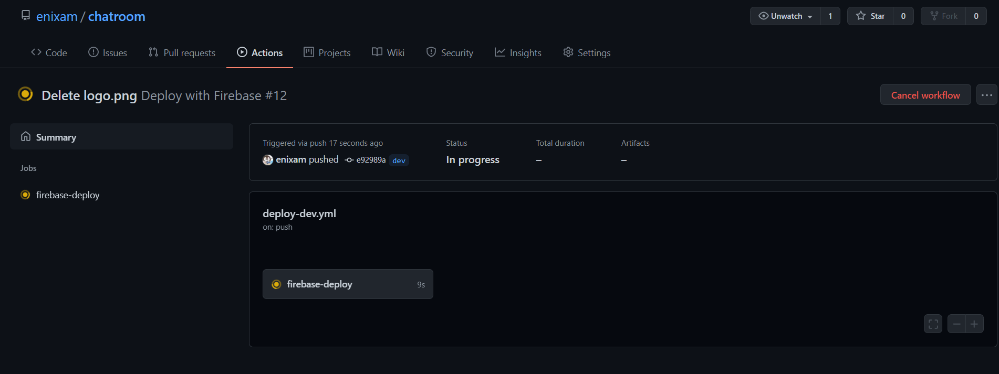
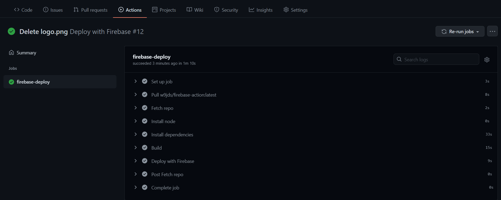
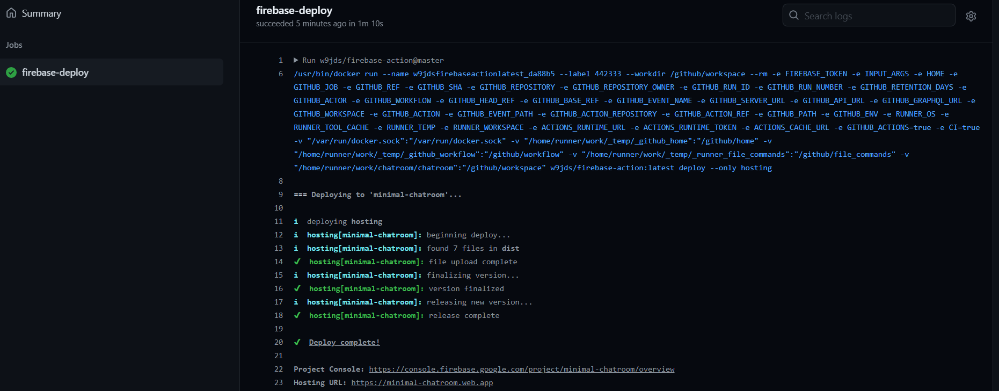

## Introduction 

[Github Actions](https://docs.github.com/en/actions) is a CI/CD service provided by Github to automate the software development workflow. Basically, it allows users to have some actions automatically triggered, for example run some testing, build a webpage or make a new release, once certain events are met, say you push to your repository or it receives a pull request. Instead of repeating the same cycle over and over again, you can use Github-hosted "runners"^[you can set up your own runner if you like] (just think of it as a virtual environment with certain tools like `git` and `python` preinstalled) do the job for you. Github Actions supports many languages and complex tasks. In this post, I will focus on one specific application, that is having [Firebase](https://firebase.google.com/) deploy a Vue app once you push to the repo. 

I assume basic understanding of Vue applications and the command line, but not necessarily Firebase. [Firebase](https://firebase.google.com/) is a backend service by Google. In this post I only use Firebase for hosting to generate a public url for my site, but there are more functionalities such as equipping your site with a real-time database.  And the framework isn't limited to Vue. For example, you could easily find Github Actions tailored for React and Angular apps once you understand its inner workings. 

## Firebase Setups

Before heading to deployment, you will first need to register a Firebase account and initialize you project as a Firebase project. The [official documentation](https://firebase.google.com/docs/hosting) details this process. In brief, you need to 

1. Register a Firebase account, and [create a remote project](https://firebase.google.com/docs/web/setup)

2. Install the Firebase cli locally with `npm install -g firebase-tools`

3. After the Firebase cli has been installed, run `firebase login` to connect your local machine to Firebase. This doesn't have to be in your project folder and only need to be done once per computer. 

4. Run `firebase init hosting` in your Vue project folder to initialize the hosting service. After it's down, you should have two files `firebase.json` and `.firebaserc` created in the root directory. 

Now, you can run `npm run build` and `firebase deploy --only hosting` every time you want to update your site and make it available to the public. Simple as it is, you might not want to do it manually. This is when Github Actions can save a lot of extra work. 


## Use Github Actions

I have a example Vue app in this [repo](https://github.com/enixam/chatroom). What I want to achieve is that every time I push to this repo, the site automatically rebuilds and Firebase would deploy the updated site. To design the according Github Actions,  create in the root directory a `.github/workflows/`, and inside that folder a yaml file with extension `.yml`. This file inside the special folder will be recognized by Github Actions and interpreted as instructions to follow. Mine is named `deploy-dev.yml` but you can name it whatever you want. You can also have multiple yaml files, which will run in parallel. Each yaml file is called a *workflow*.


Inside the yaml file, we tell Github Actions what to do after certain events. Let's have a look inside

<script src="https://gist.github.com/enixam/f9deb27ef09a8229661e8c309fa4e0a9.js"></script>

The `name` field specifies the name of the workflow. A workflow can contain multiple jobs, and a job can contain multiple steps. This is analogous to packages, functions and code. Try to make this name informative since it will help you find certain workflow if you have more than one. 

The `on` field is the event after which we want follow-up actions to happen. In this case, the event is pushing to the `dev` branch. This is highly customizable, for example, if you want something to happen after pushing to the main and dev branch, and also when the main branch receives a pull request, you can write 

```yaml
on:
  push:
    - main
    - dev
  pull_request:
    - main 
```

The next step is telling Github Actions what to do by specifying *jobs*. A job is a series *steps* to perform, and each step is individual commands executed by bash on runners. A step begins with an optional `name`, which makes debugging easier, followed by fields like `run` and `uses` that actually issue the commands. The `runs-on` keyword configures the job to run on an Ubuntu Linux runner, you can use other os such as mac-os or windows.

`steps` defines a series of actions to take. But at this point, Github Actions have only available some environmental variables of our repo, such as the repo url, the commit id and so on. It makes sense to first fetch the repo files and get the our code, since other actions will depend on them. We can do this by writing git commands as the first action to download these files. But a much easier solution is to `use` community contributed actions. These actions are essentially templates for a specific task so that we will not go into the details ourselves. You can find more community contributed actions at the [Github Marketplace](https://github.com/marketplace?type=actions).

In our case, the `uses` keyword tells the job to retrieve v2 of the community action named `actions/checkout@v2`. This is an action that checks out your repository and downloads it to the runner. Normally a job always starts with the checkout step. 

After that, the following two steps proceed to install node.js and project dependencies. We need this step because unlike git, node.js is not by default available in the runner. The third step uses `run` instead of `uses` because we are just writing bash commands ourselves. You may want to switch to python shell in a python project, for example, by appending a `shell: python` to certain steps.  If we have not used the checkout action before, `uses: actions/setup-node@master` can still run but `run: npm install` will fail because the `package.json` file won't be available. 

For now, the site is rebuilt in the runner with updates. We only have to tell Firebase to deploy. This is done by the last step

```yaml
- name: Deploy with Firebase
  uses: w9jds/firebase-action@master
  with:
    args: deploy --only hosting
  env:
    # see via cmd: firebase login:ci
    FIREBASE_TOKEN: ${{ secrets.FirebaseDeploy }}
```

The action `w9jds/firebase-action` sets up the Firebase cli. We provide an additional argument to tell `deploy --only hosting` it to run the deployment service, and an token as environmental variables for authentication. This token can be generated by running `firebase login:ci` locally. Then, you need to add the token into your *Github's Repo > Settings > Secrets*. `Mine` is named `FirebaseDeploy`. And the process is done.

To visualize the series of instructions followed by Github Actions, I created a diagram below. 

```{r, fig.height=6, echo = FALSE}
library(DiagrammeR)
mermaid("
graph TB
A(Deploy with Firebase: the worklow)-->B(firebase-deploy: the job)
A(Deploy with Firebase: the worklow)-->C(other potential jobs)
B(firebase-deploy: the job)-->D(when to run? when pushing to the dev branch)
B(firebase-deploy: the job)-->E(on which system? the latest ubuntu system)
B(firebase-deploy: the job)-->F(what to do?)
F(what to do?)-->G(use actions/checkout: Get all the files inside the repo)
G(use actions/checkout: Get all the files inside the repo)-->H(use actions/setup-node: Install node.js as well as npm)
H(use actions/setup-node: Install node.js as well as npm)-->I(run npm install: Install project dependencies)
I(run npm install: Install project dependencies)-->J(run npm run build: build and update the site)
J(run npm run build: build and update the site)-->K(use w9jds/firebase-action: Let Firebase to host the updated site)
classDef className font-size:19px, text-align:left;
class A,B,C,D,E,F,G,H,I,J,K className;
")
```

## An Example 

I made a push to the [repo](https://github.com/enixam/chatroom)'s dev branch, so we could see how the process worked in action. The change was simple, I deleted Vue's default icon inside `src/assests`, and then committed and pushed to dev. After the push completed, Github Actions gets up and running because it detected a yaml file under `.github/workflows`.


When the workflow completed, the running icon turned green. We can click inside to see the running status of each step. In this case, all steps passed. (the first one and last two steps are auto-generated by Github Actions)


Clicking on individual step gives more details. If we click on the `Deploy with Firebase` step, we can see that deployment succeed.



While this is a relatively simple workflow, hopefully it gives you a general idea of how Github Actions can be used for automation. If you want to learn more, the [official doc](https://docs.github.com/en/actions/learn-github-actions) is a great resource. 