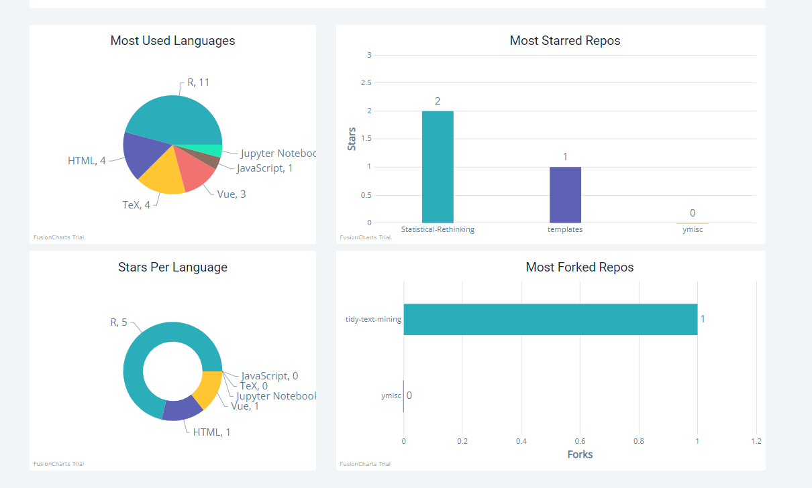

[Github Profile Viewer](https://gh-profile-viewer.netlify.app/) presents a quick image of any github user's public work, i.e, personal information, followers, repository statistics.

<figure>
  
</figure>

The app is developed with React using the Github API, charts are generated via [Fusion Charts](https://www.fusioncharts.com/).

<figure>
  
  <figcaption>most used languages, most forked repos ...</figcaption>
</figure>

You don't need to login to use this app, though unauthenticated users might have to share a 60-requests-per-hour rate limit.

