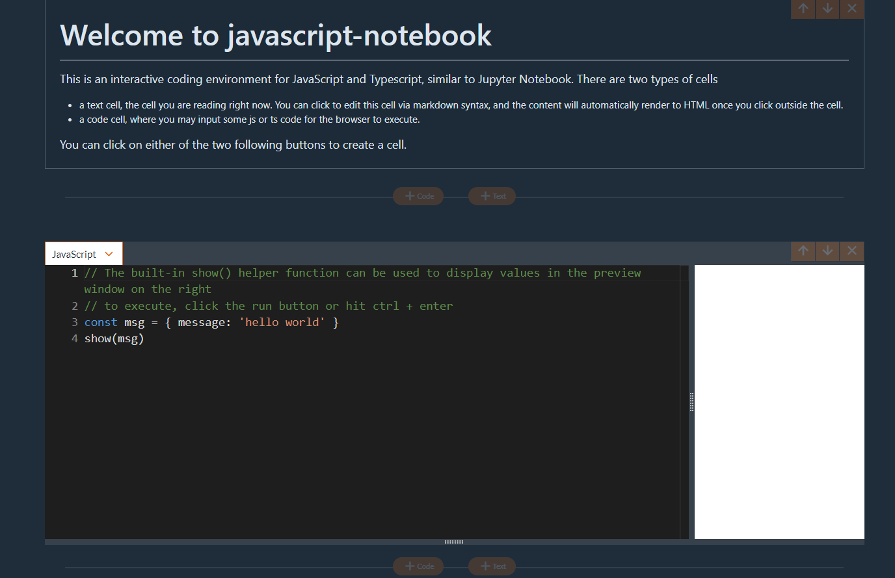

A command line tool to create browser-based interactive notebook for JavaScript and TypeScript, similar to Jupyter Notebook.


To use the app, run `npx javascript-notebook serve` and then navigate to https://localhost:3001

You can also install the package globally via

```
# npm
npm install -g javascript-notebook
# yarn
yarn global add javascript-notebook
```

For a quick preview, go to https://javascript-notebook.netlify.app/, where you can still code but not save to local files.

<figure>
  
</figure>
