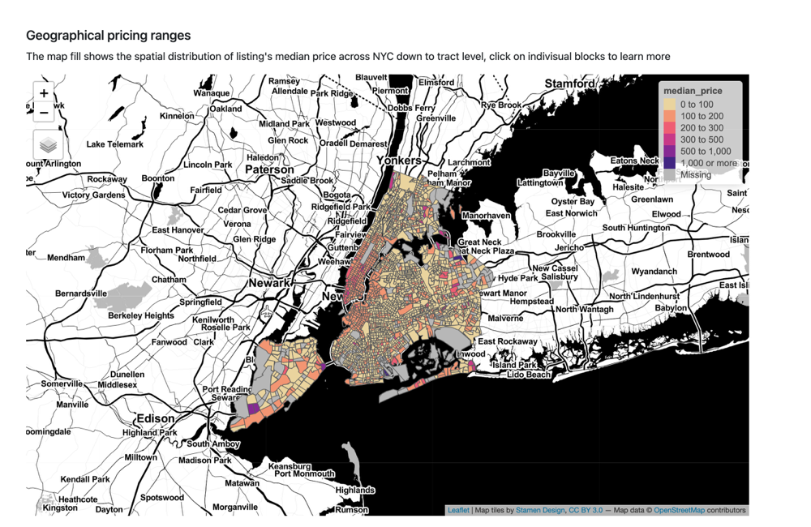
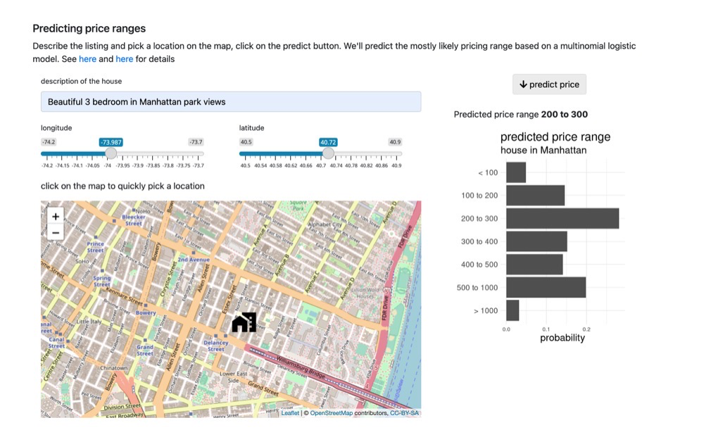
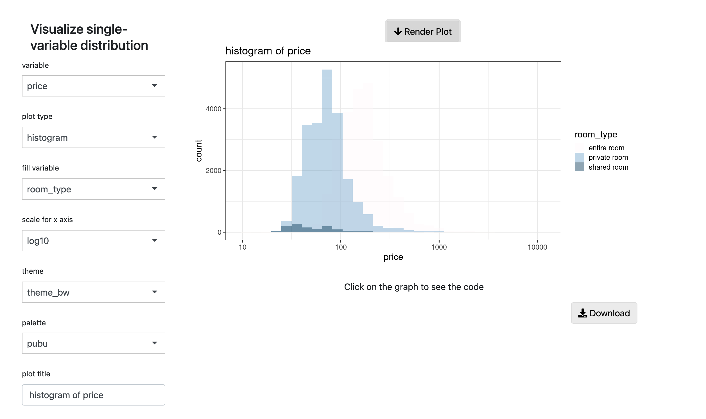
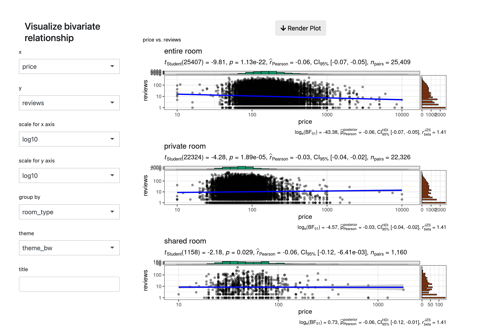
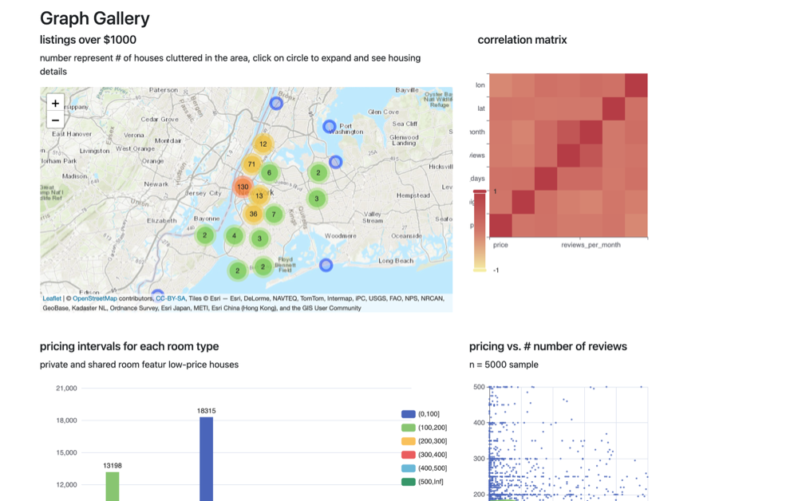

A shiny app created with the [golem](https://github.com/ThinkR-open/golem) framework. 

- Spatial Analysis: Spatial overview of pricing patterns, down to tracts

<figure>
  
</figure>

- Prediction: Predicting price ranges based on description and location

<figure>
  
</figure>

- Distribution: Histograms, density plots, bar plots of single variable

<figure>
  
</figure>

- Relationship: Scatterplots and statistical testing of bivariate relationship

<figure>
  
</figure>

- Gallery: Showcase of miscellaneous interactive plots

<figure>
  
</figure>

