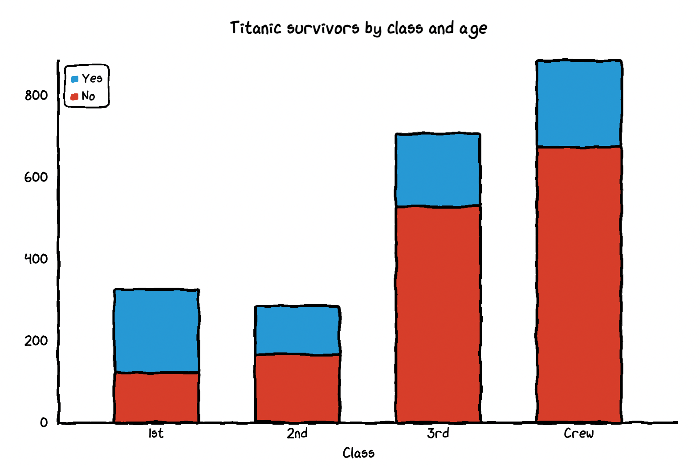

This package is a wrapper around the javascript [chart.xkcd](https://github.com/timqian/chart.xkcd) library to create xkcd-styled chart for R, with support for line graphs, scatterplots, bar plot, pie charts and radar plot. The appearance looks like this

<figure style="width: 1200px; margin: 10px auto;">
  
</figure>

See [docs](https://qiushiyan.github.io/xkcd/index.html) for more examples.