# 经济学人：Corruption and human development  {#Econmist}
来源：[ggplot2 workshop by Harvad University](http://tutorials.iq.harvard.edu/R/Rgraphics/Rgraphics.html)

目标：  
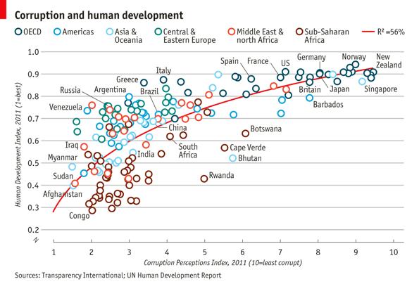


数据： `data\EconomistData.csv`

```r
corruption <- read_csv("data\\EconomistData.csv")
corruption
#> # A tibble: 173 x 5
#>   Country     HDI.Rank   HDI   CPI Region           
#>   <chr>          <dbl> <dbl> <dbl> <chr>            
#> 1 Afghanistan      172 0.398   1.5 Asia Pacific     
#> 2 Albania           70 0.739   3.1 East EU Cemt Asia
#> 3 Algeria           96 0.698   2.9 MENA             
#> 4 Angola           148 0.486   2   SSA              
#> 5 Argentina         45 0.797   3   Americas         
#> 6 Armenia           86 0.716   2.6 East EU Cemt Asia
#> # ... with 167 more rows

## 基本对象
pc1 <- ggplot(corruption,aes(CPI, HDI, color = Region))

pc1 + geom_point()
```

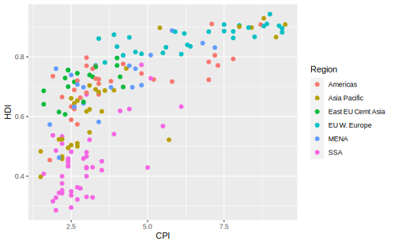

任务：  

* 添加一条趋势线 
* 改变点的形状和大小    
* 改变因子`Region`的顺序和标签  
* 为部分点打上数据标签  
* 修饰坐标轴：标题，标签、刻度等  
* 把颜色图例的位置移到图的上部  
* 添加注解: 判定系数(R^2)和来源信息  


首先添加趋势线，注意这里将`geom_smooth()`图层放在散点图的上方 ； 在`formula`中指定回归方程

```r
pc2 <- pc1 +
  geom_smooth(mapping = aes(linetype = "r2"),
              method = "lm",
              formula = y ~ x + log(x), se = FALSE,
              color = "red")
pc2 + geom_point()
```

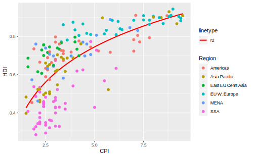

改变点的形状，这里使用`shape=1,size=2.5`:  


```r
pc2 + geom_point(shape = 1, size = 4)
```

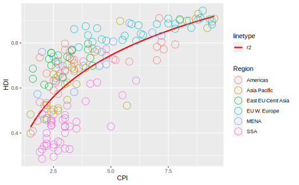

和原图比对，原图的数据点边框更厚，边框内部更小。于是这里还要使 用`geom_point()` 中一个不太常见的参数`stroke`，用来控制点的边框的厚度(point border thickness)，并相应地减小`size`：  

```r
(pc3 <- pc2 + geom_point(shape = 1, size = 2.5,
                         stroke = 1.25))
```

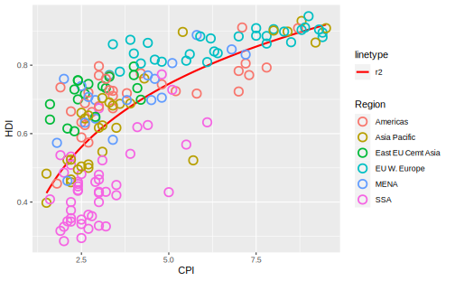

到这一步对数据点本身的修饰就基本结束了，可以把`geom_point()`图层也添加到基本对象中


下一步是**部分**数据点添加数据标签，使用 `geom_text_repel()` 以避免重叠，设置`force = 10`控制标签移动的幅度。只为部分点添加标签的方法在散点图那一章有涉及到，那里我们创建了一个新列用于添加标签，部分观测的标签被`ifelse()`设置为空字符串。但是这里使用了更巧妙的办法，直接更改`geom_text()`图层用到的数据：  

```r
pointsToLabel <- c("Russia", "Venezuela", "Iraq", "Myanmar", "Sudan",
                   "Afghanistan", "Congo", "Greece", "Argentina", "Brazil",
                   "India", "Italy", "China", "South Africa", "Spane",
                   "Botswana", "Cape Verde", "Bhutan", "Rwanda", "France",
                   "United States", "Germany", "Britain", "Barbados", "Norway", "Japan",
                   "New Zealand", "Singapore")
library(ggrepel)

(pc4 <- pc3 + geom_text_repel(aes(label = Country),
                color="grey20",
                data = filter(corruption, Country %in% pointsToLabel),
                force = 10))
```

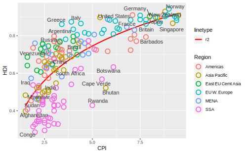

下一步是改变 `Region` 的排序和标签，原数据中 `Region` 是以字符串存储的，这里先要把它变成因子：  

```r
corruption$Region <- factor(corruption$Region,
                     levels = c("EU W. Europe",
                                "Americas",
                                "Asia Pacific",
                                "East EU Cemt Asia",
                                "MENA",
                                "SSA"))
pc4
```

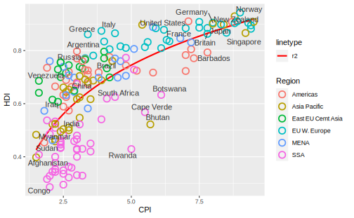


* 修饰坐标轴：设置标题、刻度和限度
* 添加主标题(title)  
* 添加来源说明(caption)


```r
(pc5 <- pc4 + 
   scale_x_continuous(name = "Corruption Perceptions Index, 2011 (10=least corrupt)",
                     limits = c(.9, 10.5),
                     breaks = 1:10) + 
   scale_y_continuous(name = "Human Development Index, 2011 (1=Best)",
                     limits = c(0.2, 1.0),
                     breaks = seq(0.2, 1.0, by = 0.1)) +
   labs(title="Corruption and Human Development",
        caption="Sources: Transparency International; UN Human Development Report"))
```

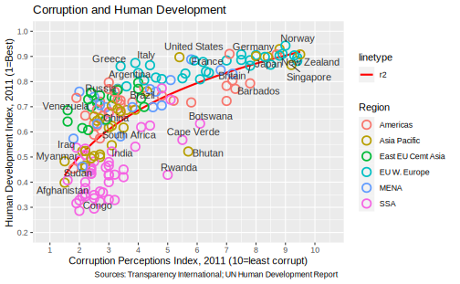


主题修饰： 


```r
library(grid) # for the 'unit' function

(pc6 <- pc5 +
  theme_bw() +
  theme(panel.border = element_blank(),  ## 取消四周的边框线
        panel.grid = element_blank(),
        panel.grid.major.y = element_line(color = "gray"),
        text = element_text(color = "gray20"),
        axis.title.x = element_text(face = "italic"),
        axis.title.y = element_text(face = "italic"),
        legend.position = "top",   ## 调整图例的位置和朝向
        legend.direction = "horizontal",
        legend.box = "horizontal",
        legend.text = element_text(size = 8),
        plot.caption = element_text(hjust = 0),
        plot.title = element_text(size = 16, face = "bold"))
        )
```

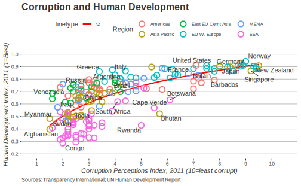


颜色标度调整，并且把图例变为一行 ； 更改图例的标签 ；   

```r
(pc7 <- pc6 +
            scale_color_manual(name = "",
                      values = c("#24576D",
                                "#099DD7",
                                "#28AADC",
                                "#248E84",
                                "#F2583F",
                                "#96503F"),
                      labels=c("OECD",
                                "Americas",
                                "Asia &\nOceania",
                                "Central &\nEastern Europe",
                                "Middle East &\nnorth Africa",
                                "Sub-Saharan\nAfrica"),
                      guide=guide_legend(nrow=1)))
```

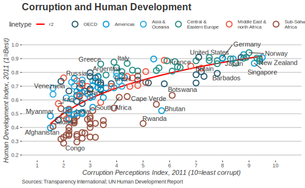


计算模型的 $R^2$ 系数

```r
mR2 <- summary(lm(HDI ~ CPI + log(CPI), 
                  data = corruption))$r.squared
mR2 <- paste0(format(mR2, digits = 2), "%")
```


下面把它添加到图形中，`annotate()`函数并不擅长把注解添加到绘图区域以外的地方；不过我们早有准备，这里实际上是要把`linetype`图例中的`labels`设定为判定系数：


```r
pc8 <- pc7 +
  scale_linetype(name = "",   ## 图例的名字
                 labels = list(bquote(R^2==.(mR2))),
                 guide = guide_legend(override.aes = list(linetype = 1, 
                                                          size = 2, 
                                                          color = "red"), order = 2))

pc8
```

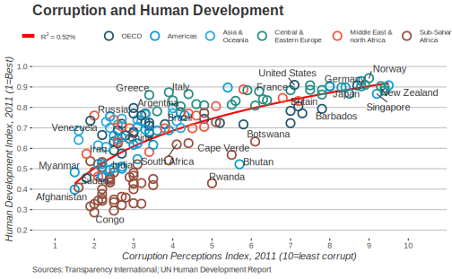


