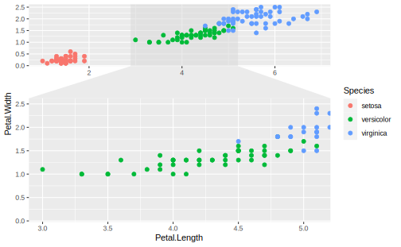

# ggforce  


```r
library(ggforce)
```


```r
ggplot(iris, aes(Petal.Length, Petal.Width, colour = Species)) +
  geom_point() +
  facet_zoom(x = Species == "versicolor")
```




```r
ggplot(mpg) +
  geom_autopoint() +
  facet_matrix(vars(drv:fl), layer.diag = 2, grid.y.diag = FALSE) + 
  geom_autodensity(aes(fill = drv))
```


