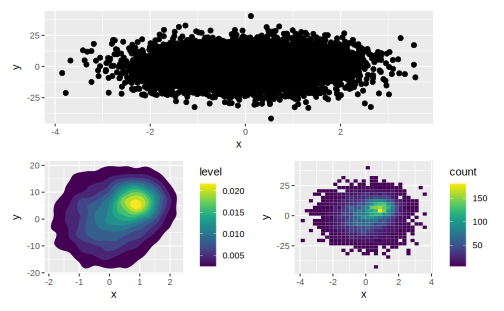
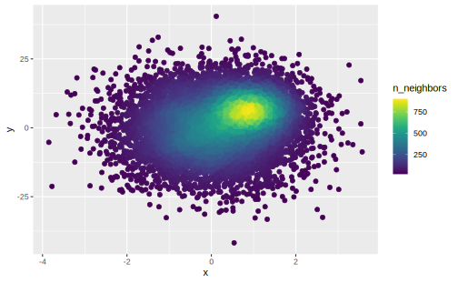
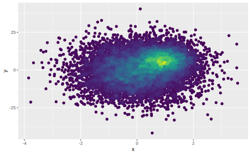
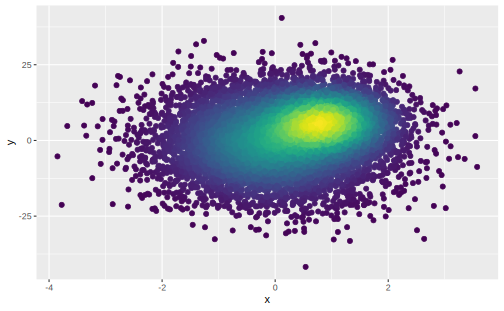
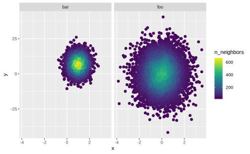
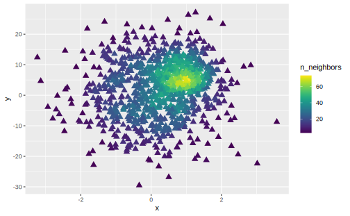
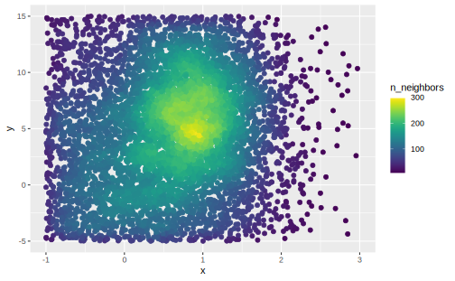

# ggpointdensity  


```r
library(patchwork)
library(viridis)
library(ggpointdensity)
```

ggplot2 主要提供了 `stat_density_2d` 和 `geom_bin_2d` 缓解二维散点图的重叠问题：  


```r
set.seed(2019)
dat <- bind_rows(
  tibble(x = rnorm(7000, sd = 1),
         y = rnorm(7000, sd = 10),
         group = "foo"),
  tibble(x = rnorm(3000, mean = 1, sd = .5),
         y = rnorm(3000, mean = 7, sd = 5),
         group = "bar"))

p1 <- ggplot(dat, aes(x, y)) + 
  geom_point()

p2 <- ggplot(dat, aes(x, y, fill = ..level..)) + 
  stat_density_2d(geom = "polygon") + 
  scale_fill_viridis()

p3 <- ggplot(dat, aes(x, y)) + 
  geom_bin2d() + 
  scale_fill_viridis()

p1 / (p2 + p3)
```




这两种办法可以很好地反映二维点的集中趋势，但不足之处是不易于观察单个离群点。 ggpointdensity 提供的 `geom_pointdensity()` 保留了点作为基本几何对象，并将**周围点的个数**映射到 `color` 上：    


```r
ggplot(dat, aes(x, y)) + 
  geom_pointdensity() + 
  scale_color_viridis()
```



`adjust` 用来调整视为 “邻近” 的距离：


```r
ggplot(dat, aes(x, y)) + 
  geom_pointdensity(adjust = 0.1, show.legend = F) + 
  scale_color_viridis()

ggplot(dat, aes(x, y)) + 
  geom_pointdensity(adjust = 4, show.legend = F) + 
  scale_color_viridis()
```

<div class="figure">

<p class="caption">(\#fig:unnamed-chunk-5)large adjust(default to 1) makes more neighbors</p>
</div>

与 ggplot2 的其他功能结合，例如分面：  


```r
ggplot(dat, aes(x, y)) + 
  geom_pointdensity() + 
  scale_color_viridis() + 
  facet_grid( ~ group)
```



改变点的大小或形状：  


```r
dat_subset <- sample_frac(dat, .1)  # smaller data set
ggplot(dat_subset, aes(x, y)) +
  geom_pointdensity(size = 3, shape = 17) +
  scale_color_viridis()
```




Zooming into the axis works as well, keep in mind that `xlim()` and `ylim()` change the density since they **remove data points**. It may be better to use **coord_cartesian()** instead.  


```r
ggplot(dat, aes(x, y)) +
  geom_pointdensity() +
  scale_color_viridis() +
  xlim(c(-1, 3)) + ylim(c(-5, 15))

ggplot(dat, aes(x, y)) +
  geom_pointdensity() +
  scale_color_viridis() +
  coord_cartesian(xlim = c(-1, 3), ylim = c(-5, 15))
```



