# `ggpubr`  

`ggpubr` 是一个基于 ggplot2 图形的图表包，全称为全称为"'ggplot2' Based Publication Ready Plots"。它并不提供额外的集合对象、统计变换和标度等，而是以 `gg*` 函数族直接创建图形对象，并将属性映射、标度调整、统计变换、排版、主题设置等功能全部设置在这个函数中, 不过也可以和 ggplot2 函数创建的图层叠加。个人认为这个包其实不太符合 ggplot2 的设计思想，这里只简单介绍几个比较喜欢的函数和可视化方案。  

参考： https://rpkgs.datanovia.com/ggpubr/index.html  


```r
library(ggpubr)
```


## `ggbarplot`  


ggpubr 提供的条形图函数 `ggbarplot()` 没有默认的统计变换 (类似 `geom_col()` )，有一个很方便的排序参数 `sort.val`，这样我们就不必对要呈现的变量事先排序。此外 ggpubr 包还带有一些不错的期刊配色方案(在 `palette` 中设置)  


```r
## 数据
dfm <- rownames_to_column(mtcars, var = "name")
dfm$cyl <- as.factor(dfm$cyl)
head(dfm)
#>                name  mpg cyl disp  hp drat   wt qsec vs am gear carb
#> 1         Mazda RX4 21.0   6  160 110 3.90 2.62 16.5  0  1    4    4
#> 2     Mazda RX4 Wag 21.0   6  160 110 3.90 2.88 17.0  0  1    4    4
#> 3        Datsun 710 22.8   4  108  93 3.85 2.32 18.6  1  1    4    1
#> 4    Hornet 4 Drive 21.4   6  258 110 3.08 3.21 19.4  1  0    3    1
#> 5 Hornet Sportabout 18.7   8  360 175 3.15 3.44 17.0  0  0    3    2
#> 6           Valiant 18.1   6  225 105 2.76 3.46 20.2  1  0    3    1
```


```r
## 降序  sort.val = "desc"
ggbarplot(dfm, x = "name", y = "mpg",
          fill = "cyl",               # change fill color by cyl
          color = "white",            # Set bar border colors to white
          palette = "jco",            # jco journal color palett. see ?ggpar
          sort.val = "desc",          # Sort the value in ascending order
          x.text.angle = 90           # Rotate vertically x axis texts
          )
```

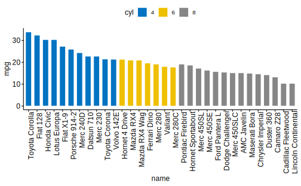

```r
## 升序  sort.val = "asc"
ggbarplot(dfm, x = "name", y = "mpg",
          fill = "cyl",               # change fill color by cyl
          color = "white",            # Set bar border colors to white
          palette = "jco",            # jco journal color palett. see ?ggpar
          sort.val = "asc",           # Sort the value in ascending order
          x.text.angle = 90           # Rotate vertically x axis texts
          )
```

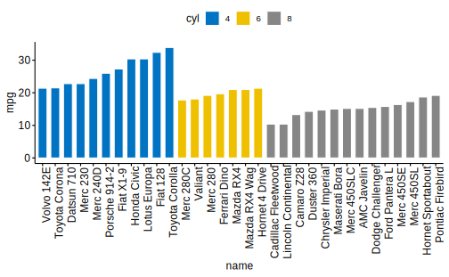

`sort.by.groups = TRUE` 可以使排序在组内进行，`rotate` 可以水平 / 竖直颠倒条形图


```r
ggbarplot(dfm, x = "name", y = "mpg",
          fill = "cyl",               # change fill color by cyl
          color = "white",            # Set bar border colors to white
          palette = "jco",            # jco journal color palett. see ?ggpar
          sort.val = "desc",          # Sort the value in ascending order
          sort.by.groups = TRUE,      # Sort inside each group
          rotate = TRUE               # Don't sort inside each group
          )
```

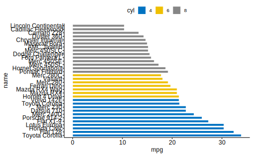

上图中的 y 轴标签过大，ggpubr 中的 `font()` 函数用于调整主标题、副标题、坐标轴标题和标签，调用方式类似于 ggplot2 中的主题函数，直接添加到图形对象上：  


```r
ggbarplot(dfm, x = "name", y = "mpg",
          fill = "cyl",               # change fill color by cyl
          color = "white",            # Set bar border colors to white
          palette = "jco",            # jco journal color palett. see ?ggpar
          sort.val = "desc",          # Sort the value in ascending order
          sort.by.groups = TRUE,      # Sort inside each group
          rotate = TRUE,              # Don't sort inside each group
          xlab = FALSE,
          ylab = FALSE
          ) + 
  font("y.text", size = 8, face = "italic") +  
  font("legend.title", color = "red", face = "bold")
```

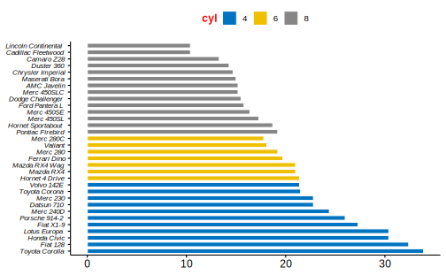

更多的设置可见： https://rpkgs.datanovia.com/ggpubr/reference/font.html


## `ggdotchart`  


`ggdotchart` 是 ggpubr 中用于创建**点图**（一个离散分组变量，一个连续变量，非散点图）的函数：  


```r
## 基础用法 
ggdotchart(dfm,
           x = "name",
           y = "mpg")
```

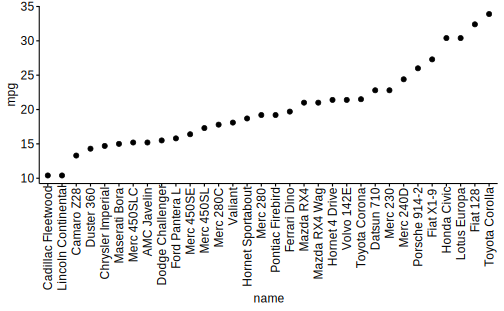

在此基础上，`ggdotchart()` 可以轻松绘制出 Cleveland 点图（lollipop chart）, 关键是设置参数 `add = "segment"`：  


```r
ggdotchart(dfm,
           x = "name",
           y = "mpg",
           add = "segment")  # Add segments from y = 0 to dots
```

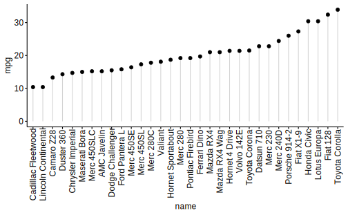

* 将 `cyl` 映射到点的颜色上  
* 用 `add.params` 改变线段的样式  
* 使用 ggpubr 的主题 `theme_pubr()`


```r
ggdotchart(dfm, x = "name", y = "mpg",
           color = "cyl",             # Color by groups
           palette = c("#00AFBB", "#E7B800", "#FC4E07"), # Custom color palette
                     
           add = "segments",                             # Add segments from y = 0 to dots
           add.params = list(color = "lightgray", size = 2),
           ggtheme = theme_pubr()                        # ggplot2 theme
           )
```

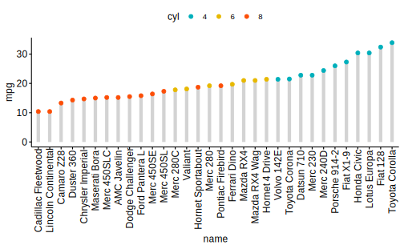

下面：  

* `ggdotchart`默认的排序是升序，更改为`sorting = “descending”`  
* 翻转坐标轴: `rotate = TRUE`  
* 使得 `mpg` 的值在组内排序，而不是总体排序：`group = “cyl”` 
* 增大点的大小，为了下一步增加标签 `dot.size = 6`  
* 增加数据标签 `label = “mpg”` 或者 `label = round(dfm$mpg)`  
* 用 `font.label` 设置数据标签的格式    


```r
ggdotchart(dfm, x = "name", y = "mpg",
           color = "cyl",                                # Color by groups
           palette = c("#00AFBB", "#E7B800", "#FC4E07"), # Custom color palette
           sorting = "descending",                       # Sort value in descending order
           add = "segments",                             # Add segments from y = 0 to dots
           add.params = list(color = "lightgray", size = 2),
           rotate = TRUE,                                # Rotate vertically
           group = "cyl",                                # Order by groups
           dot.size = 6,                                 # Large dot size
           label = round(dfm$mpg),                        # Add mpg values as dot labels
           font.label = list(color = "white", size = 9, 
                             vjust = 0.5),               # Adjust label parameters
           ggtheme = theme_pubr()                        # ggplot2 theme
           )
```

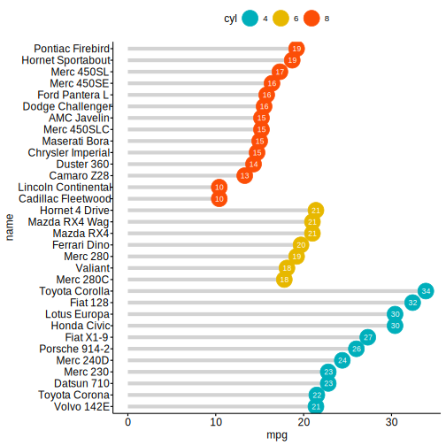


`ggdotchart` 还有一大特色： 坐标轴标签的颜色也成为可以映射的变量。在下面的图中设置： `y.text.col = TRUE` 将当前分组变量映射到 y 轴标签颜色上 ; `theme_cleveland()` 添加虚线：  


```r
ggdotchart(dfm, x = "name", y = "mpg",
           color = "cyl",                                # Color by groups
           palette = c("#00AFBB", "#E7B800", "#FC4E07"), # Custom color palette
           sorting = "descending",                       # Sort value in descending order
           rotate = TRUE,                                # Rotate vertically
           dot.size = 2,                                 # Large dot size
           y.text.col = TRUE,                            # Color y text by groups
           ggtheme = theme_pubr()                        # ggplot2 theme
           ) +
  theme_cleveland() + # Add dashed grids + 
  font("y.text", size = 8, face = "italic")
```

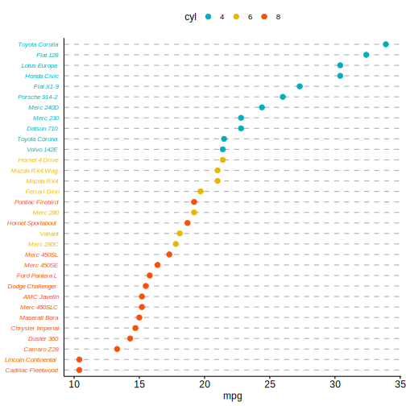


## `ggscatter`  

参考： https://rpkgs.datanovia.com/ggpubr/reference/ggscatter.html  

`ggscatter()`用于创建二维散点图（两个连续型变量，区分于之前的点图）：  


```r
df <- mtcars
df$cyl <- as.factor(df$cyl)
## 简单散点图
ggscatter(df, x = "wt", 
          y = "mpg",
          color = "cyl")
```

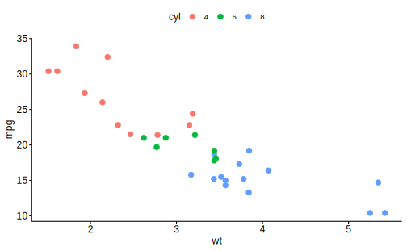


这里介绍 `ggscatter` 的最主要原因是因为它可以很方便地在散点图上添加有关回归模型和相关系数的数据标记：  

* `add = "reg.line"` 和 `add = "loess"` 添加线性回归和局部加权回归拟合线  
* `add.params`: 设置拟合线的样式，例如 `add.params = list(color = "red")`  
* `cor.coef = TRUE` 添加数据标记，展示相关系数和其 p value   
* `cor.coef.args` 指定相关系数算法和呈现细节
* `cor.method`: 指定相关系数的算法，有"pearson", "kendall" 和 "spearman"  
* `cor.coef.size`: 调节该标签的大小 	


```r
ggscatter(df, x = "wt", y = "mpg",
   color = "black", shape = 21, size = 3, # Points color, shape and size
   add = "reg.line",  # Add regressin line
   add.params = list(color = "blue", fill = "lightgray"), # Customize reg. line
   conf.int = TRUE, # Add confidence interval
   cor.coef = TRUE, # Add correlation coefficient. see ?stat_cor
   cor.coeff.args = list(method = "pearson", label.x = 3, label.sep = "\n")
   )
```

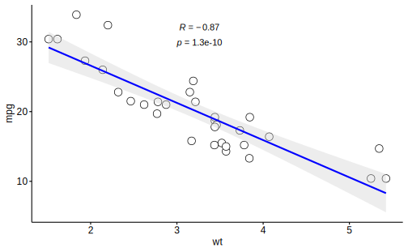


`conf.int = TRUE`（默认） 和 `conf.int.level`（默认 0.95） 可以绘制置信区间：  


```r
ggscatter(
  df,
  x = "wt",
  y = "mpg",
  color = "black", shape = 21, size = 3,
  add = "loess",
  add.params = list(color = "blue"),
  conf.int = TRUE,
  conf.int.level = 0.9
) 
```

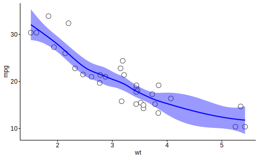


## `ggscatterhist`  

ggpubr 中的 `ggscatterhist()` 函数将散点图与直方图 / 密度图结合在一起：  


```r
## 创造数据
set.seed(20191011)
x1 <- rnorm(200, 1.5, 0.5)
y1 <- rnorm(200, 2, 0.2)
x2 <- rnorm(200, 2.5, 0.5)
y2 <- rnorm(200, 2.5, 0.5)
x3 <- rnorm(200, 1, 0.3)
y3 <- rnorm(200, 1.5, 0.2)
data <- tibble(x = c(x1, x2, x3),
               y = c(y1, y2, y3),
               class = rep(c("A", "B", "C"), each = 200))

## 绘图
ggscatterhist(
  data = data,
  x = "x",
  y = "y",
  shape = 21,
  color = "black",
  fill = "class",
  palette = c("#00AFBB", "#E7B800", "#FC4E07")
)
```

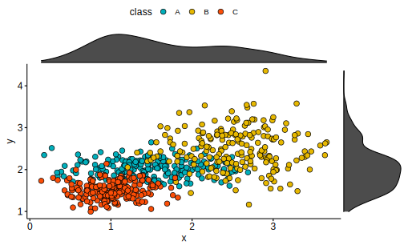

`margin.plot = "density"`(默认) 绘制核密度估计图，选择 "histogram" 绘制直方图；"boxplot"为直方图：  


```r
ggscatterhist(
  data = data,
  x = "x",
  y = "y",
  shape = 21,
  color = "black",
  fill = "class",
  palette = c("#00AFBB", "#E7B800", "#FC4E07"),
  margin.plot = "histogram"
)
```

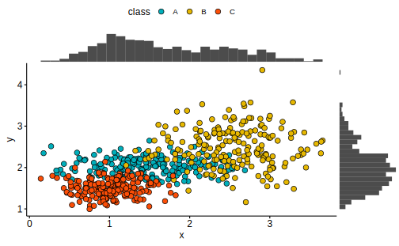


`margin.params` 用一个列表设置边缘图形的参数；`ggtheme` 设置主题：  


```r
ggscatterhist(
  data = data,
  x = "x",
  y = "y",
  shape = 21,
  color = "black",
  fill = "class",
  palette = c("#00AFBB", "#E7B800", "#FC4E07"),
  margin.plot = "boxplot",
  margin.params = list(alpha = 0.5, fill = "class", color = "black"),
  ggtheme = theme_minimal()
) 
```

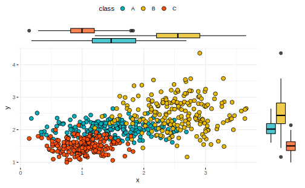

`xlab` 和 `ylab` 设置坐标轴标签，`title` 设置图表标题：  


```r
ggscatterhist(
  data = data,
  x = "x",
  y = "y",
  shape = 21,
  color = "black",
  fill = "class",
  palette = c("#00AFBB", "#E7B800", "#FC4E07"),
  margin.plot = "boxplot",
  margin.params = list(alpha = 0.5, fill = "class", color = "black"),
  ggtheme = theme_minimal(),
  xlab = FALSE,  ## 取消标签
  ylab = FALSE,
  title = "A scatterhist plot"
) 
```

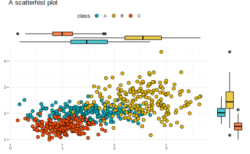


## `ggarrange`  

参考： https://www.rdocumentation.org/packages/ggpubr/versions/0.2.3/topics/ggarrange  

`ggarrange()` 是用来排版多个 ggplot 图像对象的函数(不止是 ggplot2 的图形才是 ggplot 对象)。最重要的几个参数为：  

```r
ggarrange(...
          nrow,
          ncol,
          widths,
          heights,
          label)
```


* `...`: 任意数目的 ggplot 对象，传入 `NULL` 则对应位置为空白  
* `nrow` 和 `ncol` 控制多个 ggplot 对象呈现的行数和列数  
* `widths` 和 `heights` 控制一行 / 列内图像所占区域的相对大小，如 `width = c(2, 1)` 将绘图区横向切分为两个部分，宽度比为 2 ： 1  
* 每个子图的标签  


```r
data("ToothGrowth")
df <- ToothGrowth
df$dose <- as.factor(df$dose)


# Box plot
bxp <- ggboxplot(df, x = "dose", y = "len",
    color = "dose", palette = "jco")
# Dot plot
dp <- ggdotplot(df, x = "dose", y = "len",
    color = "dose", palette = "jco")
# Density plot
dens <- ggdensity(df, x = "len", fill = "dose", palette = "jco")

# Arrange
ggarrange(bxp, dp, NULL, dens, 
          ncol = 2, nrow = 2,
          labels = c("one", "two", "three", "four"))
```

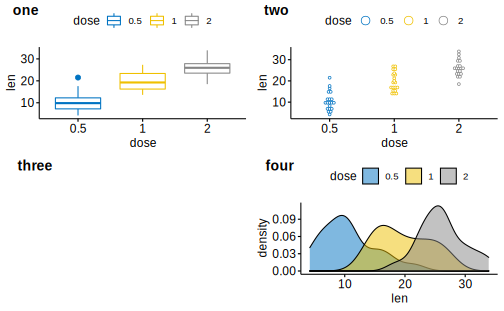


`common.legend = TRUE` 可以为多个 ggplot 对象 创建统一图例：  


```r
ggarrange(bxp, dp,
          ncol = 2,
          common.legend = TRUE)
```

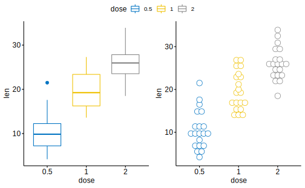

