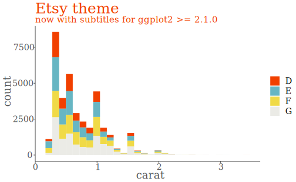
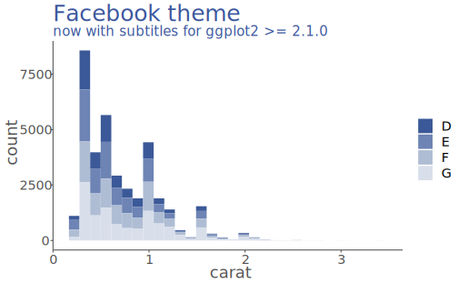
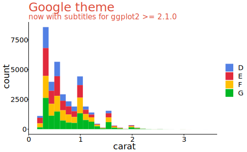
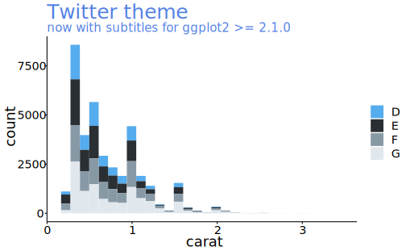

# ggtech  


```r
# 安装
# devtools::install_github("ricardo-bion/ggtech", dependencies=TRUE)
library(ggtech)
```

参考：https://github.com/ricardo-bion/ggtech   

ggtech 提供了 Facebook、google、twitter、etsy、23andme 几家科技公司的配色标度和主题设置，使用之前，需要先下载一些字体 https://github.com/ricardo-bion/ggtech#install-fonts  

在 `theme_tech(theme)` 中选用主题，在 `scale_fill_tech(theme)` 和 `scale_color_tech(theme)` 中设置颜色标度。  


```r
p <- ggplot(diamonds %>% 
         filter(color %in% LETTERS[4:7]), aes(carat)) + 
  geom_histogram(aes(fill = color))


p + 
  theme_tech(theme="etsy") + 
  scale_fill_tech(theme="etsy") + 
  labs(title="Etsy theme", 
       subtitle="now with subtitles for ggplot2 >= 2.1.0")
```




```r
p + 
  theme_tech(theme="facebook") +
  scale_fill_tech(theme="facebook") + 
  labs(title="Facebook theme", 
       subtitle="now with subtitles for ggplot2 >= 2.1.0")
```




```r
p + 
  theme_tech(theme="google") + 
  scale_fill_tech(theme="google") + 
  labs(title="Google theme", 
       subtitle="now with subtitles for ggplot2 >= 2.1.0")
```




```r
p + 
  theme_tech(theme="twitter") + 
  scale_fill_tech(theme="twitter") + 
  labs(title="Twitter theme", 
       subtitle="now with subtitles for ggplot2 >= 2.1.0")
```




