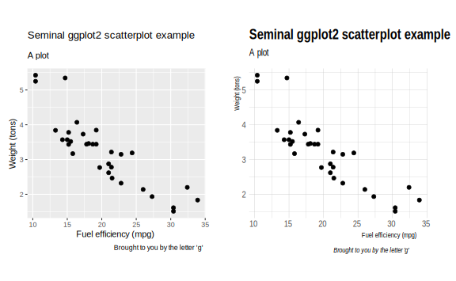
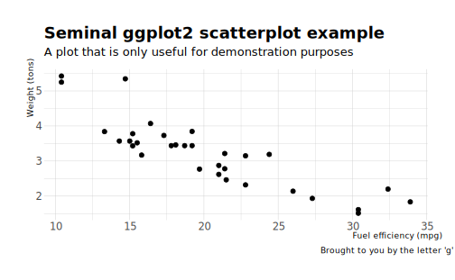
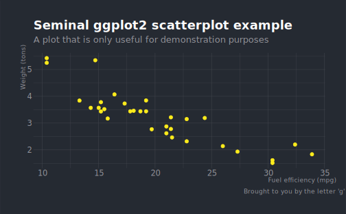
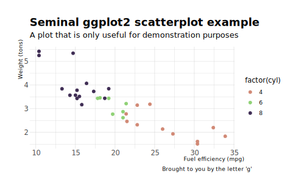
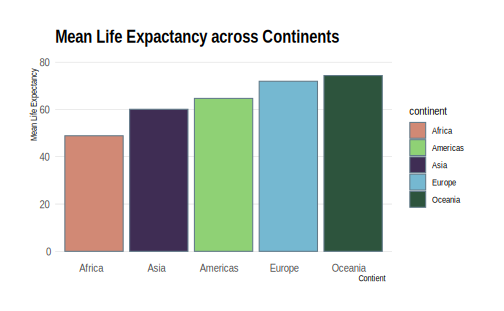

# hrbrthemes  

参考： https://github.com/hrbrmstr/hrbrthemes  

`hrbrthemes` 为 ggplot2 提供了一些利于印刷的 (typography-centric) 主题、标度、调色板和字体。  

`theme_ipsum()` 是 `hrbrthemes` 中的核心主题("ipsum" 在拉丁语中意为 "precise")，使用了较为紧凑的 Arial Narrow 字体，调整了坐标轴标题的位置，和简洁的背景设置。


```r
library(hrbrthemes)
library(patchwork)
```


## 主题  


```r
p1 <- ggplot(mtcars, aes(mpg, wt)) +
  geom_point() +
  labs(x="Fuel efficiency (mpg)", y="Weight (tons)",
       title="Seminal ggplot2 scatterplot example",
       subtitle="A plot",
       caption="Brought to you by the letter 'g'")

p2 <- ggplot(mtcars, aes(mpg, wt)) +
  geom_point() +
  labs(x="Fuel efficiency (mpg)", y="Weight (tons)",
       title="Seminal ggplot2 scatterplot example",
       subtitle="A plot",
       caption="Brought to you by the letter 'g'") + 
  theme_ipsum()

p1 + p2
```

<div class="figure">

<p class="caption">(\#fig:unnamed-chunk-3)theme_grey vs. theme_ipsum</p>
</div>


`theme_ipsum` 有几个变体，主要区别在字体和背景颜色上：    

* `theme_ipsum_es`: Ccon Sans Condensed  
* `theme_ipsum_rc`: Roboto Condensed  
* `theme_ipsum_ps`: IBM Plex Sans font  
* `theme_ipsum_pub`: Public Sans  
* `theme_ipsum_tw`: Titilium Web  
* `theme_modern_rc`: Roboto Condensed dark theme(暗色)  
* `theme_ft_rc`: Dark theme based on FT’s dark theme (Roboto Condensed, 暗色)  


**Roboto Condensed**  


```r
ggplot(mtcars, aes(mpg, wt)) +
  geom_point() +
  labs(x="Fuel efficiency (mpg)", y="Weight (tons)",
       title="Seminal ggplot2 scatterplot example",
       subtitle="A plot that is only useful for demonstration purposes",
       caption="Brought to you by the letter 'g'") + 
  theme_ipsum_rc()
```




**FT Theme**  


```r
ggplot(mtcars, aes(mpg, wt)) +
  geom_point(color = ft_cols$yellow) +
  labs(x="Fuel efficiency (mpg)", y="Weight (tons)",
       title="Seminal ggplot2 scatterplot example",
       subtitle="A plot that is only useful for demonstration purposes",
       caption="Brought to you by the letter 'g'") + 
  theme_ft_rc()
```




## 标度  

**颜色和填充色标度**： `scale_color_ipsum`、`scale_fill_ipsum`  


```r
ggplot(mtcars, aes(mpg, wt)) +
  geom_point(aes(color = factor(cyl))) +
  labs(x = "Fuel efficiency (mpg)",  y = "Weight (tons)",
       title="Seminal ggplot2 scatterplot example",
       subtitle="A plot that is only useful for demonstration purposes",
       caption="Brought to you by the letter 'g'") + 
  scale_color_ipsum() +
  theme_ipsum_rc()
```




```r
mean_lifeExp <- gapminder::gapminder %>% 
  group_by(continent) %>%
  summarize(mean = mean(lifeExp, na.rm = T))

mean_lifeExp %>%
  ggplot(aes(fct_reorder(continent, mean), mean)) + 
  geom_col(aes(fill = continent)) + 
  scale_fill_ipsum() + 
  scale_y_continuous(limits = c(0, 80)) + 
  labs(x = "Contient", y = "Mean Life Expectancy",
       title = "Mean Life Expactancy across Continents") + 
  theme_ipsum(grid = "Y")
```




**坐标轴标度**： `scale_x/y_percent`、`scale_x/y_comma`

涉及数据量级较大时，`percent` 标度添加千分位标记法：  

```r

count(mpg, class) %>% 
  mutate(n = n * 2000) %>% 
  arrange(n) %>% 
  mutate(class=factor(class, levels=class)) %>% 
  ggplot(aes(class, n)) +
  geom_col() +
  geom_text(aes(label=scales::comma(n)), hjust=0, nudge_y=2000) +
  scale_y_comma(limits=c(0,150000)) +
  coord_flip() +
  labs(x="Fuel efficiency (mpg)", y="Weight (tons)",
       title="Seminal ggplot2 column chart example with commas",
       subtitle="A plot that is only useful for demonstration purposes, esp since you'd never\nreally want direct labels and axis labels",
       caption="Brought to you by the letter 'g'") + 
  theme_ipsum_rc(grid="X")
```


在百分比面积图、条形图中，常采用的一个变换是 `scale_y_continuous(labels = scales::percent)`， `scale_y_percent()` 相当于是对这种设置的封装：  


```r
uspopage <- gcookbook::uspopage
ggplot(uspopage, aes(Year, Thousands, fill = AgeGroup)) + 
  geom_area(position = "fill") +
  scale_fill_ipsum() +
  scale_x_continuous(expand=c(0,0)) +
  scale_y_percent() +
  labs(title="Age distribution of population in the U.S., 1900-2002",
       subtitle="Example data from the R Graphics Cookbook",
       caption="Source: R Graphics Cookbook") +
  theme_ipsum_rc(grid="XY") +
  theme(axis.text.x=element_text(hjust=c(0, 0.5, 0.5, 0.5, 1))) +
  theme(legend.position="bottom")
```


