# patchwork

安装： `devtools::install_github("thomasp85/patchwork")`  


```r
library(patchwork)
```

参考：https://github.com/thomasp85/patchwork  

`patchwork` 用于组合多个 ggplot 对象，方法非常简单，直接用 `+` 连接这些对象即可：  


```r
p1 <- ggplot(mtcars) + geom_point(aes(mpg, disp))
p2 <- ggplot(mtcars) + geom_boxplot(aes(gear, disp, group = gear))

p1 + p2
```


当然，不必把 ggplot2 对象存储到某个变量中，而是可以直接通过绘图的叠加语法组合图形：  


```r
ggplot(mtcars) +
  geom_point(aes(mpg, disp)) +
  ggplot(mtcars) + 
  geom_boxplot(aes(gear, disp, group = gear))
```

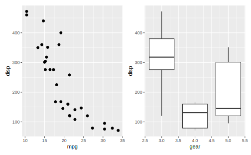

## 布局和嵌套    

默认情况下，多个 ggplot 对象进**行叠加**，若一行空间已满，进入下一行：    


```r
p1 <- ggplot(mtcars) + geom_point(aes(mpg, disp))
p2 <- ggplot(mtcars) + geom_boxplot(aes(gear, disp, group = gear))
p3 <- ggplot(mtcars) + geom_smooth(aes(disp, qsec))
p4 <- ggplot(mtcars) + geom_bar(aes(carb))
p5 <- ggplot(mtcars) + geom_violin(aes(cyl, mpg, group = cyl))

p1 + p2 + p3 + p4 + p5
```

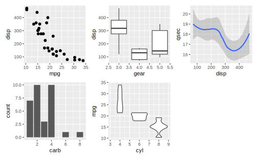

可以追加 `plot_layout` 控制 patchwork 组合图形的布局，以下是主要参数：  

* `ncol`、`nrow`: 组合后的维度  
* `byrow`: 与 `matrix()` 中类似，按行排列或按列排列  
* `widths`、`heights`: 一个指定各个 ggplot 对象在最终图形中相对宽度、高度的向量  


```r
# Use byrow to change how the grid is filled out
p1 + p2 + p3 + p4 + p5 + plot_layout(byrow = FALSE)
```

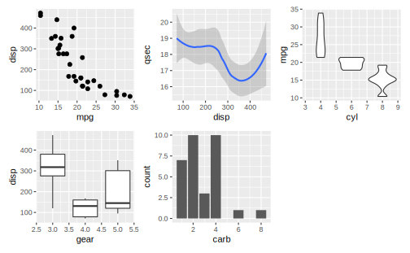


```r
# Change the grid dimensions
p1 + p2 + p3 + p4 + p5 + plot_layout(ncol = 2, widths = c(1, 2))
```

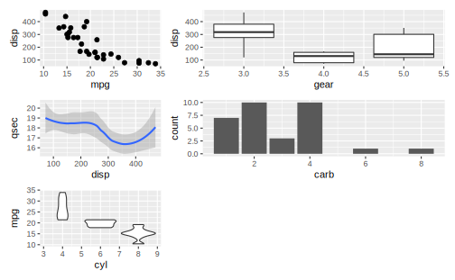


可以用 `()` 表示 ggplot 对象在组合时的层级关系：  


```r
p1 +
  p2 +
  (p3 +
     p4 +
     plot_layout(ncol = 1)
  ) +
  p5 +
  plot_layout(widths = c(2, 1))
```

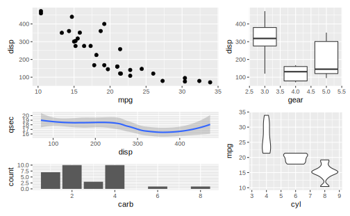

`plot_spacer` 是一个空的占位对象：  


```r
p1 + plot_spacer() + p2
```

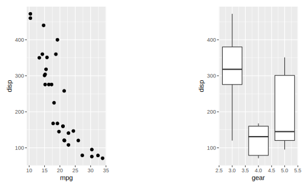


## 注解  

`plot_annotaion()` 向组合对象添加注解，几个参数：  

* `title`、`subtitle`、`caption`: 最终**组合对象**的标题、副标题和注释 
* `tag_levels`: 每个子对象的标签。集中选择： "a" 小写字母，"A" 大写字母，"1" 阿拉伯数字，"i" 小写罗马数字，"I" 大写罗马数字  
* `tag_prefix`、`tag_suffix`: 标签的前缀和后缀  


```r
p1 + p2 + 
  plot_annotation(title = "A great plot!", caption = "Source: me",
                          tag_levels = "i", tag_prefix = "Fig ")
```

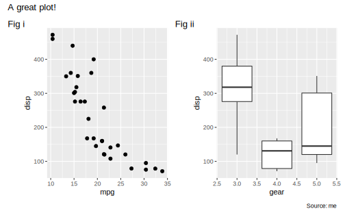


## 运算符  

除了 `+` 以外， patchwork 还定义了一些运算符。  

`-` 使其左侧的（全部）对象和右侧的（全部）对象处于同一层级：  


```r
p1 + p2 - p3 + plot_layout(ncol = 1)
```

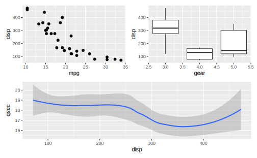


\BeginKnitrBlock{rmdtip}<div class="rmdtip">A note on semantics. If `-` is read as minus its use makes little sense as we are not removing plots. Think of it as a hyphen instead.</div>\EndKnitrBlock{rmdtip}


`|` 和 `\` 表示对象是否位于同一行：  


```r
p1 | p2 | p3 / p4  ## / 的优先级高于 | 
```

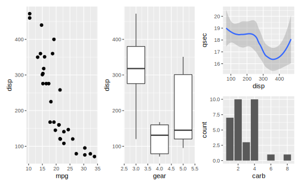


```r
(p1 | p2 | p3) /
  p4
```

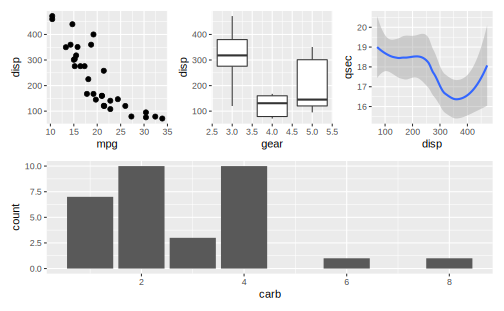


`*` 和 `&` 可以便捷地修饰组合对象中的元素，`*` 只作用于最顶层的元素，而 `&` 作用于所有元素：  


```r
## 所有元素应用 bbc_style()
windowsFonts(Helvetica = "TT Arial")
(p1 + (p2 + p3) + plot_layout(nrow = 2)) & bbplot::bbc_style()
```

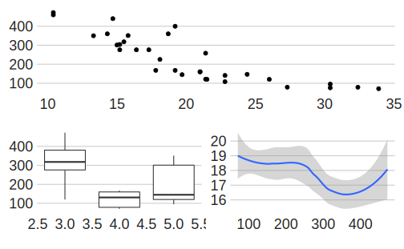


```r
## 最顶层元素应用 bbc_style()
(p1 + (p2 + p3) + plot_layout(nrow = 2)) * bbplot::bbc_style()
```

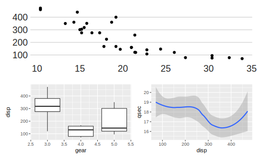

## 


```r
library(grid)
```

## 组合非 ggplot 元素  


```r
library(grid)
library(gridExtra)
```


```r
p1 + grid::textGrob('Some really important text!\n这真的很重要!')
```

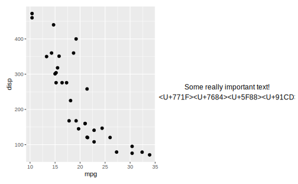


```r
tt3 <- ttheme_minimal(
  core=list(bg_params = list(fill = blues9[1:4], col=NA),
            fg_params=list(fontface=3)),
  colhead=list(fg_params=list(col="navyblue", fontface=4L)),
  rowhead=list(fg_params=list(col="orange", fontface=3L)))

p1 + gridExtra::tableGrob(mtcars[1:10, 1:2], theme = tt3)
```

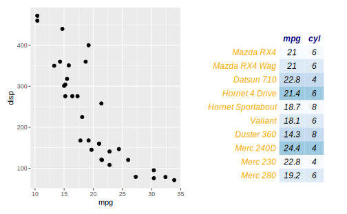

