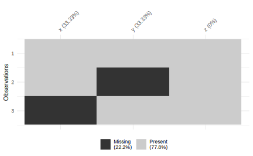

# 处理缺失值  {#missing-values}  


## 探索  {#explore-missing}

`drop_na()` 根据列去除带有缺失值的观测：  


```r
df <- tibble(x = c(1, 2, NA), y = c("a", NA, "b"))
df %>% drop_na() # df %>% drop_na(x, y)
#> # A tibble: 1 x 2
#>       x y    
#>   <dbl> <chr>
#> 1     1 a
df %>% drop_na(x)
#> # A tibble: 2 x 2
#>       x y    
#>   <dbl> <chr>
#> 1     1 a    
#> 2     2 <NA>
```


## 填充 {#fill-missing}

https://jiangjun.link/post/2018/12/r-missing-data  

用中位数或均值填补缺失值   


```r
library(tidyverse)
df <- tibble(x = c(1, 2, NA, 5, 9, NA),
             y = c(NA, 20, 1, NA, 5, NA),
             z = 5:10)


df %>% 
  mutate_all( ~ ifelse(is.na(.x), median(.x, na.rm = T), .))
#> # A tibble: 6 x 3
#>       x     y     z
#>   <dbl> <dbl> <int>
#> 1   1       5     5
#> 2   2      20     6
#> 3   3.5     1     7
#> 4   5       5     8
#> 5   9       5     9
#> 6   3.5     5    10
```

\@ref(missing-values) 中的 `fill()`:  


```r
df <- data.frame(Month = c(1:8, NA, 10), Year = c(2000, rep(NA, 9)), values = c(NA, 12:20))
df
#>    Month Year values
#> 1      1 2000     NA
#> 2      2   NA     12
#> 3      3   NA     13
#> 4      4   NA     14
#> 5      5   NA     15
#> 6      6   NA     16
#> 7      7   NA     17
#> 8      8   NA     18
#> 9     NA   NA     19
#> 10    10   NA     20
df %>% fill(starts_with("Y"), .direction = "down")
#>    Month Year values
#> 1      1 2000     NA
#> 2      2 2000     12
#> 3      3 2000     13
#> 4      4 2000     14
#> 5      5 2000     15
#> 6      6 2000     16
#> 7      7 2000     17
#> 8      8 2000     18
#> 9     NA 2000     19
#> 10    10 2000     20
```


或者 `janitor::remove_empty()`  


`full_seq()`，得到完整的序列：  


```r
full_seq(c(1, 2, 4, 5, 10), 1)
#>  [1]  1  2  3  4  5  6  7  8  9 10
```


`replace_na()` replace missing values:  


```r
df <- tibble(x = c(1, 2, NA), y = c("a", NA, "b"), z = list(1:5, NULL, 10:20))
df %>% mutate(x = replace_na(x, 0))
#> # A tibble: 3 x 3
#>       x y     z         
#>   <dbl> <chr> <list>    
#> 1     1 a     <int [5]> 
#> 2     2 <NA>  <NULL>    
#> 3     0 b     <int [11]>
df %>% replace_na(list(x = 0, y = "unknown"))
#> # A tibble: 3 x 3
#>       x y       z         
#>   <dbl> <chr>   <list>    
#> 1     1 a       <int [5]> 
#> 2     2 unknown <NULL>    
#> 3     0 b       <int [11]>
```


```r
# NULL are the list-col equivalent of NAs
df %>% replace_na(list(z = list(5)))
#> # A tibble: 3 x 3
#>       x y     z         
#>   <dbl> <chr> <list>    
#> 1     1 a     <int [5]> 
#> 2     2 <NA>  <dbl [1]> 
#> 3    NA b     <int [11]>
```


```r
df$x %>% replace_na(0)
#> [1] 1 2 0
df$y %>% replace_na("unknown")
#> [1] "a"       "unknown" "b"
```


`visdat::vis_missing()`  


```r
library(visdat)
vis_miss(df)
```




more advanced:  mice 或 Amelia


