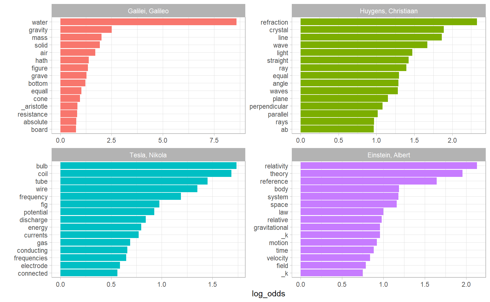
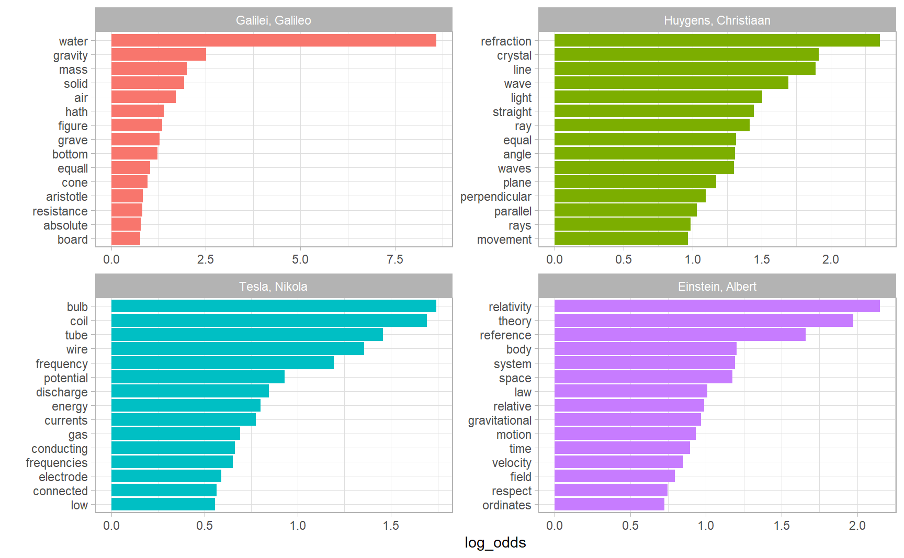

# Analyzing word and document frequency 


A central question in text mining and natural language processing is how to quantify what a document is about.  This chapter presents two approaches of measuring the "keywords" of a particular document amid other, tf-idf and weighted log odds ratio. 


```r
library(patchwork)
```


## tf-idf  

The logic of tf-idf is that the words containing the greatest information about a particular document are the words that **appear many times in that document, but in relatively few others**. Calculating tf-idf attempts to find the words that are important (i.e., common) in a text, but not too common. It is widely used in document search and information retrieval tasks. 14 To the extent tf.idf reliably captures what is distinctive about a particular document, it could be interpreted as a feature evaluation technique.  

Let $w = 1, 2, ..., W$ index words and $\boldsymbol{y}$ denots the W-vector of word counts in the corpus. Let $i \in I$ index documents in the corpus, let $\boldsymbol{y^i}$ denotes the W-vector of word counts of document $i$， $y_w^i$ the count of word $w$ in document $i$, and $n^i$ the total count of words in document $i$.     

Term frequency (tf) of a word $w$ in document $i$ is defined as its proprotions

$$
f_{w}^{i} = \frac{y_{w}^{i}}{n^{i}}
$$

 We can see that $\text{tf}_{ij}$ is essentially a scaling of term counts $n^{i}$, so that the metric will not be biased against words in lengthy documents.  

.Inverse document frequency (idf) of word $w$ in the corpus is defined as 

$$
\text{idf}_i = \log{\frac{|D|}{|{j:t_i \in d_j}|}}
$$
where $|D|$ is the number of documents in the corpus, and $|{j:t_i \in d_j}|$ the number of documents containing word $i$. We can let  $df_w$ denote the fraction of documents that contain word $w$ at least once, then idf can be stated as 

$$
\text{idf}_i = \log{\frac{1}{df_{w}}}
$$
and tf-idf, the production of term frequency and document frequency, as 

$$
tf.idf_w^i = f_w^i \log{\frac{1}{df_{w}}}
$$


### Term frequency in Jane Austen’s novels  


```r
library(janeaustenr)

book_words <- austen_books() %>%
  unnest_tokens(word, text) %>% 
  add_count(book, name = "total_words") %>%
  group_by(book, total_words) %>% 
  count(word, sort = TRUE) %>% 
  ungroup()

book_words
#> # A tibble: 40,379 x 4
#>   book           total_words word      n
#>   <fct>                <int> <chr> <int>
#> 1 Mansfield Park      160460 the    6206
#> 2 Mansfield Park      160460 to     5475
#> 3 Mansfield Park      160460 and    5438
#> 4 Emma                160996 to     5239
#> 5 Emma                160996 the    5201
#> 6 Emma                160996 and    4896
#> # ... with 4.037e+04 more rows
```

There is one row in this book_words data frame for each word-book combination; `n` is the number of times that word is used in that book and `total_words` is the total words in that book. The usual suspects are here with the highest `n`, “the”, “and”, “to”, and so forth.  

let’s look at the distribution of `n / total` for each novel, which is the predefined term frequency:  


```r
ggplot(book_words) + 
  geom_histogram(aes(n / total_words, fill = book), show.legend = FALSE) +
  xlim(NA, 0.0009) + 
  facet_wrap(~ book, nrow = 3, scales = "free_y")
```

<div class="figure" style="text-align: center">

<p class="caption">(\#fig:tf-distribution)Term Frequency Distribution in Jane Austen’s Novels</p>
</div>

### Zipf’s law  

In Figure \@ref(fig:tf-distribution) we see the characteristic long-tailed distribution of term frequency. In fact, those types of long-tailed distributions are so common in any given corpus of natural language (like a book, or a lot of text from a website, or spoken words) that the relationship between the frequency that a word is used and its rank has been the subject of study; a classic version of this relationship is called Zipf’s law, after George Zipf, a 20th century American linguist, which can be stated as.  

$$
\text{word rank} \times \text{term frequency} = c
$$

where $c$ is a constant.  


```r
freq_by_rank <- book_words %>% 
  group_by(book) %>% 
  mutate(rank = row_number(), 
         `term frequency` = n / total_words)

freq_by_rank
#> # A tibble: 40,379 x 6
#> # Groups:   book [6]
#>   book           total_words word      n  rank `term frequency`
#>   <fct>                <int> <chr> <int> <int>            <dbl>
#> 1 Mansfield Park      160460 the    6206     1           0.0387
#> 2 Mansfield Park      160460 to     5475     2           0.0341
#> 3 Mansfield Park      160460 and    5438     3           0.0339
#> 4 Emma                160996 to     5239     1           0.0325
#> 5 Emma                160996 the    5201     2           0.0323
#> 6 Emma                160996 and    4896     3           0.0304
#> # ... with 4.037e+04 more rows
```

Zipf’s law is often visualized by plotting rank on the x-axis and term frequency on the y-axis, on **logarithmic scales**. Plotting this way, an inversely proportional relationship will have a constant, negative slope. 

$$
\lg{(\text{term frequency})} = - \lg{(\text{term frequency})} + \lg{c} 
$$


```r
freq_by_rank %>% 
  ggplot(aes(rank, `term frequency`, color = book)) + 
  geom_line(size = 1.1, alpha = 0.8, show.legend = FALSE) + 
  scale_x_log10() +
  scale_y_log10()
```


The slope is not quite constant, though; perhaps we could view this as a broken power law with, say, three sections. Let’s see what the exponent of the power law is for the middle section of the rank range.  

```r
rank_subset <- freq_by_rank %>% 
  filter(rank < 500, rank > 10)

rank_subset %>% 
  lm(log10(`term frequency`) ~ log10(rank), data = .) %>%
  summary()
#> 
#> Call:
#> lm(formula = log10(`term frequency`) ~ log10(rank), data = .)
#> 
#> Residuals:
#>      Min       1Q   Median       3Q      Max 
#> -0.11814 -0.01011 -0.00217  0.00928  0.08181 
#> 
#> Coefficients:
#>              Estimate Std. Error t value            Pr(>|t|)    
#> (Intercept) -0.622569   0.002218    -281 <0.0000000000000002 ***
#> log10(rank) -1.112522   0.000953   -1168 <0.0000000000000002 ***
#> ---
#> Signif. codes:  0 '***' 0.001 '**' 0.01 '*' 0.05 '.' 0.1 ' ' 1
#> 
#> Residual standard error: 0.0184 on 2932 degrees of freedom
#> Multiple R-squared:  0.998,	Adjusted R-squared:  0.998 
#> F-statistic: 1.36e+06 on 1 and 2932 DF,  p-value: <0.0000000000000002
```
The $R^2$ is approximately $1$, so that we consider the relationship between log word rank and log tf to be $\lg{\text{tf}} = -1.11\lg{\text{rank}} - 0. 62$.  


```r
freq_by_rank %>% 
  ggplot(aes(rank, `term frequency`, color = book)) + 
  geom_abline(intercept = -0.62, slope = -1.1, color = "gray50", linetype = 2) +
  geom_line(size = 1.1, alpha = 0.8, show.legend = FALSE) + 
  scale_x_log10() +
  scale_y_log10()
```


We have found a result close to the classic version of Zipf’s law for the corpus of Jane Austen’s novels. The deviations we see here at high rank are not uncommon for many kinds of language; **a corpus of language often contains fewer rare words than predicted by a single power law**. The deviations at low rank are more unusual. Jane Austen uses a lower percentage of the most common words than many collections of language. This kind of analysis could be extended to compare authors, or to compare any other collections of text; it can be implemented simply using tidy data principles.

### Word rank slope chart   

[Emil Hvitfeldt](https://www.hvitfeldt.me/) had a great [blog post](https://www.hvitfeldt.me/blog/word-rank-slope-charts/) on how to make a word rank slope chart. This plot is generally designed to visualize the word rank difference of a set of paired words. If a writer is more comfortable using masculine words, then we could expect that "he" has a lower word rank than "she" (words are ranked in an descending order based on counts, as in `book_words`).  

In Jane Austen's novels, suppose we decide to compare word rank on a set of words related to gender  

```r
gender_words <- tribble(
  ~Men, ~Women,
  "he", "she",
  "his", "her",
  "man", "woman",
  "men", "women",
  "boy", "girl",
  "himself", "herself"
)
```

We unnest 6 books into separate words as usual, and `pull()` them out as a vector.


```r
ordered_words <- austen_books() %>% 
  unnest_tokens(word, text) %>%
  count(word, sort = TRUE) %>% 
  pull(word)
```


We then use `match()` to match individual words to its word rank. The trick is using the logged rank rather the rank itself, otherwise the y scale will be heavily extended by large word rank. `scale_y_log10()` is not the best option in this case, since we need `scale_y_reverse()` to put the most frequent words on the top of our plot, and labels on the y axis can be fixed by passing a function to `label`

```r
gender_words <- gender_words %>% 
  mutate(male_rank_log10 = match(Men, ordered_words) %>% log10(),
         female_rank_log10 = match(Women, ordered_words) %>% log10(),
         rank_diff_log10 = male_rank_log10 - female_rank_log10) %>% 
  pivot_longer(male_rank_log10:female_rank_log10, 
               names_to = "index", 
               values_to = "rank") %>% 
  mutate(label = if_else(index == "male_rank_log10", Men, Women)) %>%
  mutate(index = fct_recode(index,
                            "male" = "male_rank_log10",
                            "female" = "female_rank_log10"))

limits <-  max(abs(gender_words$rank_diff_log10)) * c(-1, 1)

library(ggrepel)
gender_words %>%
  ggplot(aes(index, rank, group = Men)) + 
  geom_line(aes(color = rank_diff_log10), show.legend = FALSE) + 
  geom_text_repel(aes(label = label)) + 
  scale_y_reverse(label = function(x) 10 ^ x, breaks = scales::breaks_pretty(n = 3)) +
  scale_color_fermenter(type = "div", palette = "Spectral", limits = limits) + 
  theme_minimal()
```


### The `bind_tf_idf()` function  

The `bind_tf_idf()` function in the tidytext package takes a tidy text dataset as input with one row per token (term), per document. One column (`word` here) contains the terms/tokens, one column contains the documents (`book` in this case), and the last necessary column contains the counts, how many times each document contains each term (`n` in this example).  


```r
book_words <- book_words %>% 
  select(-total_words) %>%
  bind_tf_idf(term = word, document = book, n = n)

book_words
#> # A tibble: 40,379 x 6
#>   book           word      n     tf   idf tf_idf
#>   <fct>          <chr> <int>  <dbl> <dbl>  <dbl>
#> 1 Mansfield Park the    6206 0.0387     0      0
#> 2 Mansfield Park to     5475 0.0341     0      0
#> 3 Mansfield Park and    5438 0.0339     0      0
#> 4 Emma           to     5239 0.0325     0      0
#> 5 Emma           the    5201 0.0323     0      0
#> 6 Emma           and    4896 0.0304     0      0
#> # ... with 4.037e+04 more rows
```

Notice that idf and thus tf-idf are zero for these extremely common words. These are all words that appear in all six of Jane Austen’s novels, so the idf term (which will then be the natural log of $1$) is zero.   

\BeginKnitrBlock{rmdnote}<div class="rmdnote">Although it is often not necessary to remove stopwords when extracting tf-idf on the ground that stop words will generally have zero idf, it is good practice, in most cases, to focus on non-stop words only (I do not anti-join here because I want to compare the results on common words between tf-idf and weighted log odds ratio). There are circumstances under which which some stop words could have a meaning worth capturing, e.g., "her" in abortion debates), and tf-idf is not a good option in such cases, see \@ref(weighted-log-odds-ratio). </div>\EndKnitrBlock{rmdnote}


Let’s look at terms with high tf-idf in Jane Austen’s works.

```r
book_words %>%
  arrange(desc(tf_idf))
#> # A tibble: 40,379 x 6
#>   book                word         n      tf   idf  tf_idf
#>   <fct>               <chr>    <int>   <dbl> <dbl>   <dbl>
#> 1 Sense & Sensibility elinor     623 0.00519  1.79 0.00931
#> 2 Sense & Sensibility marianne   492 0.00410  1.79 0.00735
#> 3 Mansfield Park      crawford   493 0.00307  1.79 0.00551
#> 4 Pride & Prejudice   darcy      373 0.00305  1.79 0.00547
#> 5 Persuasion          elliot     254 0.00304  1.79 0.00544
#> 6 Emma                emma       786 0.00488  1.10 0.00536
#> # ... with 4.037e+04 more rows
```

Proper nouns are often favoured by tf-idf, in this case names of important characters in each novel will generally have high tf-idf value. None of them occur in all of novels, and they are important, characteristic words for each text within the corpus of Jane Austen’s novels.  


```r
book_words %>% 
  group_by(book) %>% 
  top_n(15) %>%
  ungroup() %>%
  facet_bar(y = word, x = tf_idf, by = book, nrow = 3)
```


## Weighted log odds ratio

This section is heavily based on [Monroe, Colaresi, and Quinn](https://www.cambridge.org/core/journals/political-analysis/article/fightin-words-lexical-feature-selection-and-evaluation-for-identifying-the-content-of-political-conflict/81B3703230D21620B81EB6E2266C7A66)[-@monroe_colaresi_quinn] and a medium post, titled [I dare say you will never use tf-idf again](https://medium.com/@TSchnoebelen/i-dare-say-you-will-never-use-tf-idf-again-4918408b2310).  

### Log odds ratio
First, the **log odds** of word $w$ in document $i$ is defined as 

$$
\log{O_{w}^i} = \log{\frac{f_w^i}{1 - f_w^i}} 
$$

Logging the odds ratio provides a measure that is symmetric when comparing the usage of word $w$ across different documents. **Log odds ratio** of word $w$ between document $i$ and $j$ is 

$$
\log{\frac{O_{w}^i}{O_w^j}} = \log{\frac{f_w^i}{1 - f_w^i} / \frac{f_w^j}{1 - f_w^j}} = \log{\frac{f_w^i}{1 - f_w^i}} - log{\frac{f_w^j}{1 - f_w^j}} 
$$
A problem is that, when some word $w$ is only presented in document $i$, among other documents in the corpus, odds ratio will have zero denominator and the metric goes to infinity. One solution is to "add a little bit to the zeroes", in which smoothed word frequency is defined as $\tilde{f_w^i}  = f_w^i + \varepsilon$. 

Note that regardless of the zero treatment, words with hightest log odds ratio are often obscure ones. The problem is again the failure to account for sampling variability. **With logodds ratios, the sampling variation goes down with increased frequency**. So that different words are not comparable.  

A common response to this is to set some frequency "threshold" for features to ‘‘qualify’’ for consideration. For example, we only compute log odds ratio on words that appears at least 10 times. 

### Model-based approach: Weighted log odds ratio  


[Monroe, Colaresi, and Quinn](https://www.cambridge.org/core/journals/political-analysis/article/fightin-words-lexical-feature-selection-and-evaluation-for-identifying-the-content-of-political-conflict/81B3703230D21620B81EB6E2266C7A66) then proposed a model-basded approach where the choice of word $w$ are modelled as a function oof document $P(w |j)$. In general, the strategy is to first model word usage in the full collection of documents and to then investigate how subgroup-specific word usage diverges from that in the full collection of documents.  

First, the moel assumes that the W-vector $\boldsymbol{y}$ follows a multinomial distribution

$$
\boldsymbol{y} \sim \text{Multinomial}(n, \boldsymbol{\pi})
$$
where $n = \sum_{w=1}^Wy_w$ and $\boldsymbol{\pi}$ is W-vector of possibilities. And the the baseline log odds ratio between word $w$ and the first word is 

$$
\beta_w = \log{\pi_w} - \log{\pi_1}  \;\;\; w=1, 2, ...,  W
$$


BTW, this is essentially a baseline logit model including only an intercept, which is an extention of logistic regression for dealing with response with W categories.

Therefore, the likelihood function can be expressed in terms of $\beta_w$  

$$
L(\boldsymbol{\beta} | \boldsymbol{y}) = \prod_{w=1}^{W}{(\frac{\exp(\beta_w)}{\sum_{w=1}^{W}\exp(\beta_w)})^{y_w}}
$$

Within any document, $i$, the model to this point goes through with addition of subscripts 

$$
\boldsymbol{y^i} \sim \text{Multinomial}(n^i, \boldsymbol{\pi^i})
$$

The lack of covariates results in an immediately available analytical solution for the MLE of 
${\beta^i_w}$ . We calculate 

$$
\boldsymbol{\hat{\pi}}^\text{MLE} = \boldsymbol{y} / n
$$

where $n = \sum_{w = 1}^{W}y_w$and $\boldsymbol{\hat{\beta}}^\text{MLE}$ follows after transforming.

The paper proceeds with a  Bayesian model, specifying the prior using the conjugate for the
multinomial distribution, the Dirichlet:

$$
\boldsymbol{\pi} \sim \text{Dirichlet}(\boldsymbol{\alpha})
$$
where $\boldsymbol{\alpha}$ is a W-vector of parameters with each element $\alpha_w > 0$. There is a nice interpretation of $\alpha_w$, that is, use of any particular Dirichlet prior defined by $\boldsymbol{\alpha}$ affects the posterior exactly as if we had observed in the data an additional $\alpha_w – 1$ instances of word $w$. It follows this is a uninformative prior if all $\alpha_w$s are identitcal.  

Due to the conjugacy, the full Bayesian estimate using the Dirichlet prior is also analytically available in analogous form:  

$$
\boldsymbol{\hat{\pi}} = \frac{(\boldsymbol{y} + \boldsymbol{\alpha})}{n + \alpha_0}
$$
where $\alpha_0 = \sum_{w=1}^{W}\alpha_w$

Our job, therefore, is to compare if the usage of word $w$ in document $i$, $\pi_w^i$, differs from $\pi_w$ overall or in some other document $\pi^j_w$. One of the advantages of the model-based approach is that we can measure the uncertainty in odds.  

Denote the odds (now with probabilistic meaning) of word w, relative to all others, as $\Omega_w = \pi_w / (1- \pi_w)$. We are interested in how the usage of a word by document $i$ differs
from usage of the word in all documents, which we can capture with the log-odds-ratio, which we will now define as $\delta_w^i = \log{\Omega_w^i / \Omega_w}$. To compare between documents $i$ and $j$, log odds ratio of word $w$ is defined as $\delta_w^{i-j} = \log{\Omega_w^i / \Omega_w^j}$. To scale these two estimators, their point estimate and estimated variance are found

$$
\begin{aligned}
\hat{\delta}_{w}^{i-j} &= \log(\frac{y_w^i + \alpha_w}{n^i + \alpha_0 - (y_w^i + \alpha_w)}) - \log(\frac{y_w^j + \alpha_w}{n^j + \alpha_0 - (y_w^j + \alpha_w)}) \\ 
\sigma^2(\hat{\delta}_{w}^{i-j}) &\approx \frac{1}{y_w^i + a_w} + \frac{1}{y_w^j + a_w}
\end{aligned}
$$
The final standardized statistic for a word $w$ is then the z–score of its log–odds–ratio:  

$$
\frac{\hat{\delta}_{w}^{i-j}}{\sigma^2(\hat{\delta}_{w}^{i-j})}
$$

The Monroe, et al method then uses counts from a background corpus to provide a prior count for words, rather than the uninformative Dirichlet prior, essentially shrinking the counts toward to the prior frequency in a large background corpus to prevent overfitting. The general notion is to put a strong conservative prior (regularization) on the model, requiring the data to speak very loudly if such a difference is to be declared. I am not going to dive into that. But it is important to know that $\alpha_0 = 1$ means no shrinkage, and $\alpha_0 \rightarrow 0$ or $\alpha_0 \rightarrow \infty$ mean strongest shrinkage.


### Discussions

The Monroe, modifies the commonly used log–odds ratio (introduced in Section \@ref(log-odds-ratio)) in two ways [@10.5210/fm.v19i4.4944] : 

It uses the z–scores of the log–odds–ratio, which controls for the amount of variance in a word’s frequency. So the score on different words are comparable. And the metric also faciliates interpretation, positive log odds means stronger tendency to use the word, and negative ones indicate otherwise. Also, $|\hat{\delta}^i_w| > 1.96$ should mean some sort of significance.

Secondly, it uses counts from a background corpus to provide a prior count for words, essentially shrinking the counts toward to the prior frequency in a large background corpus. These features enable differences even in very frequent words to be detected; previous linguistic methods have all had problems with frequent words. Because function words like pronouns and auxiliary verbs are both extremely frequent and have been shown to be important cues to social and narrative meaning, this is a major limitation of these methods. For example, as an English reader/speaker, you won’t be surprised that all the authors you are trying to compare use "of the" and "said the" in their respective documents, and we want to know who used much more than others. tf-idf will not be able to detect this, because the idf of words appearing in every document will always be zero. 

### `bind_log_odds()`  

There is an [issue](https://github.com/juliasilge/tidylo/issues/3) suggesting that `tidylo` is still experimental. However, it did provide a ussful function `bind_log_odds()` that implemented the weighted log odds we dicussed above, and it seems that it currently uses the marginal distributions (i.e., distribution of words across all documents combined) to construct an informative Dirichlet prior.  

The data structure `bind_log_odds()` requires is the same with `bind_tf_idf()`  


```r
library(tidylo)

book_words %>% 
  bind_log_odds(set = book, feature = word, n = n) %>%
  arrange(desc(log_odds))
#> # A tibble: 40,379 x 7
#>   book                word          n      tf   idf   tf_idf log_odds
#>   <fct>               <chr>     <int>   <dbl> <dbl>    <dbl>    <dbl>
#> 1 Emma                emma        786 0.00488 1.10  0.00536      24.5
#> 2 Mansfield Park      fanny       816 0.00509 0.693 0.00352      24.1
#> 3 Sense & Sensibility elinor      623 0.00519 1.79  0.00931      23.4
#> 4 Pride & Prejudice   elizabeth   597 0.00489 0.693 0.00339      21.0
#> 5 Sense & Sensibility marianne    492 0.00410 1.79  0.00735      20.8
#> 6 Persuasion          anne        447 0.00534 0.182 0.000974     20.6
#> # ... with 4.037e+04 more rows
```

Now let's compare the result between tf-idf and weighted log odds in a subset of `book_words`  


```r
words_tf_idf <- book_words %>%
  filter(book %in% c("Emma", "Pride & Prejudice", "Persuasion")) %>% 
  bind_tf_idf(term = word, document = book, n = n) %>%
  group_by(book) %>% 
  top_n(10) %>%
  ungroup() %>% 
  facet_bar(y = word, x = tf_idf, by = book, ncol = 3) + 
  labs(title = "Top 10 words picked tf-idf")

words_wlo <- book_words %>%
  filter(book %in% c("Emma", "Pride & Prejudice", "Persuasion")) %>% 
  bind_log_odds(feature = word, set = book, n = n) %>%
  group_by(book) %>% 
  top_n(10) %>%
  ungroup() %>% 
  facet_bar(y = word, x = log_odds, by = book, ncol = 3) + 
  labs(title = "Top 10 words picked by weighted log odds")

words_tf_idf / words_wlo
```


## A corpus of physics texts  


Let’s work with another corpus of documents, to see what terms are important in a different set of works. 


```r
library(gutenbergr)
physics <- gutenberg_download(c(37729, 14725, 13476, 30155), 
                              meta_fields = "author")

physics
#> # A tibble: 15,410 x 3
#>   gutenberg_id text                                                   author    
#>          <int> <chr>                                                  <chr>     
#> 1        13476 "EXPERIMENTS WITH ALTERNATE CURRENTS OF HIGH POTENTIA~ Tesla, Ni~
#> 2        13476 ""                                                     Tesla, Ni~
#> 3        13476 "A Lecture Delivered before the Institution of Electr~ Tesla, Ni~
#> 4        13476 ""                                                     Tesla, Ni~
#> 5        13476 "by"                                                   Tesla, Ni~
#> 6        13476 ""                                                     Tesla, Ni~
#> # ... with 1.54e+04 more rows
```

Count words as usual  


```r
physics_words <- physics %>% 
  unnest_tokens(word, text) %>% 
  anti_join(stop_words) %>% 
  count(author, word, sort = TRUE)

physics_words
#> # A tibble: 10,913 x 3
#>   author              word           n
#>   <chr>               <chr>      <int>
#> 1 Galilei, Galileo    water        828
#> 2 Galilei, Galileo    gravity      240
#> 3 Huygens, Christiaan refraction   218
#> 4 Galilei, Galileo    air          211
#> 5 Galilei, Galileo    mass         208
#> 6 Huygens, Christiaan light        201
#> # ... with 1.091e+04 more rows
```

Visualize the highest log odds words (log odds is particularly useful in comparing wrting styles)  


```r
plot_physics <- physics_words %>%
  bind_log_odds(word, author, n) %>%
  mutate(word = fct_reorder(word, log_odds)) %>%
  mutate(author = factor(author, levels = c("Galilei, Galileo",
                                            "Huygens, Christiaan", 
                                            "Tesla, Nikola",
                                            "Einstein, Albert")))

plot_physics %>% 
  group_by(author) %>% 
  top_n(15, log_odds) %>% 
  ungroup() %>% 
  facet_bar(y = word, x = log_odds, by = author)
```



Why there is `_k` and `_x` in Einstein's text ?  


```r
physics %>% 
  filter(author == "Einstein, Albert",
         str_detect(text, "_[kx]_?")) %>% 
  select(text)
#> # A tibble: 97 x 1
#>   text                                                                  
#>   <chr>                                                                 
#> 1 co-ordinates (_x, y, z_) which can be dropped from the scene of the   
#> 2 space with respect to _K_ by the three perpendiculars _x, y, z_ on the
#> 3 time by corresponding values _x', y', z', t'_, which of course are not
#> 4 identical with _x, y, z, t_. It has already been set forth in detail  
#> 5 manner. What are the values _x', y', z', t'_, of an event with respect
#> 6 to _K'_, when the magnitudes _x, y, z, t_, of the same event with     
#> # ... with 91 more rows
```

Some cleaning up of the text may be in demand. Also notice that there are separate “co” and “ordinate” items in the high tf-idf words for the Einstein text; the `unnest_tokens()` function separates around punctuation like hyphens by default. Notice that the tf-idf scores for “co” and “ordinate” are close to same!

“AB”, “RC”, and so forth are names of rays, circles, angles, and so forth for Huygens.  


```r
physics %>% 
  filter(str_detect(text, "RC")) %>% 
  select(text)
#> # A tibble: 44 x 1
#>   text                                                                  
#>   <chr>                                                                 
#> 1 line RC, parallel and equal to AB, to be a portion of a wave of light,
#> 2 represents the partial wave coming from the point A, after the wave RC
#> 3 be the propagation of the wave RC which fell on AB, and would be the  
#> 4 transparent body; seeing that the wave RC, having come to the aperture
#> 5 incident rays. Let there be such a ray RC falling upon the surface    
#> 6 CK. Make CO perpendicular to RC, and across the angle KCO adjust OK,  
#> # ... with 38 more rows
```


```r
my_stop_words <- tibble(word = c("eq", "co", "rc", "ac", "ak", "bn", 
                                   "fig", "file", "cg", "cb", "cm",
                               "ab", "_k", "_k_", "k", "_x"))

physics_words <- anti_join(physics_words, 
                           my_stop_words, 
                           by = "word")

plot_physics <- physics_words %>%
  bind_log_odds(word, author, n) %>%
  mutate(word = str_remove_all(word, "_")) %>%
  group_by(author) %>% 
  top_n(15, log_odds) %>%
  ungroup() %>%
  mutate(author = factor(author, levels = c("Galilei, Galileo",
                                            "Huygens, Christiaan",
                                            "Tesla, Nikola",
                                            "Einstein, Albert")))


facet_bar(plot_physics,
          y = word,
          x = log_odds,
          by = author)
```



