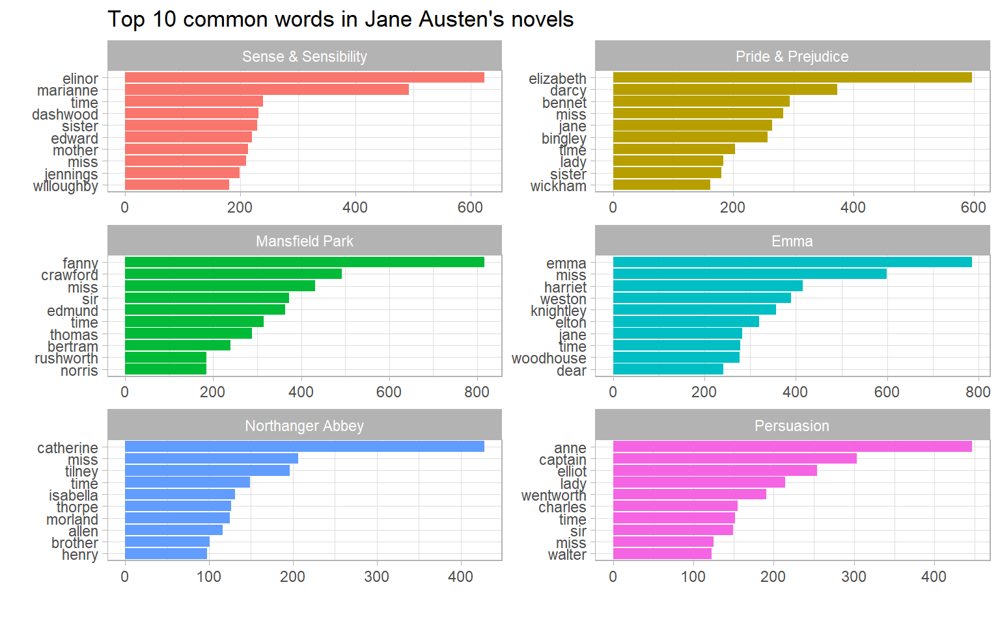

--- 
title: 'Text Mining with R --- Notes'
author: "Qiushi Yan"
date: "2020-03-31"
site: bookdown::bookdown_site
documentclass: book
github-repo: enixam/tidy-text-mining
bibliography: [references.bib, packages.bib]
biblio-style: apalike
link-citations: yes
#nocite: '@*'
--- 


# Preface {-}  


This is a notebook concerning [Text Mining with R: A Tidy Approach](https://www.tidytextmining.com/)[@10.5555/3165010].

`tidyverse` and `tidytext` are automatically loaded before each chapter: 


```r
library(tidyverse)
library(tidytext)
```

I have defined a simiple function, `facet_bar()` to meet the frequent need in this book to make a facetted bar plot, with the `y` variable reordered by `x` in each facet `by`:  


```r
facet_bar <- function(df, y, x, by, nrow = 2, ncol = 2, scales = "free") {
  mapping <- aes(y = reorder_within({{ y }}, {{ x }}, {{ by }}), 
                 x = {{ x }}, 
                 fill = {{ by }})
  
  facet <- facet_wrap(vars({{ by }}), 
                      nrow = nrow, 
                      ncol = ncol,
                      scales = scales) 
  
  ggplot(df, mapping = mapping) + 
    geom_col(show.legend = FALSE) + 
    scale_y_reordered() + 
    facet + 
    ylab("")
} 
```

As a quick demostration of this function, we can plot the top 10 common words in Jane Austen's six books:  


```r
austen_common <- janeaustenr::austen_books() %>% 
  unnest_tokens(word, text) %>% 
  anti_join(stop_words) %>% 
  count(book, word) %>% 
  group_by(book) %>% 
  top_n(10) %>% 
  ungroup()

austen_common
#> # A tibble: 60 x 3
#>   book                word         n
#>   <fct>               <chr>    <int>
#> 1 Sense & Sensibility dashwood   231
#> 2 Sense & Sensibility edward     220
#> 3 Sense & Sensibility elinor     623
#> 4 Sense & Sensibility jennings   199
#> 5 Sense & Sensibility marianne   492
#> 6 Sense & Sensibility miss       210
#> # ... with 54 more rows
```


```r
# make a bar plot 
facet_bar(austen_common,
          y = word,
          x = n,
          by = book,
          nrow = 3) + 
  labs(title = "Top 10 common words in Jane Austen's novels",
       x = "")
```



