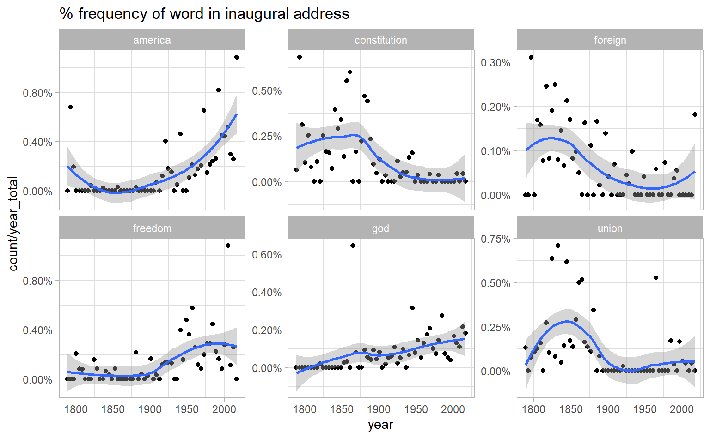

# Converting to and from non-tidy formats    


Non-tidy data structures, in particular matrcies, is essential in topic modeling where other packages for NLP in R play a major role. 

The book has a diagram describing the "glue" part functions in this chapter play:  


As shown in the figure, **a tidied DTM is typically equivalent with a one-token-per-row data frame after counting**.  

## Tidying a document-term matrix  

A document-term matrix or term-document matrix is a mathematical matrix that describes the frequency of terms that occur in a collection of documents. This is a matrix where 

- each row represents one document  

- each column represents one term (word)  

- each value (typically) contains the number of appearances of that term in that document  


Document-term matrices are often stored as a sparse matrix object. These objects can be treated as though they were matrices (for example, accessing particular rows and columns), but are stored in a more efficient format.  

`tidytext` provides ways of converting between these two formats:  

- `tidy()` turns a document-term matrix into a tidy data frame (one-token-per-row)

- `cast()` turns a tidy data frame into a matrix.There are three variations of this verb corresponding to different classes of matricies : `cast_sparse()` (converting to a sparse matrix from the `Matrix` package), `cast_dtm()` (converting to a `DocumentTermMatrix` object from `tm`), and `cast_dfm()` (converting to a `dfm` object from quanteda)  


`DocumentTermMatrix` class is built into the `tm` package. Notice that this DTM is 99% sparse (99% of document-word pairs are zero). 


```r
library(tm)
library(topicmodels)
data("AssociatedPress", package = "topicmodels")

AssociatedPress
#> <<DocumentTermMatrix (documents: 2246, terms: 10473)>>
#> Non-/sparse entries: 302031/23220327
#> Sparsity           : 99%
#> Maximal term length: 18
#> Weighting          : term frequency (tf)
```

`Terms()` is a accessor function to extract the full distinct word vector  


```r
Terms(AssociatedPress) %>% head()
#> [1] "aaron"      "abandon"    "abandoned"  "abandoning" "abbott"    
#> [6] "abboud"
```


`tidy` it to get a tidy data frame 


```r
# convert to tidy data frames with counts
ap_tidy <- tidy(AssociatedPress)
ap_tidy
#> # A tibble: 302,031 x 3
#>   document term      count
#>      <int> <chr>     <dbl>
#> 1        1 adding        1
#> 2        1 adult         2
#> 3        1 ago           1
#> 4        1 alcohol       1
#> 5        1 allegedly     1
#> 6        1 allen         1
#> # ... with 3.02e+05 more rows
```


`quanteda` uses `dfm` (document-feauture matrix) as a common data structure for text data. For example, the `quanteda` package comes with a corpus of presidential inauguration speeches, which can be converted to a dfm using the appropriate function. 


```r
data("data_corpus_inaugural", package = "quanteda")
quanteda::dfm(data_corpus_inaugural)
#> Document-feature matrix of: 58 documents, 9,360 features (91.8% sparse) and 4 docvars.
#>                  features
#> docs              fellow-citizens  of the senate and house representatives :
#>   1789-Washington               1  71 116      1  48     2               2 1
#>   1793-Washington               0  11  13      0   2     0               0 1
#>   1797-Adams                    3 140 163      1 130     0               2 0
#>   1801-Jefferson                2 104 130      0  81     0               0 1
#>   1805-Jefferson                0 101 143      0  93     0               0 0
#>   1809-Madison                  1  69 104      0  43     0               0 0
#>                  features
#> docs              among vicissitudes
#>   1789-Washington     1            1
#>   1793-Washington     0            0
#>   1797-Adams          4            0
#>   1801-Jefferson      1            0
#>   1805-Jefferson      7            0
#>   1809-Madison        0            0
#> [ reached max_ndoc ... 52 more documents, reached max_nfeat ... 9,350 more features ]
```

We, of course, want to `tidy` it  


```r
inaugural <- quanteda::dfm(data_corpus_inaugural) %>% 
  tidy()

inaugural
#> # A tibble: 44,710 x 3
#>   document        term            count
#>   <chr>           <chr>           <dbl>
#> 1 1789-Washington fellow-citizens     1
#> 2 1797-Adams      fellow-citizens     3
#> 3 1801-Jefferson  fellow-citizens     2
#> 4 1809-Madison    fellow-citizens     1
#> 5 1813-Madison    fellow-citizens     1
#> 6 1817-Monroe     fellow-citizens     5
#> # ... with 4.47e+04 more rows
```

Suppose we would like to see how the usage of some user specified words change over time. We start by `complete()` the data frame, and then total words per speech:   


```r
year_term_counts <- inaugural %>% 
  extract(document, into = "year", regex = "(\\d{4})", convert = TRUE) %>% 
  complete(year, term, fill = list(count = 0)) %>% 
  add_count(year, wt = count, name = "year_total")

year_term_counts
#> # A tibble: 542,880 x 4
#>    year term  count year_total
#>   <int> <chr> <dbl>      <dbl>
#> 1  1789 "'"       0       1537
#> 2  1789 "-"       1       1537
#> 3  1789 "!"       0       1537
#> 4  1789 "\""      2       1537
#> 5  1789 "$"       0       1537
#> 6  1789 "("       1       1537
#> # ... with 5.429e+05 more rows
```


```r
year_term_counts %>%
  filter(term %in% c("god", "america", "foreign", "union", "constitution", "freedom")) %>%
  ggplot(aes(year, count / year_total)) +
  geom_point() +
  geom_smooth() +
  facet_wrap(~ term, scales = "free_y") +
  scale_y_continuous(labels = scales::percent_format()) +
  labs(title = "% frequency of word in inaugural address")
```



## Casting tidy text data into a matrix  

`csat_` verbs convert a tidy data frame (counted) into a document-term matrix  


```r
ap_tidy %>%
  cast_dtm(document = document, term = term, value = count)
#> <<DocumentTermMatrix (documents: 2246, terms: 10473)>>
#> Non-/sparse entries: 302031/23220327
#> Sparsity           : 99%
#> Maximal term length: 18
#> Weighting          : term frequency (tf)
```

Similarly, we could cast `ap_tidy` into a `dfm` object from `quanteda`’s docuemnt term matrix with `cast_dfm()`  


```r
ap_tidy %>% 
  cast_dfm(document = document, term = term, value = count)
#> Document-feature matrix of: 2,246 documents, 10,473 features (98.7% sparse).
#>     features
#> docs adding adult ago alcohol allegedly allen apparently appeared arrested
#>    1      1     2   1       1         1     1          2        1        1
#>    2      0     0   0       0         0     0          0        1        0
#>    3      0     0   1       0         0     0          0        1        0
#>    4      0     0   3       0         0     0          0        0        0
#>    5      0     0   0       0         0     0          0        0        0
#>    6      0     0   2       0         0     0          0        0        0
#>     features
#> docs assault
#>    1       1
#>    2       0
#>    3       0
#>    4       0
#>    5       0
#>    6       0
#> [ reached max_ndoc ... 2,240 more documents, reached max_nfeat ... 10,463 more features ]
```

`cast_sparse` returns a sparse matrix 


```r
ap_tidy %>% 
  cast_sparse(row = document, column = term, value = count)
#> 2246 x 10473 sparse Matrix of class "dgCMatrix"
#>                                                                              
#> 1    1 2 1 1 1 1 2 1 1 1 2 1 1 2 1 1 1 1 4 4  1 1 1 1 1 1 1 2  1 1 4 1 ......
#> 2    . . . . . . . 1 . . . . . . . . . . . .  . . . . . . . .  . . . . ......
#> 3    . . 1 . . . . 1 . . . . . . . . . . . .  . . . . . . . .  . . . . ......
#> 4    . . 3 . . . . . . . . . . . . . . . . .  . . . . . . . .  . . . . ......
#> 5    . . . . . . . . . . . . . . . . . . . .  . . . . . . . .  . . . . ......
#> 6    . . 2 . . . . . . . . . . . 1 . . . . .  . . . . . . 1 .  . . . . ......
#> 7    . . . . . . . . . . . . . . . . . . . .  . . . . . . . .  . . . 1 ......
#> 8    . . . . . . . . . . . . . . . . . . . .  . . . . . . . .  . . . . ......
#> 9    . . . . . . . . . . . . . . . . . . . .  . . . . . . . .  . . . . ......
#> 10   . . . . . . . . . . . . . . . . . . . .  . . . . . . . .  . . . . ......
#> 11   . . . . . . . . . . . . . . . . . . . .  . . . . . . . .  . . . . ......
#> 12   . . . . . . . . . . . . . . . . . . . .  . . . . . . . .  . . . . ......
#> 13   . . . . . . . . . . . 1 . . . . . . . .  . . . . . 1 . .  . . . . ......
#> 14   . . . . . . . . . . . . . . . . . . . .  . . . . . . . .  . . . . ......
#> 15   . . 2 . . . . . . . . . . . . . 1 . . .  . . . . . . . .  . . . . ......
#> 16   1 . . . . . . . . . . . . . 1 . . . . .  . . . . . . . .  . . . . ......
#> 17   . . . . . . . . . . . . . . . . . . . .  . . . . . . . .  . . . . ......
#> 18   . . . . . . 1 1 . . . . . . 2 . . . . .  . . . . . . . .  . . . 1 ......
#> 19   . . . . . . . . . . . . . . . . . . . .  . . . . . . . .  . . . . ......
#> 20   . . 2 . . . . . . . . . . . 1 . . . . .  . . . . . . . .  . . . . ......
#> 21   . . . . . . . . . . . . . . . . . . . .  . . . . . . . .  . . . . ......
#> 22   . . . . . . . . . . . . . . . . . . . .  . . . . . . . .  . . . . ......
#> 23   . . . . . . . . . . . . . . . . . . . .  . . . . . . . .  . . . . ......
#> 24   . . . . . . . . . . . . . . . . . . . .  . . . . . 1 . .  . . . . ......
#> 25   . . . . . . . . . . . . 1 . . . . . . .  . . . . . . . .  . . . . ......
#> 26   . . 1 . . . . . . . . . . . . . . . . .  . . . . . . . .  . . . . ......
#> 27   . . 1 . . . . . . . . . . . . . . . . .  . . . . . . . .  . . . . ......
#> 28   . . 1 . 1 . . . 2 . . . 1 . . . . . . .  1 . . . . . . .  . . . . ......
#> 29   . . 1 . . . 1 . . . . . . . . . . . . .  . . 1 . . . 1 .  . . . . ......
#> 30   . . . . . . . . . . 2 . . . . . . . . .  . . . . . . . .  . . . 1 ......
#> 31   . . 1 . . . . . . . . . . . 1 . . . . 1  . . . . 1 . . .  . . . . ......
#> 32   . . . . . . . . . . . . . . 2 . 2 . . .  1 . . . . . . .  . . . . ......
#> 33   . . . . . . . . . . . . . . . . . . . .  . . . . . . . .  . . . . ......
#> 34   . . . 1 . . . . . . . . . . . . . . . .  . . . . . . . .  . . . . ......
#> 35   1 . . . . . 1 . . . . . 2 . 1 . . 2 . .  . . . . . . 1 .  . . . . ......
#> 36   . . . . . . 1 . . . . . . . . . . . . .  . . . . . . . .  . . . . ......
#> 37   . . . . . . . . . . . . 1 . 1 . . . . .  . . . . . . . .  . . . . ......
#> 38   . . 1 . . . . . . . . . . . 1 . . . . .  . . 1 . . . . .  . . . . ......
#> 39   . . 1 . . . . . . . . . . . . . . . . .  . . . . . . . .  . . . . ......
#> 40   . . . . . . . . . . . . . . . . . . . .  . . . . . . . .  . . . . ......
#> 41   . . . . . . . 1 . . . . . . . . . . . .  . . . . . . . .  . . . . ......
#> 42   . . . . . . . . . . . . . . . . . . . .  . 2 . . . . . .  . . . . ......
#> 43   . . 3 . . . . . . 3 . 2 . . . . . . . .  . . . . . . . .  . . . . ......
#> 44   . . . . . . . . . . . . . . . . . . . .  . . . . . . . .  . . . . ......
#> 45   . . . . . . 1 1 . . . . . . . . . . . .  1 . . . . . . .  . . . 1 ......
#> 46   . . . . . . . . . . . . . . . . . . . .  . . . . . . . .  . . . . ......
#> 47   . . . . . . . . . . . . . . . . . . . .  . . . . . . . .  . . . . ......
#> 48   . 4 . . . . . . . . . . . . . . . . . .  . . . . . 1 . .  . . . . ......
#> 49   . . 3 . . . . . . . . . . . . . . . . .  . . . . . . . .  . . . . ......
#> 50   . . . . . . . . . . . . . . . . . . . .  . . . . . . . .  . . . . ......
#> 51   . . . . . . . . . . . . 1 . . . . . . .  . . . . . . . .  . . . . ......
#> 52   . . . . . . . 1 . . . . . . . . . . . .  . . . . . . . .  . . . . ......
#> 53   . . . . . . . . . . . . 3 . . . . . . .  . . . . . . . .  . . . . ......
#> 54   . . 1 . . . . . . . . . . . . . . . . .  . . . . . . . .  . . . . ......
#> 55   . . . . . . . . . . . . . . . . . . . .  . . . . . . . .  . . . . ......
#> 56   . . . . . . . . . . . . . . . . . . . .  . . . . . . . .  . . . . ......
#> 57   . . 1 . . . . . . . . . . . . . . . . .  . . . . . . 1 .  . . . . ......
#> 58   . . . . . . . . . . . . . . . . . . . .  . . . . . . . .  . . . . ......
#> 59   . . . . . 1 . . 1 . . . . . . . . . . .  . . 1 . . . . .  . . . . ......
#> 60   . . . . . . . . . . . . . . . . . . . .  . . . . . . . .  . . . . ......
#> 61   . . . . . . . . . . . . . . . . . . . .  . . . . . . . .  . . . . ......
#> 62   . . 1 . . . . . . . . . . . . . . . . .  . . . . . . . .  . . . . ......
#> 63   . . . . . . 1 . . . . . . . . . . . . .  . . . . . . 3 .  . . . . ......
#> 64   . . . . . . . 1 . . . . . . . . 1 1 . .  . . . . . . . .  . . . . ......
#> 65   . . . . . . . . . . . . . . . . 1 . . .  . . . . . . . .  . . . . ......
#> 66   . . . . . . . . . . . . . . . . . . . .  . . . . . . . .  . . . . ......
#> 67   . . . . . . . . . . 1 . . . . . . . . .  . . . . . . . .  . . . . ......
#> 68   . . . . . . . . 1 . . . . . . . . . . .  . . . . . . . .  . . . . ......
#> 69   . . . . . . . . . . . . . . . . . . . .  . . . . . . . .  . . . . ......
#> 70   . . . . . . . . 2 . . . 1 . 1 . . . . .  . . . . . . . .  . . . . ......
#> 71   . . . . . . . . . . . . . . . . . . . .  . . . . . . . .  . . . . ......
#> 72   1 . . . . 1 . . . . . . . . . . 1 . . .  . . . . . . . .  1 . . . ......
#> 73   . . . . . . . . . . . . . . . . . . . .  . . . . . . . .  . . . . ......
#> 74   . . . . . . . . . . . . . . . . . . . .  . . . . . . . .  . . . . ......
#> 75   . . . . . . . . . . . . . . . . . . . .  . . . . . . 1 .  . . . 1 ......
#> 76   . . 1 . 1 . . . . . . . . . 6 . . . . .  . . . . . . . .  . . . . ......
#> 77   . . 1 . . . . . . . . . . . . . 1 . . .  . . . . . . . .  . . . . ......
#> 78   . . . . . . . . . . . . . . . . . . . .  . . . 2 . 1 . .  . . . . ......
#> 79   . . . . . . . . . . . . . . . . . . . .  . . . . . . . .  . . . . ......
#> 80   . . . . . . . . . . . . . . . . 2 . . .  . . . . . . . .  . 1 . . ......
#> 81   . . . . . . . . . . . . 1 . . . . . . .  . . . 1 . . . .  9 . . . ......
#> 82   . . . . . . . . . . . . . . . . . . . .  . . . 1 2 . . .  . . . . ......
#> 83   . . . . . . . . . . . . . . . . . . . .  . . . . . . . .  . . . . ......
#> 84   1 . . . . . . . . . . . . . . . . . . .  . . . . . . . .  . . . . ......
#> 85   . . 1 . . . . . . . . . . . . . . . . .  . . . . . . 1 .  . . . . ......
#> 86   . . . . . . . . . . . . . . . . . . . .  . . . 1 2 . 1 .  1 . . . ......
#> 87   . . . . . . . . . . . . . . . . . . . .  . . . . . . . .  . . . . ......
#> 88   . . . . . . . . . . 1 . . . . . . . . .  . . . . . . . .  . . . . ......
#> 89   . . . . . . . . . . . . . . . . . . . .  . . . . . . . .  . . . . ......
#> 90   . . . . . . . . . . . . . . . . . . . .  . . . 1 1 . . .  . 1 . . ......
#> 91   . . . . . . . . . . . . . . . . . . . .  1 . . . . . . .  . . . . ......
#> 92   . . . . . . . . . . . . 1 . . . . . . .  . . . . . . . .  . . . . ......
#> 93   1 . . . . . . . . . . . . . . . . . . .  . . . . . . . .  . . . . ......
#> 94   . . . . . . . 1 . . . . . . . . . . . .  . . . . . . . .  . . . . ......
#> 95   . . . . . . . . . . 1 . . . . . . . . .  1 . . . . . . .  . . . . ......
#> 96   . . . . . . . . 1 1 . . . . . . . . . .  . . . 1 . . . .  . . . . ......
#> 97   . . 1 . 1 . . . . . . . 1 . . . . . . .  . . . . 1 . . .  . . . . ......
#> 98   . . . . . . . . . . . . . . . . . . . .  . . . . . . . .  . . . . ......
#> 99   . . . . . . . . . . 2 . . . . . . . . .  . . . . . . . .  . . . . ......
#> 100  . . . . . . . . . . . . . . . . . . . .  . . . . . . . .  . . . . ......
#> 101  1 . . 1 . . . . 1 . . . . . . . . . . .  . . . . . . 4 .  . 1 . . ......
#> 102  . . . 2 . . . . . . . . . . . . . . . .  . . . . . . . .  . . . . ......
#> 103  . . . . . . . . . . . . . . . . . . . .  . . . . . . . .  . . . . ......
#> 104  . . . . . . 1 . 1 . . . 4 . . . . . . .  1 . 1 2 . . . .  . . . . ......
#> 105  . . . . . . . . . . . . . . . . . . . .  . . . . . . . .  . . . . ......
#> 106  . . . . . . . . . . . . . . . . . . . .  . . . . . . . .  . . . . ......
#> 107  . . . . . . . . . . . . . . . . . . . .  . . . . 3 . . .  . . . . ......
#> 108  . . . . . . . . . . . . . . . . . . . .  . . . . . . 2 .  . . . . ......
#> 109  . . . . . . . . . . . . . . . . . 1 . .  . . . . . . . .  . . . . ......
#> 110  . . . . . . . . . . . . . . . . . . . .  . . . 1 . . . .  . . . . ......
#> 111  1 . . . . . . . . . . . . . . . . . . .  . . . . . . . .  . . . . ......
#> 112  . . 3 . . . . . . . . . . . . . . . . .  . . . . . . . .  1 . . . ......
#> 113  . . . . . . . . . . . . . . . . . . . .  . . . . . . . .  . . . . ......
#> 114  . . . . . . . . . . . . . . . . . . . .  . . . . . . . .  . . . . ......
#> 115  . . 1 . . . . . . . . . . . . . . . . .  . . . . . . 1 .  . . . . ......
#> 116  . . . . . . . . . . . . . . . . . . . .  . . . . . . 5 .  . . . 1 ......
#> 117  . . . . . . . . . . . . . . . . . . . .  . . . . . . 1 .  . 1 . . ......
#> 118  . . 1 . . . . . . . . . . . . . . . . .  . . . . . . 1 .  . . . . ......
#> 119  . . . . . . . . . . . . . . . . . . . .  . . . . . . 1 .  . . . . ......
#> 120  . . . . . . . . . . . . . . . . . . . .  . . . . . . . .  . . . . ......
#> 121  . . . . . . . . . . . . . . . . . . . .  . . . . . . . .  . . . . ......
#> 122  . . . . . . . . . . . . . . . . 1 . . .  . . . . . . . .  . . . . ......
#> 123  . . . . . . . . . . . . . . . . . . . .  . . . . . . . .  . . . . ......
#> 124  . . . . . . . . . . . . . . . . . . . .  . . . . . . . .  . . . . ......
#> 125  . . . . . . . . . . . . . . . . . . . .  . . . . . . . .  . . . . ......
#> 126  . . . . . . . . . . . . . . . . . . . .  . . . . . . . .  . . . . ......
#> 127  . . . . . . . . . . . . . . . . . . . .  . . . . . . . .  . . . . ......
#> 128  . . . . . . . . . . . . . . . . . . . .  . . . . . . . .  . . . . ......
#> 129  . . . . . . . . . . . . . . . . . . . .  . . . . . . . .  . . . . ......
#> 130  . . . . . . . . . . . . 1 . . . . . . .  . . . . . . . .  . . . . ......
#> 131  . . . . . . . . . . . . . . . . . . . .  . . . . . . . .  . . . . ......
#> 132  . . . . . . . . . . . . 1 . . . . 2 . .  . . . . . . . .  . . . . ......
#> 133  . . . . . . . . . . . . . . . . . . . .  . . . . . . . .  . . . . ......
#> 134  . . . . . . . . . . . . . . . . . . . .  . . . . . . . .  . . . . ......
#> 135  . . . . . . . . . . . . . . . . . . . .  . . . . . . . .  . . . . ......
#> 136  . . 1 . . . . . . . . . . . . . . . . .  . . . . . . . .  . . . . ......
#> 137  . . . . . . . . . . . . . . . . . . . .  . . . . . . . .  . . . . ......
#> 138  . . . . . . 1 . . . . 1 1 . . . . . . .  . . . . . . 1 .  . . . . ......
#> 139  . . 2 . . . . . . . . . . . . . . . . .  1 . . . . . . .  . . . . ......
#> 140  . . . . . . . . . . . . . . . . . . . .  . . . . . . 1 .  . . . . ......
#> 141  . . . . 1 . . . 1 . . . 1 . . . . . . .  . . . . 1 . 1 1  . . . . ......
#> 142  . . . . . . . . . . . . . . . . . . . .  . . . . . . . .  . . . . ......
#> 143  . . . . . . . . . . . . . . 1 . . . . .  . . . . . . 1 .  . 1 . . ......
#> 144  . . . . . . . 1 . . . . 1 . . . . . . .  . . . . . . . .  . . . . ......
#> 145  . . . . . . . . . . . . . . . . . . . .  . 1 . . . . . .  . . . . ......
#> 146  . . . . . . . . 1 . . . 1 . . . . . . .  . . . . 1 . 2 .  . . . 1 ......
#> 147  . . . . . . . . . . . . . . . . . . . .  . . . . . . 1 .  . . . . ......
#> 148  . . . . . . . . . . . . 1 . . . . . 1 .  . 1 . . . . 1 .  . . . . ......
#> 149  . . . . . . . . . . . . . . . . . . . .  . . . . . . . .  . . . . ......
#> 150  . . . . . . . . . . . . . . . . . . . .  . . . . 1 . . .  . . . . ......
#> 151  . . . . . . . . . . . . 1 . . . . . . .  . . . . . . . .  1 . . . ......
#> 152  . . . . . . . . . . . . 1 . . . . . . .  . . . . 1 . 1 .  . . . . ......
#> 153  . . . . . . . . 1 . . . . . . . . . 5 .  . . . . 3 . . .  . . . . ......
#> 154  . . 2 . . . . . . . . . . . . . . . . .  . . . . . . . .  . . . . ......
#> 155  1 . . . . . . . . . . . . . . . . . . .  . . . . . . . .  . . . . ......
#> 156  . . . . . . 1 . . . . . . . . . . . . .  . . . . 2 . . .  . . . . ......
#> 157  . . . . . . . . 1 . . . . . . . . . . .  . . . 1 1 . . .  . . . . ......
#> 158  . . . . . . . . . . . . . . . . . . . .  . . . . . . . .  . . . . ......
#> 159  . . . . 1 . . . 5 . . . . . . . . . . .  . . . . . . 5 .  . . . . ......
#> 160  . . . . . . . . 1 . . . . . . . . . . .  . . . 1 . . . .  . . . . ......
#> 161  1 . . . . . . . . . . . . . . . . . . .  . . . . . . . .  . . . . ......
#> 162  . . . . . . . . . . . . . . . . . . . .  . . . . . . . .  . . . 1 ......
#> 163  . . . . . . . . . . . . . . . . . . . .  . . . . . . . .  . . . . ......
#> 164  . . . . . . . . . . . . . . . . . . . .  . . . . . 1 . .  . . . . ......
#> 165  . . . . . . . . . . . . . . . . . . . .  . . . . . . . .  . . . . ......
#> 166  . . . . . . . . . . . . 1 . . . . 1 . .  . . . . . . . .  1 . . . ......
#> 167  . . . . . . . . . . . . 1 . . . . . . .  . . . . . . . .  . . . . ......
#> 168  . . . . . . . . . . . . . . 1 . . . . .  . . . . . . . .  . . . . ......
#> 169  . . . . . . . . . . . . . . . . . . . .  . . 1 . . . . .  . . . . ......
#> 170  . . 1 . . . . 1 . . . . 3 . 1 . . . . .  . . . . . . . .  . . . . ......
#> 171  . . . . . . . . . . . . . . . . . . . .  . . . . . . . .  . . . 1 ......
#> 172  . . 1 2 . . . . . . . . . . . . . . . .  . . . . . . . .  . . . . ......
#> 173  . . . . . . . . . . . . . . . . . . . .  . . . . . . . .  . . . . ......
#> 174  . . . . . . . . . . . . . . . . . . . .  . . . . . . . .  . . . . ......
#> 175  . . . . . . . . . . . . . . . . . . . .  . . . . . . . .  . . . . ......
#> 176  . . . . . . . . . . . . . . . . . . . .  . 2 . . . . 1 .  . . . . ......
#> 177  1 . 1 . . . . . . . . . . . . . . . . .  . . . . . . . .  . . . . ......
#> 178  . . . . . . . . . . . . . . . . . . . .  . . . . . . . .  . . . . ......
#> 179  . . . . . . . . . . . . . . . . . . . .  . . . . . . 1 .  . . . . ......
#> 180  . . . . . . . . 5 . . . . . . . . . . .  1 . . . 1 . 2 .  . . . . ......
#> 181  . . . . . . . . . . . . . . . . . . . .  . . . . . . . .  . . . . ......
#> 182  . . . 1 1 . . . 2 . . . . . . . . . . .  . . . 1 . . . .  . . . . ......
#> 183  . . . . . . . . . 2 . . . . . . . . . .  . . . . . . . .  . . . . ......
#> 184  . . 1 . . . . . . . . . . . 1 . . . . .  . . . . . . . .  . . . . ......
#> 185  . . . . . . . . . . . . . . . . 1 . . .  . . . . . . . .  . . . . ......
#> 186  . . . . . . . . . . . . . . . . . . . .  . . . . . . . .  . . . . ......
#> 187  . . . . . . . . . . . . . . . . . . . .  . . . . . . . .  . . . . ......
#> 188  . . . . . . . . . . . . . . . . . . . .  . . . . 1 . . .  . . . . ......
#> 189  . . . . . . . . . . . . . . . . . . . .  . . . . . . . .  . . . . ......
#> 190  . . . . . . . . . . . . . . . . . . . .  . . . . . 1 . .  . . . . ......
#> 191  . . . . . . . . . . . . . . . . . . . .  . . . . . 1 . .  . . . . ......
#> 192  . . . . . . . . . . . . . . 1 . 1 . . .  1 . . . . . . .  . . . . ......
#> 193  . . . . . . . . . . . . . . . . . . . .  . . . . . . . .  . . . . ......
#> 194  . . . . . . . . 1 . . . . . . . . . . .  . . . . . . . .  . . . . ......
#> 195  1 . . . . . . . . . . . . . . . . . . .  1 . . . . . . 1  . . . . ......
#> 196  . . . . . . . . . . . . . . . . . . . .  . . . . . . . .  . . . . ......
#> 197  . . . . 1 . . . 1 . . . . . 1 . . . . .  . . . . 2 . . .  . . . . ......
#> 198  . . . . . . . . . . . . . . . . . . . .  . . . . . . . .  . 1 . . ......
#> 199  . . . . . . . 1 . . . . 2 . . . . . . .  . . . . . . . .  . . . . ......
#> 200  . . . . . . . . . . . . . . . . . . . .  . . . . . . . .  . . . . ......
#> 201  . . . . . . . . . . . . . . . . . . . .  . . . . . . . 1  . . . . ......
#> 202  . . . . . . . . . . . . . . . . 1 . . .  . . . . . . . .  . . . . ......
#> 203  . . . . . . . . . . . . 1 . . . . . . .  . . . . . . 1 .  . . . . ......
#> 204  . . 1 . . . . . . . . . . . . . . . . .  3 . . . . . . .  . . . . ......
#> 205  . . . . . . . . . . . . . . . . . . . .  . . . . . . . .  . . . . ......
#> 206  . . . . . . . . . . . . . . . . . . . .  . . . . . . . .  . . . . ......
#> 207  . . . . . . . . . . . . . . . . . 1 . .  1 . . . . . . .  . . . 1 ......
#> 208  . . 1 . . . . . . . . . . . . . . . . .  . . . . . . . .  . . . . ......
#> 209  . . . . 1 . . . . . . . . . . . . . . .  . . . . . . . .  . . . . ......
#> 210  . . . . . . . . . . . . . . . . 1 . . .  . . . . . . . 1  . . . . ......
#> 211  . . . . . . . . . . . . . . . . . . . .  . . . . . . . .  . . . . ......
#> 212  . . . . . . . . . . . . . . . . . 1 . .  . . . . . . . .  . . . . ......
#> 213  . . . . . . . . . . . . . . . . . . . .  . . . . 1 . . .  . . . . ......
#> 214  . . . . . . . . . . . . . . . . . . . .  . . . . . . . .  . . . . ......
#> 215  . . 1 . . . . . 1 . . . 1 . . . . . . .  . . . . . 1 . .  . . . . ......
#> 216  . . 1 . . . . . 1 . . . 1 . . . . . . .  . . . 1 1 . . .  . . . . ......
#> 217  . . . . . . . . . . . . . . . . . . . .  . . . . . . . .  . . . . ......
#> 218  . . . . . . . . . . . . . . . . . . . .  . 1 . . . . . .  . . . . ......
#> 219  1 . 1 . . . . . . . . . . . . . . . . .  . . . . . . . .  . . . . ......
#> 220  . . . . 1 . . . . . . . . . . . . . . .  . . . 2 . . . .  . . . . ......
#> 221  . . . . . . . . . . . . . . . . . . . .  . . . . . . . .  . . . . ......
#> 222  . . . . . . . . . . . . . . . . . . . .  . . . . . . . .  . . . . ......
#> 223  . . . . . . . . . . . . . . . . . . . .  . . . . . . . .  . . . . ......
#> 224  . . . . . . . 2 . . . . . . . . . 2 . .  1 . . . . . . .  . . . 1 ......
#> 225  . . . . . . . . 2 . . 2 1 . . . . . . .  . . . . 4 1 . .  . . . . ......
#> 226  . . 1 . . . . . . . . . . . 1 . . . . .  . . . . . . . .  . . . . ......
#> 227  . . . . . . . . . . . . . . . . . . . .  . . . . . . . .  . . . . ......
#> 228  . . . . . . . 1 . . . . . . . . . . . .  . . . . . . . .  . . . . ......
#> 229  . . . . . . . . . . . . . . . . . . . .  . . . . . . 1 .  . . . . ......
#> 230  . . 2 . . . . . . . . . . . 1 . 1 . . .  3 . . . . . . .  . 1 . 2 ......
#> 231  . . . . . . . . . . . . . . . . . . . .  . . . . . . . 1  . . . . ......
#> 232  . . . . . . . . . . . . . . . . 1 . . .  . . . 1 . . . .  . . . . ......
#> 233  . . . . . . . . . . . . . . . . 2 . . .  . . . . . . . .  . . . . ......
#> 234  . . . . . . . . . . . . 1 . . . . . . .  . . 1 . . . . .  . . . . ......
#> 235  . . . . . . . . . . . . . . . . . . 1 .  . . . . . . . .  . . . . ......
#> 236  . . 1 . . . 1 . . . . . . . . . . . . .  . . . . 1 . 1 .  . . . . ......
#> 237  . . . . . . . . . . . . . . . . . . . .  . . . . . . . .  . . . . ......
#> 238  1 . . . . . . . . . . . . . . . . . . .  . . . . . . . .  . . . . ......
#> 239  . . . . . . 1 . . . . . . . . . . . 1 4  . . . . . . . .  . . . 2 ......
#> 240  . . . . . . . . . . . . . . . . . . . .  . . . . . . . .  . . . . ......
#> 241  . . . . . . . . 1 . . . . . . . . . . .  . . . . 1 . . .  . . . . ......
#> 242  . . . . . . . . . . . . . . . . . . . .  . . . . . . 1 .  . . . . ......
#> 243  . . . . . . . . . . . . . . . . . . . .  . . . . . . . .  . . . . ......
#> 244  . . . . . . . 1 . . . . . . . . . . . .  . . . . . . . .  . . . . ......
#> 245  . . . . . . . . . . . . 1 . . . . . . .  . . . . . . . .  1 . . . ......
#> 246  . . . . . . . . . . . . . . . . . . . .  . . . . . . . .  . . . . ......
#> 247  . . . . . . . . . . . . . . . . . . . .  . . . . . . . .  . . . . ......
#> 248  . . . . . . . . . 1 . . . . . . . . 1 .  . . . . . . . .  . . . 1 ......
#> 249  . . . . . . . . . . . . . . . . . . . .  . . . . . . . .  . . . . ......
#> 250  . . . . . . . . . . . . . . . . . . . .  . . . . . . . .  . . . . ......
#> 251  . . . . . . . . . . . . . . . . . . . .  . . . . . . . .  . . . . ......
#> 252  . . . . . . . . . . . . . . . . . . . .  . . . . . . . .  . . . . ......
#> 253  . . . . 1 . . . 3 . . . 4 . . . . . . .  . . . 2 . . . .  . . . . ......
#> 254  . . . . . . . . . 1 . . . . . . . . . .  . . . . . . . 1  . . . . ......
#> 255  . . . . . . . . . . . . . . 1 . . . . .  . . . . . . . .  . . . . ......
#> 256  . . . . . . . . . . . . 1 . . . . . . .  . . . . . . . .  . . . . ......
#> 257  . . . . . . . . . . . . . . . . . . 2 1  . . . . . . . .  . . . . ......
#> 258  . . . . . . . . . . . . . . . . . . . .  . . . . . . . .  . . . . ......
#> 259  . . 1 . . . . 2 . . . . . . . . . . 2 .  . . . . . . . .  1 . . . ......
#> 260  . . . . . . . . . . . . . . . . . . . .  . . . . . . . .  . . . . ......
#> 261  . . . . . . . . . . . . . . . . . . . .  . . . 1 1 . . .  . . . . ......
#> 262  . . 1 . . . . . . . . . . 1 . . . . 1 .  1 . . . . . . .  . . . . ......
#> 263  . . . . . . . . . . . . . . 1 . 1 . . .  . . . . . . 1 .  . . . . ......
#> 264  . . . . . . . . . . . . . . . . . . . .  . . . . . . . .  . . . . ......
#> 265  . . . . . . . . . . . . . . . . . . . .  1 . . . . . . .  . . . . ......
#> 266  . . . . . . . . . . . . . . . . . . . .  . . . . . . . .  . . . . ......
#> 267  . . . . . . . . . . . . . . . . . . . .  . . . . . . . .  . . . . ......
#> 268  . . . . . . . . . . . . . . . . . . . .  . . . . . . . .  . . . . ......
#> 269  . . . . . . . . . . 1 . . . . . 1 . . .  . . . . . . . .  . . . . ......
#> 270  . . . . . . . . . . . . 1 . . . . 1 . .  . . . . . . 2 .  . . . . ......
#> 271  . . . . . . . . . . . . 1 . . . . . . .  . . . . . . . .  . . . . ......
#> 272  . . . . . 1 . . . . . . . . . . . . . .  . . . . . . 1 .  . . . . ......
#> 273  . . . . . . . . . . . . . . . . . . . .  . . . . . . . .  . . . . ......
#> 274  . . . . . . . . . . . . . . . . . . . .  . . . . . . . .  . . . . ......
#> 275  . . . . . . . . . . . . . . . . . . . .  . . . . . . . .  . . . . ......
#> 276  . . 1 . . . . . . . . . . . . . . . 1 .  . . . . . . . .  . . 1 . ......
#> 277  . . . . . . . . . . 1 . . . . . . . . .  . . . . . . . .  . . . . ......
#> 278  . . . . . . . . . 1 . . . . . . . . . .  . . . . 1 . . .  . . . . ......
#> 279  . . . . . . . . . 1 . . 1 . . . . . . .  . . . 2 1 . . .  . . . . ......
#> 280  . . . . . . . . . . . . . . . . . . . .  . . . . . . . .  . . . . ......
#> 281  . . . . . . . . . . . . 1 . . . . . 3 1  . . . . . . . .  . . . . ......
#> 282  . . . . . . . . . . . . . . . . . . . .  . . . . . . . .  . . . . ......
#> 283  . . . . . . . . 3 . . 1 4 . 1 . . . . .  . . . 1 . . . .  . . . . ......
#> 284  . . . . . . . . . . 1 . . . . . . . . .  . . . . . . . .  . . . . ......
#> 285  . . . . . . . . . . . . . . . . . . . .  . . . . . . . .  . . . . ......
#> 286  . . 1 . . . . . . . 1 . . . . . . . . .  . . . . . . . .  . . . 1 ......
#> 287  . . 1 . . . . . . 1 . . . . . . . . . .  . . . . . . . .  . . . . ......
#> 288  . . . . . . . . . . . . . . . . 1 . . .  . . . . . . . .  . . . . ......
#> 289  . . . . . . . . . . . . . . . . . . . .  . . . . . . . .  . . . . ......
#> 290  . . . . . . 1 . 1 . . . 1 . . . . 2 . .  . . . 1 2 . 5 .  . . . . ......
#> 291  . . . . . . . 1 . . . . . . . . . 1 . .  1 1 . . . 1 1 .  . . . . ......
#> 292  . . . . . . . . . . . . . . . . . . . .  . . . . . 1 . .  . . . . ......
#> 293  . . . . . . . . . . . . . . . . 1 . . .  . . . . . . . .  . . . . ......
#> 294  . . . . . . . . 2 . . . . . . . . . . .  . . . . . . . .  . . . . ......
#> 295  . . 1 . . . . . . . . . . . . . . . . .  . . . . . . . .  . . . . ......
#> 296  . . 1 . . . 1 . . . . . . . . . . . . .  . . . . . . . .  . . . . ......
#> 297  . . . . . . . . . . . . . . . . . . . .  1 . . . . . . .  . . . . ......
#> 298  . . . . . . . . . . 1 . . . . . . . . .  . . . . . . . .  . . . . ......
#> 299  . . . . . . . . . . . . . . . . . . . .  . . . 1 . . . .  . . . . ......
#> 300  . . . . . . . . . . 1 . . . . . 1 . . .  . . 1 . . . . .  . . . . ......
#> 301  . . . 1 . . . . . . . . . . . . 1 . . .  . 1 . 2 . . . .  . . . . ......
#> 302  . . . . . . . . . . . . . . . . 1 . . .  . . . . . . . .  . . . . ......
#> 303  . . . . . . . . . . . . . . . . . . . .  . . . . . . . .  . . . . ......
#> 304  1 . . . . . . . . . . . . . . . . 3 . .  . . . . . . 2 .  . . . . ......
#> 305  . . . . . . . . . . . . 1 . . . . . . .  . . . . 1 . . .  . . . . ......
#> 306  . . . . . . . . . . . . . . 1 . . . . .  . . . . . . . .  . . . . ......
#> 307  . . . . . . . . . . . . . . . . . . . .  . . . . . . . .  . . . . ......
#> 308  . . . . . . . . . . . . . . . . . . . .  . . . . . . . .  . . . . ......
#> 309  . . . . . . . . . . . . . . 1 . . . . .  . . . . . . . .  . . . . ......
#> 310  . . . . . . . . . . . . . . . . . . . .  . . . . . . . .  . . . . ......
#> 311  . . . . . . . . . . . . . . . . . 1 . .  . . . . . . . .  . . . 1 ......
#> 312  . . . . . . . . . . . . . . . . . . . .  . . . . . . . .  . . . . ......
#> 313  . . . . . . . . . . . . . . . . . . . .  . 1 . . . . . .  . . . . ......
#> 314  . . . 1 . . . . . . . . . . . . . . . .  . . . . . . . .  . . . . ......
#> 315  . . . . . . . . . . . . . . . . . 1 . .  . . . . . . . .  . . . . ......
#> 316  . . . . . . . . . . . . . . . . . . . .  . . . . . . . .  . . . . ......
#> 317  . . . . . . . . . . . . . . . . . . . .  . . . . . . . .  . . . . ......
#> 318  . . . . . . . . . . 2 . . . . . . . . .  . . . . . . . .  . . . . ......
#> 319  . . . . . . 1 . . . . . . . . . . . . .  . . . . . . . .  . . . . ......
#> 320  . . . . . . . . . . . . 1 . 2 . . . . .  . . . . . . 1 .  . . . . ......
#> 321  . . . . . . . . . . . . . . . . . . . .  . . . . . . 1 .  . . . . ......
#> 322  . . . . . . . . . . . . . . . . . . . .  . . . . 3 . . .  . . . . ......
#> 323  1 . . . . . . . . . . . . . . . . . . .  . . . . . . 1 .  . . . . ......
#> 324  . . . . . . . . . . . . . . . . . . . .  4 . . . . . . .  . . . . ......
#> 325  . . . . . . . . . . . . . . 1 . . . . .  . . . . . . . .  . . . . ......
#> 326  . . . . . . . . . . . . . . . . . . . .  . . . . . . . .  . . . . ......
#> 327  . . . . . . . . . . 1 . . . . . 2 . . .  . . . . . . . .  . . . . ......
#> 328  . . . . . . . . . . . . . . . . . . . .  2 . . . . . . .  . . . . ......
#> 329  . . 1 . . . . . . . . . 1 . . . . . . .  2 . . . . . . .  . . . . ......
#> 330  . . . . . . . 1 . . . . . . . . . . . .  . . . . . . . .  . . . . ......
#> 331  . . 1 . . . . . . . . . 2 . . . . . . .  . . . . . . . .  . . . . ......
#> 332  . . . . . . . . . . . . 2 . . . . . . .  . . . . . . . .  . . . . ......
#> 333  . . . . . . . . . . . . . . . . . . . .  . . . . . 1 . .  . . . . ......
#> 334  . . . . . . 1 . . . . . . . . . 1 . . .  . . . . . . 1 1  . . . . ......
#> 335  . . . . . . . . . . . . . . . . . . . .  . . . . . . . .  . . . . ......
#> 336  . . . . . . . 1 . . . . . . 1 . 1 . . .  . . . . . . . .  . . . . ......
#> 337  . . 2 . . . . . . . . . 1 . . . . . . 1  1 . . . . . 2 .  . . . . ......
#> 338  . . . . . . . . . . . . . . . . . . . .  . . . . . . . .  . . . . ......
#> 339  . . . . . . . . . . . . . . . . . . . .  . . . . . . . .  . . . . ......
#> 340  . . . . . . . . . 1 . . . . . . . . . .  2 . . . 1 . 1 1  . . . . ......
#> 341  . . . . . . . . . . . . . . . . 1 . . .  . . . . . . . .  . . . . ......
#> 342  . . . . . . . . . . . . . . . . 1 . . .  . . . . . . . .  . . . . ......
#> 343  . . . . . . . . . . . . . . . . . . . .  . . . . . . 2 .  . . . . ......
#> 344  . . . . . . . . 3 . . . 1 . . . . . . .  . 1 . 1 3 . . .  . . . . ......
#> 345  . . . . . . . . . . . . . . . . . . . .  . . . . . . . .  . . . . ......
#> 346  . . . . . . . . . . . . . . . . . . . .  . . 1 . . . . .  . . . . ......
#> 347  . . . . . . . 1 . . . . . . . . . . . .  . . . . . . . .  . . . . ......
#> 348  . . . . . . . . . . . . . . . . . . . .  . . . . . . 1 .  . . . . ......
#> 349  . . . . . . . . . . . . . . . . . . . .  . 2 . . . . . .  . . . . ......
#> 350  . . . . . . . . . . . . 1 . 1 . . . . .  . . . . . . . .  . . . . ......
#> 351  . . 1 . . . . . . . . . . . . . . . . .  . . . . . . . .  . . . . ......
#> 352  . . . . . . . . . . . . . . . . . . . .  . . . . . . . 1  . . . . ......
#> 353  . . . . . . . . . . . . 1 . . . . . . .  . . . . . . . .  . . . . ......
#> 354  . . . . . . . . . . . . . . . . . . . .  . . . . . . . .  . . . . ......
#> 355  . . . . . . . . . . . . 1 . . . . . . .  . . . 1 . . . .  . . . . ......
#> 356  . . . . . . . . . . . . . . . . 2 . . .  . . . . . . . .  . 1 1 . ......
#> 357  . . . . . . . . . . . . . . 1 . . . . .  . . . 1 . . . .  . . . . ......
#> 358  . . . . . . . . . . . . . . . . . . . .  . . . . . . . .  . . . . ......
#> 359  . . . . . . 1 . . . . . . . . . . . 1 3  . . . . . . . .  . . . . ......
#> 360  . . . . . . . . . . . . . . . . . . . .  . . . . . . . .  . . . . ......
#> 361  . . . . . . . 1 . . . . . . . . . . . .  . . . . . . . .  . . . . ......
#> 362  . . . . . . 1 . . . . . . . . . . . . .  . . . . . . . .  . . . . ......
#> 363  . . . . . . . . . . . . . . . . . . . .  . . . . . . 1 .  . . . . ......
#> 364  . . 1 . . . . . . . . . . . . . . . . .  . . . . . . . .  . . . . ......
#> 365  . . . . . . . . 2 . . . . . . . . . . .  . . . . 1 . . .  . . . . ......
#> 366  . . . . . . . . . . . . . . . . . . . .  . . . . . . . .  . . . . ......
#> 367  . . . . . . . . . . . . . . . . . . . .  . . . . . . . .  . . . . ......
#> 368  . . . . . . . . . . . . . . . . . . . .  . . . . . . . .  . . . . ......
#> 369  . . 1 . . . 1 . . . . . . . . . 2 . . .  . . 1 . . . . .  . . . . ......
#> 370  . . . . . . . . . . . . . . . . . . . .  . . . . . . . .  . . . . ......
#> 371  . . . . . . . . . . . . . . . . . . . .  . . . . . . . .  . . . . ......
#> 372  . . 1 . . . . . . . . . 2 . . . . . . .  . . 1 . 2 . . .  . . . . ......
#> 373  . . . . . . . . . . . . . . . . . . . .  . . . . . . . .  . . . . ......
#> 374  . . . . . . . . . . . . . . . . . . . .  . . . . . . . .  . . . . ......
#> 375  . . . . . . . . . . . . 1 . . . . . . .  . . . . . . . .  . . . . ......
#> 376  . . . . . . . . . . . . . . . . . . . .  . . . . . . . .  . . . . ......
#> 377  . . . . . . . . . . . . . . . . . . . .  . . . . . . . .  . . . . ......
#> 378  . . . . . . . . . . . . 1 . . . . . . .  . . . . . . 1 .  . . . . ......
#> 379  . . . . . . . . . 2 . 1 . . . . . . . .  . . . 1 1 . . .  . . . . ......
#> 380  . . . . . . . . . . . . . . . . . . . .  . . . . . . 2 .  . . . . ......
#> 381  . . . . . . . . . . . . . . . . . . . .  . . . . . . . .  . . . . ......
#> 382  . . 1 . . . . . . . 1 . . . 1 . . . . .  . . . . 3 . 1 .  . . . . ......
#> 383  . . . . . . . . . . . . . . . . . . . .  . . . . . . . .  . . . . ......
#> 384  . . . . . . . . . . . . . . . . . . . .  . . . . . . . .  . . . . ......
#> 385  . . . . . . . . . . . . . . . . . 1 . .  . . . . . . 1 .  . . . . ......
#> 386  . . . . . . . . . . . . . . . . . . . .  . . . . . . . .  . . . . ......
#> 387  . . . . . . . . . . . . . . . . . . . .  . . . . . . . .  . . . . ......
#> 388  . . . . . . . . . . . . . . . . . . . .  . . 1 . . . 1 .  . . . . ......
#> 389  . . . . . . . . . . . . . . . . . . . .  . . . . . . . .  . . . . ......
#> 390  . . 1 . . . . . . . . . . . . . 1 . . .  . . . . . . . .  . . . . ......
#> 391  . . . . . . . . . . . . . . . . . . . .  . . . . . . . .  1 . . . ......
#> 392  . . . . . . 1 1 . . . . . . . . . . . .  . . 1 . . . . .  . . . . ......
#> 393  . . . . . . . 1 . . . . 2 . . . . . . .  . . . . . . . .  2 . . . ......
#> 394  . . 1 . . . . . . . . . . . . . . . . .  . . . . . . . .  . . . . ......
#> 395  . . . . . . . . . . . . . . . . . . . .  . . . . . . . .  . . . . ......
#> 396  . . 1 . . . . . . 2 . . . . 1 . . . . .  . . . . . . 1 .  . . . . ......
#> 397  . . . . 1 . . . . . . . . . . . . . . .  . . . . . . . .  . . . . ......
#> 398  . . . . . . . . . . . . . . 1 . . . . .  . . . . . . . .  . . . . ......
#> 399  . . . . . . . . . . . . . . . . . 1 . .  . . . . . . . .  . . . . ......
#> 400  . . . . . . . . . . . . . . . . . . . .  . . . . . . 1 .  . . . . ......
#> 401  . . . . . . . 1 . . . . . . . . . . . .  . . . . . . . .  . . . . ......
#> 402  . 1 . . . . . . . . . . . . . . . . . .  . . . . . . . .  . . . . ......
#> 403  . . . . 1 . . . . . . . . . . . . . . 2  . . . 1 1 . . .  . . . . ......
#> 404  . . . . . . . . . . . . . . . . . . . .  . . . . . . . .  . . . . ......
#> 405  . . . . . . . . . . . . . . . . . . . .  . . . . . . . .  . . . . ......
#> 406  . . . . . . . . . . . . . . . . . . . .  . . . . . . . .  . . . . ......
#> 407  . . . . . . . . . . . . . . . . . . . .  1 . . . . . . .  1 . . . ......
#> 408  . . . . . . . 1 . . . . . . . . 1 . . .  . . . . . . . .  . . . . ......
#> 409  . . . . . 2 . . . . . . . . . . . . . 4  . . . . . . 1 .  . . . . ......
#> 410  . . . 1 . . . 1 . 1 . . . . . . . . . .  . 2 . . 3 1 1 .  . . . . ......
#> 411  . . . . . . . . . . . . . . . . . . . .  . . . . . . 1 .  . . . . ......
#> 412  . . . . . . . . . . . . . . . . . . . .  . . . . . . 2 .  . . . . ......
#> 413  . . . . . . . . . . . . . . . . . . . .  . . . . . . . .  . . . . ......
#> 414  . . . . 1 . . . . . . . . . . . . . . .  . . . 3 . . . .  . . . . ......
#> 415  . . . . . . . . . . . . . . . . . . . .  . . . . . . . .  . 1 . . ......
#> 416  . . . . . . . . . . . . . . . . . . . .  1 . . . . . . 2  1 . . . ......
#> 417  . . 1 . . 1 . . . . . . . . 2 . 1 . . .  . . . . . . 1 .  . . . . ......
#> 418  . . . . . . . . 1 . . . . . . . . . . .  . . . . . . 1 .  . . . . ......
#> 419  . . 1 . . . . . . . . . . . 1 . . . . .  . . . . . . . .  . . . . ......
#> 420  . . . . . . . . . . . . . . . . . . . .  . . . . . . . .  . . . . ......
#> 421  . . . . . . . . . . . . . . . . . . . .  . . . . . . . .  . . . . ......
#> 422  . . . . . . . . . . . . 1 . . . . . . .  . . . . . . . .  . . . . ......
#> 423  . . 1 . . . 1 . . . . . . . . . . . . .  . . . . . . 1 .  . . . . ......
#> 424  . . . . . . . . . . . . 1 . . . . . . .  . . . . 1 1 . .  . . . . ......
#> 425  . . . . . . . . . . . . . . . . . . . .  . . . . . . . .  . . . . ......
#> 426  . . . . . . . . . . . . . . . . . . . .  2 . . . . . . .  . . . . ......
#> 427  . . . . . . . . . . . . . . . . . . . .  . . . . 1 . . .  . . . . ......
#> 428  . . . . . . . . . . . . . . . . . . . .  . . 1 2 . . . .  . . . . ......
#> 429  . . . . . . . . . . . . . . . . . . . .  . . . . . . . .  . . . . ......
#> 430  . . . . . . . . . . . . . . . 2 . . . .  . . . . . . . .  . . . . ......
#> 431  . . . . . . . . . . . . . . . . . . . .  . . . . . . 1 .  . . . . ......
#> 432  . . 1 . . . . . . . . . . . . . . . . .  . . . . . . . .  . . . . ......
#> 433  1 . . . . . . . . . . . . . . . . . . .  . . . . . . . .  . . . . ......
#> 434  . . . . . . . . . . . . . . . . . . . .  . . . . . . . .  . . . . ......
#> 435  . . . . 1 . . . . . . . . . . . . . . .  2 . 1 . 2 . 1 .  . . . . ......
#> 436  . . . . . . . . . . . . . . . . . . . .  . . . . . . . .  . . . . ......
#> 437  . . 1 . . . . . . . . . . . . . . . . .  . . . . . . . .  . . . . ......
#> 438  . . . . . . . . . 1 . . . . . . . . . .  . . . . . . . .  . 1 7 . ......
#> 439  . . . 1 . . . . . . . . . . . . . . . .  . 1 . . . . . .  . . . . ......
#> 440  . . 1 . . . . . . . 1 . . . . . 1 . . .  . . . . . . 2 .  . . . . ......
#> 441  . . 1 . . . . . . . . . . . . . . . . .  . . . . . . . .  . . . . ......
#> 442  . . . . . . . . . . . . . . . . . . . .  . . . . 1 . . .  . . . . ......
#> 443  . . . . . . . . 1 5 . . 2 . . . . . . .  . . . . . . 2 .  . . . . ......
#> 444  . . . . . . . . . . . . . . . . . . . .  . . . . . . . .  . . . . ......
#> 445  . . . . . . . . . . 1 . 1 . . . . . . .  . . . . . . . .  . . . . ......
#> 446  . . . . . . . . . . . . . . 1 . . . . .  . . . . . . . .  . . . . ......
#> 447  . . . . . . . . . . . . . . . . . . . .  . . . . . . . 1  . . . . ......
#> 448  1 . . . . . . . . . . . . . . . . . . .  . . . . . . 1 .  . . . . ......
#> 449  . . . . . . . 1 . . . . . . . . . . . .  1 . . . . . . .  . . . . ......
#> 450  . . . . . . 1 . . . . . . . . . . . . .  . . . . . . . .  . . . . ......
#> 451  . . . . . . . . . . . . . . . . . . . .  . . . . . . . .  . . . . ......
#> 452  . . . . . . . . . 1 . . . . . . . . . .  1 . . . . . 1 .  . . . . ......
#> 453  . . . . . . . . . . . . . . . . . . . .  . . . . . . . .  . . . . ......
#> 454  . . . . . . . . . . . . . . . . . . . .  . . . 1 . . . .  . . . . ......
#> 455  . . . . . . . . 1 . . . . . . . . . . .  1 . . . . . . .  . . . . ......
#> 456  . . . 3 . . . 1 . . . . . . . . . . . .  . . . . 1 . . .  . . . . ......
#> 457  . . . . . . . . . . . . . . . . . . . .  . . . . . . . .  . . . . ......
#> 458  . . . . . . . . . 1 . . . . . . . . . .  . . . . . . . .  . . . . ......
#> 459  . . . . . . . . . . . . . . . . . . . .  . . . 1 . . . .  . . . . ......
#> 460  . . . . . . . . . . . . . . . . . . . .  . . . . . . . .  . . . . ......
#> 461  . . 1 . . . . . . . . . . . . . . . . .  . . . . . . 1 .  . . . . ......
#> 462  . . . . . . . . . . . . . . . . . . . .  . . . . . . . .  . . . . ......
#> 463  . . . . . . . . . . . . . . . . . . . .  . . . . 1 . 1 .  . . . . ......
#> 464  . . 2 . . . . . . . . . . . . . . . . .  1 . . . . . . .  . . . . ......
#> 465  . . . . . . . . . . . . . . . . . . . .  . 1 . . . . . .  . . . . ......
#> 466  . . . . . . . . . . . . . . . . . . . .  . . . . . . . .  . . . 1 ......
#> 467  . . . . . . . . . . . . . . . . . . . .  . . 1 . . 1 . .  . . . . ......
#> 468  1 . . . . . . . . . . . . . . . . . . .  . . . . . . . .  . . . . ......
#> 469  . . . . . . . . . . . . . . . . 3 . . .  . . . . 1 . 1 .  . . . . ......
#> 470  . . . . . . 1 . . . . . . . . . . . . .  . . . . . . . .  . . . . ......
#> 471  . . . . . . . . . . . . . . . . 1 . . .  . . . . . . . .  6 . . . ......
#> 472  . . . . . . . . . . . . 2 . 1 . . . . .  . . . . . . . .  . . . 1 ......
#> 473  . . . . . . . . . . . . . . . . . . . .  . . . . . . . .  . . . . ......
#> 474  . . 1 . . . . . . . . 1 . . 1 . . . . .  . . . . 1 . 2 1  . . . . ......
#> 475  1 . 1 . . . . . . . . . . . . . . . . .  . . . . . . 1 .  . . . . ......
#> 476  . . . . . . . . . . 2 . . . . . . . . .  . . . 1 . . . .  . . . . ......
#> 477  . . . 1 . . . . . . . . . . . . . . . .  . . . . 1 . 1 .  . . . . ......
#> 478  . . . . . . . . . . . 1 . . . . . . . .  . . . . . . . .  . . . . ......
#> 479  . . . . . . . 1 . . . . 1 . . . . . . .  1 . . . . . 1 .  . . . . ......
#> 480  . . 1 . . . . . . . . . . . . . . . . .  . . . . . . . .  . . . . ......
#> 481  . . 1 . . . . 1 . . . . . . 1 . . . . .  . . . . 1 . 1 .  . . . . ......
#> 482  . . . . . . . . . . . . . . . . 1 . . .  . . . . . . 1 .  . . . . ......
#> 483  . . . . . . . . . . . . 1 . . . . . . .  . . . . . . . .  . . . . ......
#> 484  . . . . 1 . . . . . . . . . . . . . . .  . . . . 1 . . .  . . . . ......
#> 485  . . . . . . . . . . . . . . . . . . . .  . . . . . . . .  . . . . ......
#> 486  . . 1 . . . . . . . . . . . . . 1 . . .  . . . . . . . .  . . . . ......
#> 487  . . . . . . . . . . . . . . . . . . . .  . . . . . . . .  . . . . ......
#> 488  . . . . . . . . . . . . . . . . . . . .  . 1 . . . . . .  . . . . ......
#> 489  . . . . . . . . . . . 1 . . . . . . . .  . . . . . . 1 .  . . . . ......
#> 490  . . . . . . . . . . . . . . . . . . . .  . . . . . 1 . .  . 1 . . ......
#> 491  . . . . . . . . . . . . . . . . 1 . . .  . . . . . . . .  . . . . ......
#> 492  . . . . . . . . . . . . . . . . . . . .  . . . . . . . .  . . . . ......
#> 493  . . . . . . . . . . . . . . . . . . . .  . . . . . . . .  . . . . ......
#> 494  . . . . . . . . . . . . . . . . . . . .  . . . . . . . .  1 . . . ......
#> 495  . . . . . . . . . . . . . . . . . . . .  . . . . . . . .  . . . . ......
#> 496  . . 4 . . . . . . . . . . . . . . 1 . .  1 . . . . . . .  . . . . ......
#> 497  . . . . . . . . . . . . . . . . . . . .  1 . . . . . . .  . 1 . . ......
#> 498  . . . . . . . . . . . . . . 1 . . . . .  . . . . 2 . 2 .  . . . . ......
#> 499  . . . . . . . . . . . . . . . . . . . .  . . . . . . . .  . . . . ......
#> 500  . . . . . . . . . . . . . . . . . . . .  . . . . . . . .  . . . . ......
#> 501  1 . . . . . . . . . . . . . . . . . . .  . . . . . . . .  . . . . ......
#> 502  . . 1 . . . . 1 . . . . 2 . . . . . . .  . . . . 4 . 1 .  . . . . ......
#> 503  . . . . . . . . . . . . . . . . . . . .  1 . . . . . 1 .  . . . . ......
#> 504  . . . . 1 . . . . . . . . . . . . . . .  . . . . . . . .  . . . . ......
#> 505  . . . . . . . . . . . . . . 1 . . . . .  . . . . . . . .  . . . . ......
#> 506  . . 1 . . . . . . . . . . . . . . . . .  . . . . . . . .  . . . . ......
#> 507  . . 1 . . . 1 . 1 . . . . . . . . . . .  . . . . 1 . 1 .  . . . . ......
#> 508  . . . . . . . . . . . . . . . . . . . .  . . . . . . . .  . . . . ......
#> 509  . . . . . . 1 . . . . . 1 . . . . . . .  . . 1 . . . . .  . . . . ......
#> 510  . . . . . . 1 . . . . . 2 . . . . . . .  . . 1 . . . . .  . . . . ......
#> 511  . . . . . . . . . . . . . . . . . . . .  1 . . . . . . .  . . . . ......
#> 512  . . . . . . . . . 1 . . . . . . . . . .  . . 1 3 5 . . 1  . . . . ......
#> 513  . . . . . . . . . . . . . . . . . . . .  . . . . . . 1 .  . . . . ......
#> 514  . . . . . . . . . . . . . . . . . . . .  . . . . . . . .  . . . . ......
#> 515  . . . . . . . . . . . . . . . . . . . .  . . . . . . . .  . . . . ......
#> 516  1 . . . . . . . . . . . . . . . . . . .  . . . . . . 1 .  . 1 . . ......
#> 517  . . . . . . . . . . . . . . . . . . . .  . . . . . . 1 .  . . . . ......
#> 518  . . . . . . . . . . . . . . . . . . . .  . . . . . . . .  . . . 1 ......
#> 519  . . . . . . . . . . . . . . . . . . . .  . . . . 1 . . .  . . . . ......
#> 520  . . . . . . . . . . . . . . . . . . . .  . . . . . . . .  . . . . ......
#> 521  . . . . . . . . . . . . . . . . 1 . . .  . . . . . . . .  . . . . ......
#> 522  . . . . . . . . . . . . . . . . . . . .  . . . . 1 . . .  2 . . . ......
#> 523  . . . . . . . . . . . . . . . . . . . .  . . . 1 . . . .  . . . . ......
#> 524  . . . . . . . . . . . . 1 . . . . . . .  . . . . . . . .  . . . . ......
#> 525  . . . . . . . . . . . . . . . . . . . .  1 . . . . . . .  . 1 . . ......
#> 526  . . . . . . . . . . . . . . . . . . . .  2 . . . . . . .  . . . . ......
#> 527  . . 1 . . . 2 . . . . . . . . . 1 . . .  . . . . . . . .  . . . . ......
#> 528  . . . . . . 1 . . . . . 1 . . . . . . .  1 . . . . . . .  . . . . ......
#> 529  . . . . . . . . . . . . . . . . . . . .  . . . . . . . .  . . . . ......
#> 530  . . . . . . . . . . . . . . . . . . . .  . . . . . . . .  . . . . ......
#> 531  . . . . . . . . . . . . . . 1 . . . . .  . . . . 2 . . .  . . . . ......
#> 532  . . . . . . . . . . . . . . . . . . 1 .  . . . . . . 1 .  . . . . ......
#> 533  . . . . . . . . . . . . 1 . 1 . . . . .  . . . . . . . .  . . . . ......
#> 534  . . . . . . . . . . . . . . . . . . . .  . . . . . . . .  . . . . ......
#> 535  . . . . . . . . . . . 1 . . . . . . . .  . . 2 2 . . 1 .  . . . . ......
#> 536  . . . . . . . . . . . . . . . . . . . .  . . . . . . . .  . . . . ......
#> 537  . . 1 . . . . . . . . . . . . . . . . .  2 . . . . . . .  . . . . ......
#> 538  . . . . . . . . . . . . . . . . . . . .  . . . . . . . .  . . . . ......
#> 539  . . . . . . . . . . . . . . . . . . . .  . . . . . . . .  . . . . ......
#> 540  . . . . . . . . . . . . . . . . . . . .  . . . . 1 . . .  . . . . ......
#> 541  . . . . . . . . . . . . . . . . . . . .  . . . . . . . .  2 . . . ......
#> 542  . . . . . . . . . . . . . . 1 . . . . .  . . . . . . . .  2 . . . ......
#> 543  . . . . . . . 1 . . . . . . . . 1 . . .  . . . . . . . .  . . . . ......
#> 544  . . . . . . . . . . . . . . . . 1 . . .  . . . . . . . .  . . . . ......
#> 545  . . . . . . . . . . . . . . . . . . . .  . . . . . . . .  . . . . ......
#> 546  . . . . . . . . . . 1 . . . . . . . . .  . . . . . . . .  . . . . ......
#> 547  . . . . . . . . . . . . 1 . . . . . . .  1 . . . 1 . . .  . . . . ......
#> 548  . . . . . . . . . . . . . . . . . . . .  . . . . . . . .  . . . . ......
#> 549  . . . . . . . . . . . . . . . . . . . .  . . 1 . . . . .  . . . . ......
#> 550  . . . . . . . . . . . . . . . . . . . .  . . . . . . . .  . . . . ......
#> 551  . . . . . . . . . . . . 1 . . . . . . .  . . 1 . . . . .  . . . . ......
#> 552  . . . . . . . . . . . . . . . . . . . .  . . . . . . . .  . . . . ......
#> 553  . . . . . . . . . . . . . . . . . . . .  . . . . . . . .  . . . . ......
#> 554  . . . . . . . . . . . . . . . . . . . .  . . . . . . . 7  . . . . ......
#> 555  . . . . . . . . . . . . . . . . . . . .  . . . . . . 1 .  . . . . ......
#> 556  . . . . . . . . 2 . . . . . . . . . . .  . . . . . . . .  . . . . ......
#> 557  . . 1 . . . . . 1 3 . 1 1 . . . . . . .  . . . 1 2 . . .  . . . . ......
#> 558  . . . . . . . . . . . . . . . . . . . .  . . . . . . . .  . . . . ......
#> 559  . . . . . . . . . . . . . . . . . . . .  . . . . . . . .  . . . . ......
#> 560  . . . . . . . 1 1 . . . 1 . . . . . . .  . . . . . . 1 .  . . . . ......
#> 561  1 . . . . . . . . . . . . . . . 1 . . .  . . . . . . . .  . . . . ......
#> 562  . . . . . . . . . . . . 1 . . . . . . .  1 . . . . . . .  . . . . ......
#> 563  . . . . . . . . . . . . . . . . . . . .  . . . . . . . 1  . . . . ......
#> 564  . . . . . . . . . . . . . . . . . . . .  . . 1 . . . . .  . . . . ......
#> 565  . . . . . . 1 1 . . . . . . . . . . . .  . . . . . . . .  . . . . ......
#> 566  . . . . . . . . . . . . . . . . . . . .  . . . . . . . .  . . . . ......
#> 567  . . . . 1 . 1 . . . . . 2 . 1 . . . . .  . . 2 1 . . 1 .  . . . . ......
#> 568  . . 1 . . . 1 . . . . . . . . . . . . .  . . . . . . . .  . . . . ......
#> 569  . . 1 . . . . . . . . . . . . . . . . .  . . . . . . 1 .  . . . . ......
#> 570  . . . . . . . . 1 . . . . . . . . . . .  . . . . . . 1 .  . 2 . . ......
#> 571  . . . . 1 . . . 1 . . . 1 . . . . . . .  . . . . 1 . . .  . . . . ......
#> 572  . . . . . . . . . . . . . . . . 1 . . .  . . . . . . . .  . . . . ......
#> 573  . . . . . . 1 . 2 . . . 1 . . . . . . .  . . . . 1 . . .  . . . . ......
#> 574  . . 1 . . . . . 1 . . . 2 . . . . . . .  . . . . . . . .  . . . . ......
#> 575  . . . . . . . . . . . . . . 2 . . . . .  . . . . . . . .  . . . 1 ......
#> 576  . . 1 . . . . . . . . . . . . . . 2 . .  . . . . . . . .  . . . . ......
#> 577  . . . . . . . 1 . 1 . . . . . . . . . .  . . . . . . . .  . . . . ......
#> 578  . . . . . . 1 . . . . 2 . . . . . . . .  . . . . . . . .  . . . . ......
#> 579  . . . . . . . . . . . . . . . . . . . .  . . . . . . . .  . . . . ......
#> 580  . . . . 1 . . . . . . . 1 . . . . . . .  . . . . 2 . . .  . . . . ......
#> 581  . . . 2 . . . . . . . . . . . . . 2 1 .  . . . . . . 1 .  . . . . ......
#> 582  . . . . . . . . . . . . . . . . . 1 . .  . . . . . . . .  . . . . ......
#> 583  . . 1 . . . . . . . . . . . . . 2 . . .  . . . . . . . .  . . . . ......
#> 584  . . . . . . . . . . . . 1 1 . . . . . 1  . . . . . 1 . 2 10 . . . ......
#> 585  . . 1 . . . . . . . . . . . . . 1 . . .  . . . . . . . .  . . . . ......
#> 586  . . . . . . . . 1 . . . . . . . . 3 . .  . . . . . . . .  . 1 . . ......
#> 587  . . . . . . 1 . . . . . 1 . . . . . . .  . . . . . . . .  . . . 1 ......
#> 588  . . . . . . . . . . . . . . . . . . . .  . . . . . . . .  . . . . ......
#> 589  . . . . . . . . . . . . . . . . . . . .  . . . . . . 1 .  . . . . ......
#> 590  . . . . . . . . . . . . . . 2 . . . . .  . . . . . . . .  . . . . ......
#> 591  . . . . . . 1 . . . . . . . . . . . . .  . . . . . . 1 .  . . . . ......
#> 592  . . . . . . . . . . . . . . . . 1 . . .  . . . . . . . .  . . . . ......
#> 593  . . . . . . . . . . . . . . . . . . . .  . . . . . . . .  . . . . ......
#> 594  . . . . . . . . . . . . . . . . . . . .  . . . . . . 2 .  . . . . ......
#> 595  . . . . . . . . . . . . . . . . . . . .  . . . . . . . .  . . . . ......
#> 596  . . . 1 . . . . 1 . . . 2 . . . . . . .  . . . 1 . . . .  . . . . ......
#> 597  . . 1 . . . 1 . . . . . . . . . . . . .  . . . . . . . .  4 . . . ......
#> 598  . . . . . . . . . . 1 . . . . . . . . .  . . . . . . 1 .  . . . . ......
#> 599  . . . . . . . . . . . . . . . . 1 1 . .  . . . . . . . .  . . . . ......
#> 600  . . . . . . . . . . . . . . . . . . . .  . . . . . . . .  . . . . ......
#> 601  . . . . . . . . . . . . . . . . . . 1 .  . . . 1 . . . .  . . . . ......
#> 602  . . . . . . . . . . . . 1 . 1 . . . . .  . . . . . . . .  . . . . ......
#> 603  . . . . . . . . 1 . . . 2 . . . . . . .  . . . 1 . . 1 .  . . . . ......
#> 604  . . 1 . . . . . . . . . . . 1 . 3 . . .  . . . . . . . .  . . . . ......
#> 605  . . . . . . . . . . . . . . . . . . . .  . . . . . . . .  . . . . ......
#> 606  . . . . . . . . . . . . . . . . . . . .  . 1 . . . . . .  . . . . ......
#> 607  . . . . . . . . . . . . . . 1 . . . . .  . . . . . . . .  . . . . ......
#> 608  . . . . . . . . . . . . . . . . . . . .  . . . . . . 5 .  . . . . ......
#> 609  . . . . . . . . . . . . . . . . . . . .  . 8 . . . . . .  . . . . ......
#> 610  . . . . . . . . . . . . . . . . . . . .  . . . . . . . .  . . . . ......
#> 611  . . . . . . . 2 . . . . . . 1 . . . . .  . . . . . . 1 .  . . . . ......
#> 612  . . . . . . . . . . . . . . . . . . . .  . . 1 . . . . .  . . . . ......
#> 613  . . . . . . . . 1 . . . . . . . . . . .  . . . . . . . .  . . . . ......
#> 614  . . . . . . . . . . . . . . . . . . . .  . . . . . . . .  . . . . ......
#> 615  . . . . . . 1 . . . . . . . . . . 2 . .  3 . . . . . . .  . . . . ......
#> 616  . . . . . . . . . . . . . . . . 1 . . .  . . . . . . . .  . . . 1 ......
#> 617  . . . . . . . . . . . . . . . . . . . .  1 . . . . . . .  . . . . ......
#> 618  . . . . . . . . 1 . . . 1 . . . . . . .  . . . . 1 . . .  . . . . ......
#> 619  . . 1 . . . . . . . . . . . . . . . . .  . . . . . . . .  . . . . ......
#> 620  . . . . . . . . 1 1 . 1 1 . . . . 1 . .  . . . 1 . . 1 .  . . . 5 ......
#> 621  . . . . . . . . . . . . . . . . . . . .  . . . . . . . .  . . . . ......
#> 622  1 . . . . 1 . . . . . . . . . . 1 . . .  . . . . . . . .  . . . . ......
#> 623  . . 2 . . . . . . . . . 1 . . . . . . .  . . . . . . . .  . . . . ......
#> 624  . . . . . . . . . . . . . . . . . . . .  8 . . 1 . . 1 .  . . . . ......
#> 625  . . . . . . . . . . . . . . . . . . . .  . . . . . . . .  . . . . ......
#> 626  . . . . . . . . . . . . 2 . . . . . . .  . . . . . . . .  . . . . ......
#> 627  . . . . . . . . . . . . . . . . . . . .  . . . . . . . .  . . . . ......
#> 628  . . . . . . . . . . . . . . . . . . . .  . . . . . . . .  . . . . ......
#> 629  . 1 . . . . . . . . . . . . . . . . . .  . . . . . . . .  . . . . ......
#> 630  . . . . . . . . 2 . . 1 . . . . . . . .  . . . . . . . .  . . . . ......
#> 631  . . 1 . . . . . . . . . . . . . . . . .  . . 1 . . . . .  . . . . ......
#> 632  . . . . . . . . . . . . . . 1 . . . . .  . . . . 1 . . .  . . . . ......
#> 633  . . . . . . . . . . . . . . . . . . . .  . . . . . . . .  . . . . ......
#> 634  . . . . . . . . . . . . . . . . 1 . . .  . . . . . . . .  . . . . ......
#> 635  . . . . . . . . . . . . . . . . . . . .  1 . . . . . . .  . . . . ......
#> 636  . . . . . . . . . . . . . . . . . . . .  . . . . . . . .  . . . . ......
#> 637  . . . . . . 1 . . . . . . . . . . . . .  . . . . . . . .  . . . . ......
#> 638  . . 1 . . . . . . . . . 1 . 1 . . . . .  . . . . . . . .  . . . . ......
#> 639  . . . . . . . . . . . . . . . . . . . .  . . . . . . . .  . . . . ......
#> 640  . . . . . . . . . . . . . . . . . . . .  . . . . . . . .  . . . . ......
#> 641  . . . 1 . . . . . . . . . . . . . . . .  . . . . . . . .  . . . . ......
#> 642  . . . . . . . . . . . . . . . . . . . .  . . . . . . . .  . . . . ......
#> 643  . . . . . . . . . . . . . . 1 . 3 . . .  . . . . . . . .  . . . . ......
#> 644  . . . . . . . . . . . . . . . . . . . .  . . . 1 3 . . .  . . . . ......
#> 645  . . . . . . 1 . . . . . . . . . . . . .  . . . . . . . 1  . . . . ......
#> 646  . . . . . . . . . . . . . . . . 1 . . .  . . . . . . . .  . . . . ......
#> 647  . . . . . . . . . . . . . . 1 . . . . .  . . . . . . . .  . . . . ......
#> 648  . . 1 . . . . . . . . . . . 1 . . . . .  . . . . . . . .  . . . . ......
#> 649  . . 1 . . . . . . . . . . . . . . . . .  . . . . . . 1 .  . . . . ......
#> 650  . . . . . . . . . . . . . . . . . . . .  . . . . . . . .  . . . . ......
#> 651  . . . . . . . . . . . . . . . . . . . .  . . . . . . . .  . . . . ......
#> 652  . . . . . . . . . . . . . . . . . . . .  . . . . . . . .  . . . . ......
#> 653  . . . . . . . . . . . . . . . . . . . .  . . . . . . . .  . . . . ......
#> 654  . . . . . . . . . . . . . . . . . . . .  . . 1 . . . . .  . . . . ......
#> 655  . . . . . . . . . . . . . . . . . . . .  . . 1 . . . 1 .  . . . . ......
#> 656  . . . . . . . . 2 . . . 2 . . . . . . .  . . . . 1 . . .  . . . . ......
#> 657  . . . . . . . . . . . . . . . . . . . .  . . . . . . . .  . . . . ......
#> 658  . . 1 . . . . . . . . . . . . . . . . .  . . . . . . . .  . . . . ......
#> 659  . . . . 1 . . . . . . . . . . . . . . .  . . . . 1 . . .  . . . . ......
#> 660  . . 1 . . . . . . . . . . . . . . . . .  . . . . . . . 1  . . . . ......
#> 661  . . . . . . . . . . . . . . . . . . . .  . . . . . . . .  . . . . ......
#> 662  . . 1 . 1 . . . 2 . . . . . . . . . . .  . . . . . . . .  . . . . ......
#> 663  . . . . . . . . . . . . . . . . . . . .  . . . . . . 2 .  . . . . ......
#> 664  . . 1 . . . . 1 . . . . . . . . . . . .  . . . . . . . .  . . . . ......
#> 665  . . . . . . . . . . . . . . . . . . . .  . . . . 1 . . .  . . . . ......
#> 666  . . . . . . . . . . . . . . . . . . . .  . . . . . . . .  . . . . ......
#> 667  . . . . . . . . . . . . . . . . 1 2 . 1  . . . . . . . .  . . . . ......
#> 668  . . 1 . . . . 1 . . . . . . . . . . . .  . . . . . . 1 .  1 . . . ......
#> 669  . . . . . . . . 3 . . . 1 . . . . . . .  . . . 3 1 . . .  . . . . ......
#> 670  . . . . . . . . . . . . . . . . . . . .  . . . . . . . .  . . . . ......
#> 671  . . . . . . . . . . . . . . . . 1 . . .  . . . . . . . .  . . . . ......
#> 672  . . . 4 . . . . . . . . . . . . . . 1 3  . . . . . . . .  . . . . ......
#> 673  . . . . . . . . . . . . . . . . . . . .  . . . . . . . .  . . . . ......
#> 674  . . . . . . . . . . . . . . . . . . . .  . . . 1 . . . .  . . . . ......
#> 675  . . . . . . . . . . . . . . . . . . . .  . . . . . . . .  . . . . ......
#> 676  . . . . . . . . . . . . . . . . . 1 . .  . . . . . . . .  . . . . ......
#> 677  . . . . . . . . . . . . . . . . 1 . . .  . . . . . . . .  . . . . ......
#> 678  . . 1 1 . . . . . . 2 . . . . . . . . .  . . . . . . 1 .  . . . . ......
#> 679  . . . . . . . . . . . . . . . . . . . .  . . . . . . . .  1 . . . ......
#> 680  . . . . . . . . . . . . . . . . . . . 2  . . . . . . . .  . . . . ......
#> 681  . . . . . . . . . . . . . . . . . . . .  . . . . . . . .  . . . . ......
#> 682  . . . . . . . . . . . . . . . . . . . .  . . . . . . . .  . . . . ......
#> 683  . . 1 . . . . . . . . . . . . . . . . .  . . . . 1 . 1 .  . . . . ......
#> 684  . . . . . . . . . . . . . . . . . . . .  . . 1 . . . . .  . . . . ......
#> 685  . . . . . . . . . . . . . . 1 . . . . .  . . . . . . . .  . . . 1 ......
#> 686  . . . . . . . . . . . . . . . . . . . .  7 . . . . . . .  . . . . ......
#> 687  . . . . . . . . . . . . . . . . . . . .  . . . . . . . .  . . . 1 ......
#> 688  . . . . . . . . . . . . . . . . . . . .  . . . . . . . .  . . . . ......
#> 689  . . . . 1 . . . 1 . . . . . 1 . . . . .  . . . 1 . . . .  . . . . ......
#> 690  . . . . . . . . . . . . . . 2 . . . . .  . . . . . . . 1  . . . . ......
#> 691  . . . . . . . 1 . . . . . . . . . . . .  . . . . . . . .  . . . . ......
#> 692  . . . . . . . . . . . . . . . . . . . .  . . . . . . . .  . . . . ......
#> 693  . . . . . . . . . . . . . . . . . . . .  . . . . 2 . . .  . . . . ......
#> 694  . . . . . . . . . . . . . . . . . . . .  1 . . . . . . .  . . . . ......
#> 695  . . . . . . . . . . . . . . . . . . . .  . . . . . . . .  . . . . ......
#> 696  . . . . . . . . . . . . . . . . . . . .  . . . . . . . .  . . . . ......
#> 697  . . 1 . . . . . . . . . . . . . . . . .  . . 1 . . . 1 .  . . . . ......
#> 698  . . . . . . . . . . 2 . 1 . . . . . . .  . . . 1 . . . .  . . . . ......
#> 699  . . . . . . . . . . . . . . . . . . . .  . . . . . . . .  . . . . ......
#> 700  . . . . . . . . . . . . . . . . . . . .  . . . . . . . .  . . . . ......
#> 701  . . . . . . . . . . . . . . . . 2 . . .  . . . . . . . .  . . . . ......
#> 702  . . . . . . . . . . . . . . . . . . . .  . . . . . . . .  . . . . ......
#> 703  . . . . . . . . . . . . . . . . . . . .  . . . . . . . .  . . . . ......
#> 704  . . 1 . . . . . . . . . . . 1 . . . . .  . . . . . . . .  . . . . ......
#> 705  . . 1 . . . . . . . . . . . . . . . . .  . . . . . . . .  . 1 . . ......
#> 706  . . . . . . . . . . . . . . . . . . . .  . . . . . . . .  . . . . ......
#> 707  . . . . . . 1 . . . . . . . . . . . . .  . . . . . . 1 .  1 . . . ......
#> 708  . . . . . . . . . . . . . . . . 1 . . .  . . . . . . . .  . . . . ......
#> 709  . . . . . . . . . . . . . . . . . . . .  . . . . . . . .  . . . . ......
#> 710  . . . . . . . . . . . . . . 1 . . . . .  . . . . . . . .  . . . . ......
#> 711  . . . . . . . . . . . . . . . . . . . .  . . . . . . . 2  . . . . ......
#> 712  . . . . . . . . . . . . . . . . . . . .  . . . . . . . .  . . . . ......
#> 713  . . . . . . . . . . . . . . . . . . . .  . . . . . . . .  . . . . ......
#> 714  . . . . . . . . . . . . . . . . . . . .  . . . . . . . .  . . . . ......
#> 715  1 . . . . . . . . . . . . . . . . 2 . .  . . . . . . . .  . . . . ......
#> 716  . . . . . . . . . . . . . . . . 3 . . .  . . . . . . . .  . . . . ......
#> 717  . . . . . . . . . . . . . . . . . . . .  . . . . . . 1 .  . . . . ......
#> 718  . . . . . . . . . . . . 1 . . . . . . .  1 . . . . . 2 .  . . . . ......
#> 719  . . . . . . . . . . . . . . . . . . . .  . . . . . . . .  . . . . ......
#> 720  . . . . . . . . . . . . . . . . 1 . . .  . . . . . . . .  . . . . ......
#> 721  . . . . 2 . . . . . . . 5 . . . . . . .  . . 1 . . . 1 1  . . . . ......
#> 722  . . . . . . . . . . . . . . . . . . . .  . . . . . . . .  . . . . ......
#> 723  . . . . . . . 1 1 . . . . . 1 . . . . .  . . . 1 1 . . .  . . . . ......
#> 724  . . . . . . . . . . . . . . . . . . . .  . . . . . . . .  . . . . ......
#> 725  . . . . . . . . . . . . . . . . . . . .  . . . . . . . .  . . . . ......
#> 726  . . 1 . . . . 1 . . . . 2 . . . . 2 . .  . . . . 1 . . .  . . . . ......
#> 727  . . . . . . . . . . . . . . . . . . . .  . . . . . . . .  . . . . ......
#> 728  . . . . . . . . . . . . . . . . . . . .  . . . . . . . .  . . . . ......
#> 729  . . 2 . . . . . . . . . . . . . . . . .  . . . . . . . .  . . . . ......
#> 730  . . 2 . . . . . . . . . . . . . . . . .  . . . . . . . .  . . . . ......
#> 731  . . . . . . . . . . . . . . . . . . . .  . . . . . . . .  . . . 1 ......
#> 732  . . 1 . . . . . . . . . . . . . . . . .  . . . 1 . . . .  . . . . ......
#> 733  . . . . . . . . . . . . . . . . . . . .  . . . . . 1 . .  . . . . ......
#> 734  . . . . . . . . . . . . . . . . . . . .  . . . . . . . .  . . . . ......
#> 735  . . . . . . . . . . . . . . . . . . . .  . . . . . . . .  . . . . ......
#> 736  . . . . . . . . . . . . . . . . . . . .  . . . . . . . .  . . . . ......
#> 737  . . 1 . . . . . . 1 . . 1 . . . . . . .  . . . . . . . .  . . . . ......
#> 738  . . . . . . . . . . . . 1 . . . . . . .  . . . . . 1 . .  . . . . ......
#> 739  . . . . . . . . . . . . . . . . 1 . . .  . . . . . . . .  . . . . ......
#> 740  . . . . . . . . . . . . . . . . . . . .  . . . . . . . .  . . . . ......
#> 741  . . . . . . . . . . . . . . . . 3 . . .  . . . . . . . .  . . . . ......
#> 742  . . . . . . . . . . . . . . . . . . . .  . . . . . . . .  . . . . ......
#> 743  . . . . . . . . . . . . . . . . . . . .  . . . . . . . .  . . . . ......
#> 744  . . . . . . . . . . . . . . . . . . . .  . . . . . . 1 .  . . . . ......
#> 745  . . . . . . . 1 . . . . . . . . . . . .  . . . . 2 . . .  . . . . ......
#> 746  . . 4 . . . . . . . . . . . . . . . . .  . . . . . . . .  . . . . ......
#> 747  . . 1 . . . . . . . . . . . . . . . . .  . . 1 1 . . . .  4 . . . ......
#> 748  . . . . . . . . . . . . . . . . . . . .  . . . . . . . .  . . . . ......
#> 749  . . . . . . . . . . . . 1 . . . . . . .  . . . . . . . .  3 . . . ......
#> 750  . . . . . . . . . . . . . . . . . . . .  . . . . . . . .  . . . 1 ......
#> 751  . . . . . . . . . . . . . . . . . . . .  . . . . . . . .  . . . . ......
#> 752  . . . . . . . . . . . . . . . . . . . .  . . . . . . . .  . . . . ......
#> 753  . . . . . . . . . . . . . . . . . . . .  . . . . . . 2 .  . . . . ......
#> 754  . . 1 . . . 1 . . . . . . . . . . . . .  . . . 1 . . 1 .  . 5 . . ......
#> 755  . . . . . . . . . . . . . . . . . . . .  . . . . . . 1 .  . . . . ......
#> 756  . . . . . . . . . . . . . . . . . . . .  . . . . . . . .  . . . . ......
#> 757  . . . . . . . . . . . . . . . . . . . .  . . . . . . . .  . . . . ......
#> 758  . . . . . . 1 . . . . . . . . . 1 . . .  . . . . . . . .  . . . . ......
#> 759  . . 1 . 1 . . . 1 . . 1 . . 1 . . . . .  1 . . . 7 . . .  . . . . ......
#> 760  . . . . . . . . . . . . . . . . . . . .  . . . . . . 2 2  . . . . ......
#> 761  . . . . . . 1 . . . . . 1 . . . 1 . . .  . . . . 1 . . .  . . . . ......
#> 762  . . . . . . . 1 . . . . . . . . . . . .  . . . . . . 1 .  . . . . ......
#> 763  . . . . . . . . . . . . . . . . . . . .  . . . . . . . .  . . . . ......
#> 764  . . . . . . . . 2 . . . . . . . . . . .  . . . . 2 . 6 .  . . . . ......
#> 765  . . . . . . . . . . . . . . . . . . . .  . . . . . . . .  . . . . ......
#> 766  . . . . . . . . . . . . . . . . . . . .  . . . . . . . .  . . . . ......
#> 767  . . . . . . . . . . . . . . . . . . . .  . . . . . . . .  . . . . ......
#> 768  . . . . . . . . . . . . . . . . . . . .  . . . . . . . .  . . . . ......
#> 769  1 . . . . . . 1 . . . . . . . . . . . .  . . . . . . . .  . . . . ......
#> 770  . . . . . . . . . . . . . . . . . . . .  . . . . . . . .  . . . . ......
#> 771  . . 1 . . . . . . . . . . . . . . . 1 .  . . . . . . . .  . . . . ......
#> 772  . 1 . . . . . . . . . . . . . . . . . .  . . . . . . . .  . . . . ......
#> 773  . . . . . . . . . . . . . . . . . . . .  1 . . . . . . .  . . . . ......
#> 774  . . . . . . . . . . . . . . . . . . . .  . . . . 1 . . .  . . . . ......
#> 775  . . . . . . . . . . . . . . . . . . . .  . . . . . . . .  . . . . ......
#> 776  . . . . . . . . . . . . . . . . . 2 . .  . . . . . . . .  . 1 . . ......
#> 777  . . 1 . . . . . . . . . . . . . 1 . . .  . . . . 1 . . .  . . . . ......
#> 778  . . . . . . . . . . . . . . . . . . . .  . . . . . . . .  . . . . ......
#> 779  . . . . . . 1 . . . . . . . . . . . . .  . . . . . . 1 .  . . . . ......
#> 780  . . . . . . . . . . . . . . . . . . . .  1 . . . . . . .  . . . . ......
#> 781  . . . . . . . . . . . . . . . . . . . .  . . . 4 2 . . .  . . . . ......
#> 782  . . . . . . . 1 . . . . . . . . . . . .  . . . . . . . .  . . . . ......
#> 783  . . . . . . . . . . . . . . . . . 4 . .  . . . . . . . .  . . . . ......
#> 784  . . . . . . . . . . . . . . . . . . . .  . . . . . . . .  . . 1 . ......
#> 785  . . . . . . . . . . . . . . . . . . . .  . . . . . . . .  . . . . ......
#> 786  . . . . . . . . . . . . . . . . . . . .  . . . . . . . .  . . . . ......
#> 787  . . . . . . . . 2 1 . . . . . . . . . .  . . . . . . . .  . . . . ......
#> 788  . . . . . . . . . . . . . . . . . 1 . .  . . . . . . . .  . . . . ......
#> 789  . . . . . . . . . . . . . . . . . . . .  . . . . . . . .  . . . . ......
#> 790  . . . . . . . 1 . . . . . . 1 . . . . .  . . . . . . 1 .  . . . . ......
#> 791  . . . . . . . 1 . . . . . . . . . . . .  . . . . . . . .  . . . . ......
#> 792  . . . . . . . . . . . . . . . . . . . .  . . . . . . . .  . . . . ......
#> 793  . . . . . . . . . . . . . . . . 2 . . .  . . . . . . . .  . . . . ......
#> 794  . . 1 . . . . . . . . . . . . . . 1 . .  . . . . . . 2 .  . . . . ......
#> 795  . . . . . . . . . . . . . . . . . 1 . .  . . . . . . . .  . . . . ......
#> 796  . . . . . . . . . . . . . . . . . . . .  . . . . . . . .  . . . . ......
#> 797  . . . . . . . . . . . . . . . . 1 . . .  . . . 1 1 . . .  . . . . ......
#> 798  . . . . . . . . . . . . . . . . . . . .  . . . . . . . .  . . . . ......
#> 799  . . . . . . . . . . . . . . 2 . . . . .  . . . 1 . . . .  1 . . . ......
#> 800  1 . . . . . . . . 1 . . . . . . . . . .  . . . . . . . .  . . . . ......
#> 801  . . . . . . . . . . . . . . . . . . . .  . . . . . . . .  . . . . ......
#> 802  . . . . . . . . . . . . . . . . . . 1 .  . . . . . . . .  . . . . ......
#> 803  . . . 1 . . . . . . . . . . . . . . . .  . . . . . . . .  . . . . ......
#> 804  . . . . . . . . . . . . . . . . . . . .  . . . . 1 . 1 .  . . . . ......
#> 805  . . . . . . . . . . . . . . 1 . . . . .  . . . . . . . .  . . . . ......
#> 806  1 . . . . . . . . . . . . . . . . . . .  . . . . . 1 . .  . 2 . . ......
#> 807  . . . . . . . . . . . . . . . . . . . .  . . . . . . . .  . . . . ......
#> 808  . . . . . . 1 . . . . . . . . . . . . .  . . . . . . . .  . . . . ......
#> 809  . . . . . . . 1 . . . . . . . . . . . .  . . . . . . . .  . . . . ......
#> 810  . . . . . . . . . . . . . . . . . . . .  1 . . . . . . .  . . . . ......
#> 811  . . 3 . . . . . . . . . . . . . . . . .  . . . . . . . .  . . . . ......
#> 812  . . . . . . . . . . . . . . . . . . . .  4 . . . . . . .  . . . . ......
#> 813  1 . . . . . . . . . . . . . 1 . . . . .  2 . . . . . . .  . . . . ......
#> 814  . 1 1 . . . . . . . . . . . . . . . . .  . . . . . 1 1 .  . 1 . . ......
#> 815  . . . . . . . . . 1 . . . . . . . . . .  . . . . . . . .  . . . . ......
#> 816  . . . . . . . 3 . . . . . . . . . . . .  . . . 1 . . 1 .  . . . . ......
#> 817  . . . . . . . . . . . . . . . . . . . .  . . . . . . . .  . . . . ......
#> 818  . . 1 . . . . . . . . . . . . . . . . .  . . . . . . . .  . . . . ......
#> 819  . . . . . . . . . . . . . . 1 . . . . .  . . . . . . . .  . . . . ......
#> 820  . . . . . . . . . . . . . . . . . . . .  . . . . . 1 . .  . . . . ......
#> 821  . . . . . . . . . . . . . . . . . . . .  . . . . . . . .  . . . . ......
#> 822  . . . . . . . . . . . . . . 1 . . . . .  . . . . . . . .  . . . . ......
#> 823  . . . . . . . . . . . . . . . . . . . .  . . . . . . . .  . . . . ......
#> 824  . . . . . . . . . . . . . . . . . . . .  . . . . . . 1 .  . . . . ......
#> 825  . . . . . . . . . . . . . . . . 1 . . .  . . 1 . . . . .  7 . . . ......
#> 826  . . . . . . . . . . . . 1 . . . . . . .  . . 1 2 1 . . .  . . . . ......
#> 827  . . . . . . . . . . . . . . . . . . . .  1 . . . . . . .  . . . . ......
#> 828  . . . . . . . . . . . . . . . . . . . .  . . . . . . . .  . . . . ......
#> 829  . . . . . . . . . . . . . . . . . . . .  . . . . . . . .  . . . . ......
#> 830  . . . . . . . . . . . . . . . . . . . .  . . . . . . . .  . . . . ......
#> 831  . . . . . . . . . . . . . . . . . . . .  . . . . . . . .  . . . . ......
#> 832  . . . . . . . . . . . . . . . . . . . .  . . . . . . 1 .  . . . . ......
#> 833  . . . . . . . . . . . . . . . . 1 . . .  . . . . . . . .  . . . . ......
#> 834  . . . . . . . . . . . . 1 . . . . . . .  . . . . . . . .  . . . . ......
#> 835  . . . . . . . . 1 . . . . . . . . . . .  . . . 1 . . . .  . . . . ......
#> 836  . . . . . 1 . . . . . . . . . . 1 . . .  . . . . . . . .  . . . . ......
#> 837  . . . . . . . . . . . . . . . . . . . .  . . . . . . . .  . . . . ......
#> 838  . . . . . . . . . . . . . . . . . . . .  . . 1 . . . . .  . . . . ......
#> 839  . . . . . . . 1 1 . . . . . . . . . . .  . . . . 2 . 1 .  . . . . ......
#> 840  . . 1 . . . . . . . . . . . . . . . . .  . . . . . . . .  . . . . ......
#> 841  . . . . . . 3 . 1 . . . 1 . . . . . . .  . . . . . . . .  . . . . ......
#> 842  . . . . . . . . . 1 . . 1 . . . . . . .  1 . . . . . 2 .  . . . . ......
#> 843  . . . . . . . . . . . . . . 1 . . . . .  . . . 1 . . . .  . . . . ......
#> 844  . . 1 . . . . . . . . . . . . . . . . .  1 1 . . . . . .  . . . . ......
#> 845  . . . . . . . . . . . . . . . . . . . .  . . . . . . . .  . . . . ......
#> 846  . . . . . . . . . . . . . . . . . . . .  . . . . . . . .  . . . . ......
#> 847  . . . . . 4 . . . 1 . . . . . . . . . .  . . . . . . . .  . . . . ......
#> 848  . . . . 1 . . . . . . . . . . . . . . .  . . . . 1 . 1 .  . . . . ......
#> 849  . . . . . . . . . . . . . . . . . . . .  . . . . . . . .  . . . . ......
#> 850  . . . . . . . . . . . . . . . . . . . .  . . . . . . . .  . . . . ......
#> 851  1 . . . . . . . . . . . . . . . . . . .  . . . . . . . .  . . . . ......
#> 852  . . . . . . . . . . . . . . . . . . . .  . . . . . . . .  . . . . ......
#> 853  . . . . . . . . . . . . . . . . . . . .  . . . . 1 . 1 .  . . . . ......
#> 854  . . 2 . . . . . . . . . . . . . . . . .  . . . . . . . .  . . . . ......
#> 855  . . . . . . . . . . . . . . . . . . . .  . . . . . . . .  . . . . ......
#> 856  . . . . . . . . . . . . . . . . . . . .  1 . . . . . . .  . . . . ......
#> 857  . . . 1 . . . . . . . . . . . . . . . .  . . . . . . 1 .  . . . . ......
#> 858  1 . . . . . . . . . . . . . . . . . . .  . . . . . . . .  . . . . ......
#> 859  . . . . . . . . . . . . . . . . . . . .  . . . . . . . .  . . . . ......
#> 860  . . . . . . . . . . . . . . . . . . . .  . . . . 2 . . .  . . . . ......
#> 861  . . 1 . . . . . . . . . . . . . 1 . . .  . . . . . . . .  . . . . ......
#> 862  . . . . . . . . . . . . . . . . . . . .  . . . . . . . .  . . . . ......
#> 863  . . 1 . . . . . . . . . . . . . . . . .  . . . . . . . .  . . . . ......
#> 864  . . . . . . . . . . . . . . . . . . . .  . . . . . . . .  . . . . ......
#> 865  . . . . . . . 1 . . . . 1 . . . . . . .  . . . . . . . .  . . . . ......
#> 866  . . . . . . . . . . . . . . . . . . . .  1 . . . . . . .  . . . . ......
#> 867  . . . . . . . 1 . . . . . . . . . . . .  . . . . . 1 . .  . . . . ......
#> 868  . . . . . . . . . . . . . . . . . . . .  . . . . . . . .  . . . . ......
#> 869  . . 1 . . . . . . . . . . . . . . . . .  . . . . . . . .  . . . . ......
#> 870  . . . . . . . . . . . . . . . . . . . .  1 . . . 1 . . .  . . . . ......
#> 871  . . . . . . . . . . . . . . . . . . . .  . . . . . . . .  . . . . ......
#> 872  . . . . . . . . . . . . . . . . . . . .  . . . . . . . .  . . . . ......
#> 873  . . . . . 5 . . 2 . . . 1 . . . . . . .  . . . . . . . .  . . . . ......
#> 874  . . . . . . . . . . . . . . 1 . . . . .  . . . . . . . .  . . . . ......
#> 875  . . . . . . . . . . . . . . . . . . . .  1 . . . . . . .  9 . . . ......
#> 876  . . . . . . . . . . . . . . . . . . . .  . . . . . . . .  . . . . ......
#> 877  . . . . . . . 1 . . . . . . . . . 2 . .  . . . . . . . .  . . . . ......
#> 878  . . . . . . . . . . . . . . . . . . . .  . . . . . . . .  . . . . ......
#> 879  . . . . . . . . . . . . . . . . . . . .  . . . . . . . .  . . . 1 ......
#> 880  . . 1 . . . . . . . . . . . . . . . . .  . . . . . . . .  . . . . ......
#> 881  . . 1 . . . . . . . . . . . . . . . 1 .  . . . . . . . 5  1 . . . ......
#> 882  . . 3 . . . . . . . . . . . . . . . . .  . . . . . . . .  . . . . ......
#> 883  . . . . . . . . . . . . . . . . . . . .  . . . . . . . .  . . . . ......
#> 884  . . . . . . . . . 3 . 1 . . . . . . . .  . . . 4 1 . . .  . . . . ......
#> 885  . . . . . . . . . . . . . . . . . . . .  . . . 2 1 . . .  . . . . ......
#> 886  . . . . . . . . . . . . . . . . 1 . . .  . . . . . . . .  . . . . ......
#> 887  . . . . . . . . . . . . . . . . . . . .  . . . 1 . . . .  . . . . ......
#> 888  . . . . . . . . . . . . . . . . . . . .  . . . . . . . .  . . . . ......
#> 889  . . . . . . . . . . . . . . . . . . . .  . . . . . . . .  . . . . ......
#> 890  . . . . . . . . 3 . . . 1 . . . . . . .  1 . . . . . . .  . . . . ......
#> 891  . . . . . . . . . . . . . . . . . . . .  1 . . . . . 1 .  . . . . ......
#> 892  . . . . . . . . . . . . . . . . . . . .  . . . . . . . .  . . . . ......
#> 893  . . . . . . . 1 . 1 . . . . . . . . . .  . . . . 3 . . .  2 . . . ......
#> 894  . . . . . . . . . . . . . . . . . . . .  . . . . . . . .  . . . . ......
#> 895  . . . . . . . . 1 . . . . . . . . . . .  . . . . . . . .  . . . . ......
#> 896  . . . . . . . 2 1 . . . 2 . . . . . . .  . . . 1 . . . .  . 1 . . ......
#> 897  . . . . . . . . . . . . 1 . . . . . . .  . . . . . . . .  . . . . ......
#> 898  . . . . . . . . . . . . 1 . . . . . . .  . . . . . . . .  1 . . . ......
#> 899  . . . . . . . . . . . . . . . . . . . .  . . . . . . . .  . . . . ......
#> 900  . . . . . . . . . . . . 2 . . . . . . .  . . . . . . 1 .  . . . . ......
#> 901  . . . . . . . . . . . . . . . . . . . .  . . . . . 1 . .  1 . . . ......
#> 902  . . . . . . . . . . . . . . . . . . . .  . . . . . . 1 .  . . . . ......
#> 903  . . . . . . . . . . . . . . . . . 2 . .  . . . . . . . .  . . . . ......
#> 904  . . 1 . . . . . . . . . . . . . . . . .  . . . . . . . .  . . . . ......
#> 905  . . . . . . . . . . . . . . . . . . . .  . . . . . . . .  . . . . ......
#> 906  . . . . . . . . . . . . . . . . . . . .  2 . . . . . . .  . . . . ......
#> 907  . . . . . . . . . . . . . . 1 . . . . .  . . . . . . . .  . . . . ......
#> 908  . . . . . . . . . . . . . . . . 1 . . .  . . . . . . . .  . . . . ......
#> 909  . . . . . . . . . . . . . . . . . . . .  . . . . 1 . . .  . . . . ......
#> 910  . . . . . . 2 . . 2 . . . . . . . . . .  . . . . 1 . . .  . . . . ......
#> 911  . . 1 . . . . . . . . . . . . . . . . .  . . . . . . . .  . . . . ......
#> 912  . . 1 . . . . . . . . . . . . . 1 . . .  . . . . . . . .  . . . . ......
#> 913  . . . . . . . . 3 . . . . . . . . . . .  . . . . . . . .  . . . . ......
#> 914  . . . . . . . . . . . . . . . . . . . .  . . . . . . . .  . . . . ......
#> 915  . . . . . . . . . . . . . . . . . . . .  1 . . . . . 1 .  . . . . ......
#> 916  . . . . . . . . . . . . . . . . . . . .  . . . . . . . .  . . . . ......
#> 917  . . . . . . . . . . . . 1 . 1 . . . . .  . . . 1 1 . . .  . . . . ......
#> 918  . . . . . . . . . . . . . . . . . . . .  . . 1 . . . 2 .  . . . . ......
#> 919  . . . . . . . . . . . . . . . . . . . .  . . 1 . . . . .  . . . . ......
#> 920  . . . . . . 2 . . . . . . . . . . . . .  . . . . . . . .  . . . . ......
#> 921  . . . . . . . . . . . . . . . . . . . .  . . . . . . 1 .  . . . . ......
#> 922  . . 1 . . . . . . . . . . . . . 2 . . .  . . . . . . . .  . . . . ......
#> 923  . . . . . . . . . . . . . . . . . . . .  . . . . . . . .  . . . . ......
#> 924  . . . . . . . . . . . . . . . . . . . .  . . . . . . . .  . . . . ......
#> 925  . . . . . . . . . . . . . . . . . . . .  . . . . . . . .  . . . . ......
#> 926  1 . . . . . . . . . . . . . . . . . . .  . . . . . . . .  2 . . . ......
#> 927  . . . . . . . . . . . . 1 . . . . . . .  . . . . . . . .  . . . . ......
#> 928  . . . . . . . . . . . . . . . . . . . .  . . . . . . . .  . . . . ......
#> 929  . . 1 . . . . . . . . . . . . . . 6 . .  . . . . . . 2 .  . . . . ......
#> 930  . . . . . . . . . . . . . . . . . . . .  . . . . . . . .  . . . . ......
#> 931  . . . . . . . . . . . . . . 1 . . . . .  . . . . . . . .  . . . . ......
#> 932  . . . . . . . . . . . . . . . . . . . .  . . . . . . 1 .  . . . . ......
#> 933  . . . . . . . . . . . . . . . . . . . .  . . . . . . . .  . . . . ......
#> 934  . . . 1 . . . . . . . . . . . . . . . .  . . . . . . . .  . . . . ......
#> 935  . . . . . . . . . . . . 1 . . . . . . .  . . . . . . . .  . . . . ......
#> 936  . . 1 . . . 1 . . . . . . . . . . . . .  . . . . . . . .  . . . . ......
#> 937  . . 2 . . . . . . . . . . . 2 . . . . .  . . . . . . . .  . . . . ......
#> 938  . . . . . . . . . . . . . . . . . . . .  . . . . . . . .  . . . . ......
#> 939  . . . . . . . . . . . . . . . . . . . .  . . . . . . . .  . . . . ......
#> 940  . . . . . . . . . . . . . . . . . . . .  . . . . . . . .  . . . . ......
#> 941  . . . . . . . . . . . . . . . . . 1 . .  . . . . . . . .  . . . . ......
#> 942  . . 1 . . . . . . . . . . . . . . . . .  . . . . . . . .  . . . . ......
#> 943  . . . . . . . . . . . . . . . . . . . .  . . . . . . . 1  . . . . ......
#> 944  . . 1 . . . . . . . . . . . . . . . . .  . . . . . . . .  . . . . ......
#> 945  2 . . . . . . . . . . . . . . . 1 . . .  . . . . . . . .  . . . . ......
#> 946  . . . . . . . . . . . . . . . . . . . .  . . . 2 . . . .  . . . . ......
#> 947  . . . . . . . . . . . . . . . . . . . .  . . . . 1 1 3 .  . . . . ......
#> 948  . . . . . . . . . . . . . . 1 . . . . .  . . . . . . . .  . . . . ......
#> 949  . . . . . . . . . . . . . . . . . . . .  . . . . . . . .  . . . . ......
#> 950  . . . . . . . . . . . . . . 1 . . . . .  1 . . . 1 1 . .  . . . . ......
#> 951  . . . . . . . . . . . . . . . . . . . .  . . . . . . . .  . . . . ......
#> 952  . . . . . . . . . . . . . . . . . . . .  . . . . . . . .  . . . . ......
#> 953  . . . . . . . . . . 1 . . . . . . . . .  . . . . . . . .  . . . . ......
#> 954  . . . . . . . . . . . . . . 1 . . . . .  . . . . . . 1 .  . . . . ......
#> 955  . . 1 . . . . . . . . . . . . . . . . .  . . . . . . . .  . . . . ......
#> 956  . . . . . . . . . . . . . 1 . . . 1 . .  . . . . . . . .  . 1 . . ......
#> 957  . . . . . . . . . . . . . . . . . . . .  . . . . . . . .  . . . . ......
#> 958  . . . . . . . . 1 . . . . . . . . . . .  . . . . . . . .  1 . . . ......
#> 959  . . . . . . . . . . . . . . . . . . . .  . . . . . . 3 .  . . . . ......
#> 960  . . . . . . . . . . . . 1 . . . . . 1 .  . . . . 1 . . .  . . . . ......
#> 961  . . . . . . . . . . . . . . . . . . . .  . . . . . . 1 .  . 1 . . ......
#> 962  . . . . . . . . . . . . . . . . . . . .  . . . . . . . .  . . . . ......
#> 963  . . 1 . . . . . . . . . . . . . . . . .  . 6 . . . 2 5 .  . . . . ......
#> 964  . . 1 . . . 1 . . . . . . . . . . . . .  . . . 1 1 . . .  . . . . ......
#> 965  . . . . . . . . . . . . . . . . . . . .  . . . . . . . .  . . . . ......
#> 966  . . 1 . . . . . . . . . . . . . . . . .  . . . . . . . .  . . . . ......
#> 967  . . . . . . . . . . . . . . . . . . . .  . . . . . . . .  . . . . ......
#> 968  . . . . . . . . . . . . . . . . . . . .  . . . . . . . .  . . . . ......
#> 969  . . . . . . . . . . . 1 . . . . . . . .  . 1 . . . . . .  . . . . ......
#> 970  . . . . . . . . . . . . . . . . . . . .  . . . . . . . .  . . . . ......
#> 971  . . . . . . . . . . . . . . . . . . . .  . . . . . . . .  . . . . ......
#> 972  . . . . . . . . . . . . . . . . . . . .  . . . . . . . .  . . . . ......
#> 973  . . . . . . 2 . 1 . . . 1 . . . . . . .  . . . . . . . .  . . . . ......
#> 974  . . . . . . . . . . . . . . . . . . . 4  . . . . . . . .  . . . . ......
#> 975  . . 5 . . . . . . . . . . . . . . . . .  . . . . . . . .  . . . . ......
#> 976  . . . . . . . . . . . . . . . . . . . .  . . . . . . . .  . . . . ......
#> 977  . . . . . . . . . . . . . . . . . . . .  . . . . . . . .  . . . . ......
#> 978  . . . . . . . . . . . . . . . . . . . .  . . . . . . . .  . . . . ......
#> 979  . . . . . . . . . . . . . . . . . . . .  . . . . . . 1 .  . . . . ......
#> 980  . . . . . . . 1 . . . . 1 . . . . . . .  1 . . . . . . .  . . . . ......
#> 981  . . . . . . . . . . . . . . . . . . . .  . . . . 1 . . .  . . . . ......
#> 982  . . 1 . . . . . . . . . . . . . . . . .  . . 1 . . . . .  . . . . ......
#> 983  . . . . . . 1 . . . . . . . 1 . . . . .  . . . . . . . .  . . . . ......
#> 984  . . . . . . 1 . 1 1 . 1 . . . . . . . .  . . . . . . . 5  . . . . ......
#> 985  . . . . . . . . . . . . . . . . . 1 . .  . . . . . . . .  . . . . ......
#> 986  . . . . . . . . . . . . . . . . . . . .  . . . . . . . .  . . . . ......
#> 987  . . 1 . . . . . . . . . . 2 . 2 . 1 . .  . . . . . . . 1  . . . . ......
#> 988  . . . . . . . . . . . . 1 . . . . . . .  . . . . . . . .  . . . . ......
#> 989  . . . . . . . . . . . . . . . . . . . .  . . . . . . . .  . . . . ......
#> 990  . . . . . 1 . . . . . . . . . . . . . .  . . . . . 1 . .  . . . . ......
#> 991  . . 1 . . . . . . . . . . 1 . . . . . .  . . . . . . . .  2 1 . . ......
#> 992  . . . . . . . . . . . . . . . . . . . .  . . . . . . . .  . . . . ......
#> 993  . . . . . . . . . . . . . . . . . . . .  . . . . . . . .  . . . 1 ......
#> 994  . . . . . . . . . . . . . . . . . . . .  . . . . . . . .  3 . . . ......
#> 995  . . 1 . . . . 1 . . . . . . . . . . . .  . . . . . . . .  . . . . ......
#> 996  . . . . . . . . . . . . . . . . . . . .  . . . . . . . .  . . . . ......
#> 997  . . . . . . . . . . . . . . . . . . . .  . . . . . . . .  . . . . ......
#> 998  . . 1 . . . . . . . . . . . . . . . . .  . . . . . . 1 .  . . . . ......
#> 999  . . . . . . . . . . . . . . . . . . . .  . . . . . . . .  . . . . ......
#> 1000 . . . . . . . . . . . . . . . . . . . .  . . . . . . . .  . . . . ......
#> 1001 . . . . . . . . . . . . . . . . 1 . . .  . . . . . . . .  . . . . ......
#> 1002 . . . . . . . . . . . . . . . . . . . .  . . . . . 1 . .  . . . . ......
#> 1003 . . . . . . . . . . . . . . . . . . . .  . . . . 1 . . .  . . . . ......
#> 1004 . . . . . . . . . . . . . . . . . . . .  . . . . . . 1 .  . . . . ......
#> 1005 . . . . . . . . . . . . . . . . 1 . . .  . . . . . . . .  . . . . ......
#> 1006 . . . . . . . . . . . . . . . . . . . .  . . . . . . . .  . . . . ......
#> 1007 . 1 . . . 1 . . . . . . . . . . . . . .  . 1 . . . . . .  . . . . ......
#> 1008 . . . . 1 . . . . . . . . . . . . . . .  . . . 2 . 1 . .  . . . . ......
#> 1009 . . . . . . . . . . . . . . . . 1 . . .  . . . . . . . .  . . . . ......
#> 1010 . . . . . . . . . . . . . . . . . . 1 .  . . . . . . . .  . . . . ......
#> 1011 . . . . . . . . . . . . . . . . 1 . . .  . . . . . . . .  . . . . ......
#> 1012 . . . . . . . . . . . . . . . 1 . . . .  . . . 1 . . . .  6 . . . ......
#> 1013 . . . . . . . . . . . . . . . . . . . .  . . . . . . . .  . . . . ......
#> 1014 . . . . . . . . . . . . . . . . . . . .  . . . . . . 3 .  . . . . ......
#> 1015 . . . . . . . 1 . . . . . . 1 . . . . .  . . . . . . . .  . . . . ......
#> 1016 . . . . 1 . . . . . . . . . . . . . . .  2 . . . . . . .  . . . . ......
#> 1017 . . . . . . . . . . . 1 . . . . . . . .  . . . . . . 1 .  . . . . ......
#> 1018 . . . . . . . . . . . . . . . . . . . .  . . . . . . . .  . . . . ......
#> 1019 . . 1 . . . . . . . . . . . . . . . . .  . . . . . . . .  . . . . ......
#> 1020 . . . . . . . . . . . . 1 . 2 . . . . .  . . . . . . . .  . . . . ......
#> 1021 . . . . . . . . . . . . . . . . . . . .  . . . . . . . .  . . . . ......
#> 1022 . . . . . . . . . . . . . . . . . . . .  . . . . . . . .  . . . . ......
#> 1023 . . . . . . . . . . . . . . . . . . . .  . . . . . . . .  . . . . ......
#> 1024 . . . . . . . 2 1 . . . . . . . . . . .  . . . . . . 1 .  . . . . ......
#> 1025 . . . . . . . . 2 . . . . . 1 . . . . .  . . . . . . . .  . . . . ......
#> 1026 . . . . . . . . . . . . . . . . . . . .  . . . 1 . . . .  . . . . ......
#> 1027 . . 1 . . . . . . . . . . . 1 . 1 . . .  . . . . . . . .  . . . . ......
#> 1028 . . . . . . . . . . . . . . . . . . . .  . . . . . . . .  . . . . ......
#> 1029 . . . . . . . . . . . . . . . . . . . .  . . . . . . . .  . . . . ......
#> 1030 . . . . . . . . 3 . . . 2 . . . . . . .  . . . . 4 . . .  . . . . ......
#> 1031 . . . . . . . . . . . . . . . . . . . .  . . . . . 1 . .  . . . . ......
#> 1032 . . . . . . . . . . . . . . . . . . . .  . . . . . . . .  . . . . ......
#> 1033 . . . . . . . . . . . . . . . . . . . .  . . . . . . . .  . . . . ......
#> 1034 . . . . . . . . . . . . . . . . . . . .  . . . . 1 . . .  . . . . ......
#> 1035 . . . . . . . . . . . . . . 1 . . . . .  . . . . . . . .  . . . . ......
#> 1036 . . 2 . . . . . . . . . . . . . . . . .  . . . . . . . .  1 . . . ......
#> 1037 . . . . . . . 1 . . . . 1 . . . . . . .  . . . . . . . .  . . . . ......
#> 1038 . . 1 . . . . . . . . . 1 . . . . . . .  . . . . . . . .  . . . . ......
#> 1039 . . . . . . . . . . . . . . . . . . . .  . . . . . . . .  . . . . ......
#> 1040 . . 1 . . . . . . . . . . . . . . . . 1  1 . . . . . . .  . . . . ......
#> 1041 . . . . . . . . . . . . 1 . . . . . . .  . . . . . . . .  . . . . ......
#> 1042 . . . . . . 1 . . . . . . . . . . . . .  . . . . . . . .  . . . . ......
#> 1043 . . . . . . . . . . . . . . . . . . . .  . 1 . . . . 4 .  . . . . ......
#> 1044 . . . . . . . . . . . . . . . . . . . .  . . . . . . 2 .  . . . . ......
#> 1045 . . . . . . . . . . . . . . . . . . . .  . . . . . . . .  . . . . ......
#> 1046 . . 1 . . . . . . . . . . . . . . . . .  . . . . . . . .  . . . . ......
#> 1047 . . . . . . . . . . . . . . . . . . . .  . . . . . . . .  . . . . ......
#> 1048 . . . . . . . . . . . . . . . . . . . .  . . . . . . 1 .  . . . . ......
#> 1049 . . . . . . . . . . . . . . . . . . . .  . . . . . . . .  . . . . ......
#> 1050 . . 1 . . . . . . . . . . . . . . . . .  . 1 . . . . 1 .  . . . . ......
#> 1051 . . . . . . 1 . . . . . 1 . . . . . . .  . . . . . 1 . .  . . . . ......
#> 1052 . . . . . . . . . . 2 . . . . . 1 . . .  . . . . . . . .  . . . . ......
#> 1053 1 . . . . . . . . . . . . . . . . . . .  . . . . . . . .  . . . . ......
#> 1054 . . . . . . . . . . . . . . . . . . . .  . . . . . . . .  . . . . ......
#> 1055 . . . . . . . . . . . . . . . . . . . 1  . . . . . . . .  . . . . ......
#> 1056 . . . . . . . . . . . . . . . . . . . .  . . . . . 2 . .  . . . . ......
#> 1057 . . 1 . . . . . . . . . . . . . . 1 . .  . . . . . . . 2  . . . . ......
#> 1058 . . . . . . . . . . . . . . . . . . . .  . . . . . . . .  . . . . ......
#> 1059 . . 1 . . . . . . . . . . . . . . . . .  . . . . . . . .  . . . . ......
#> 1060 . . . . . . . 1 . . . . . . . . 1 . . .  . . . . . . . .  . . . . ......
#> 1061 . . . . . . . . . . . . . . . . . . . .  . 1 . . . . . .  . . . . ......
#> 1062 . . . . . . . . . . . . . . . . . . . .  . . . . . . . .  . . . . ......
#> 1063 . . . . . . . . . . . . . . . . . 1 . .  . . . . . . . .  . . . . ......
#> 1064 . . . . . . . . . . . . . . . . 1 . 1 .  . . . . . . . .  . . . . ......
#> 1065 . . . . . . . . . . . . . . . . . . . .  . . . 1 . . 2 .  . . . . ......
#> 1066 . . 1 . . . . . . . . . . . . . . . . .  . . . . . . . .  . . . . ......
#> 1067 . . . . . . . 1 . . . . . . . . . . . .  . . . . . . . .  . . . . ......
#> 1068 . . . . . . . . . . . . . . . . . . . .  . . . . 1 . . .  . . . . ......
#> 1069 . . . . . . . . . . . . . . . . . . . .  . . . . . . . .  . . . . ......
#> 1070 . . . . . . . . 1 . . . . . 1 . . . . .  . . . . 1 . . .  1 1 . . ......
#> 1071 . . . . . . . . . . . . . . . . 1 . . .  . 1 . . . . 1 .  1 . . . ......
#> 1072 . . . . . . . . . . . . . . . . . . . .  . . . . . . . .  1 . . 1 ......
#> 1073 . . . . . . . . . . . . . . . . . . . .  . . . . . . . .  . . . . ......
#> 1074 . . . . . . 1 . . . . . . . . . . . . .  . . . . . . . .  . . . . ......
#> 1075 . . . . . . . . . . . . . . . . . . . .  . . . . . 1 . .  . . . . ......
#> 1076 . . . . . . . . . . . . . . . . . . . .  . . . . . . . .  . . . . ......
#> 1077 . . . . . . . . . . . . . . . . . . . .  . . . . . . . .  . . . . ......
#> 1078 . . . . . . . . . . . . . . . . . . . .  . . . . . . . .  . . . . ......
#> 1079 . . . . . . . . . . . . 2 . . . . . . .  . . . . . . . .  . . . . ......
#> 1080 . . . . . . . . . . . . . . . . . . . .  . . . . . . . .  . . . . ......
#> 1081 . . . . . . . . . . . . . . . . . . . .  . . . . . . . .  1 . . . ......
#> 1082 . . 1 . . . . . . . . . . . . . . . . .  . . . . . . . .  . . . . ......
#> 1083 . . . . . . . . . . . . . . . . . . . .  . . . . . . 1 .  . . . . ......
#> 1084 . . . . . . . . . . . . . . . . . . . .  . . . . . . . .  . . . . ......
#> 1085 . . . . . . . . 3 . . . 2 . 1 . . . . .  . . . 1 . . . .  . . . . ......
#> 1086 . . . . . . . . . . . . 1 . . . . . . .  . . . . . . . .  . . . . ......
#> 1087 . . . . . . . . . . . . . . . . . . . .  . . . . . . . .  . . . . ......
#> 1088 . . . . . . . . . . . . . . . . . . . .  . . . . . . . .  . . . . ......
#> 1089 . . . . . . . . . . . . 1 . . . . . . .  . . . . . . . .  . . . . ......
#> 1090 . . . . . . . . . . . . . . . . . . . .  . . . . . . . .  . . . . ......
#> 1091 . . . . . . . . . . . . . . . . . . . .  . . . . . . . .  . . . . ......
#> 1092 . . . . . . . . . . . . . . 1 . . . . .  . . . . . . . .  . . . . ......
#> 1093 . . 1 . . . . . . . . . . . . . . . . .  . . . . 1 . . .  . . . . ......
#> 1094 . . . . . . . . . . . . . . . . . . . .  . . . . . . . .  . . . . ......
#> 1095 . . . . . . . . . . . . . . . . . . . .  1 . . . . . 3 .  . . . . ......
#> 1096 . . . . . . . . . . . . . . . . . . . .  . . . . . . . .  . . . . ......
#> 1097 . . 1 . . . . 1 . . . . . . . . . . . .  . . . . . . . .  . . . . ......
#> 1098 . . 1 . . . . . . . . . . . . . . . . .  . . . . . . . .  . . . . ......
#> 1099 . . . . . . . . . . . . . . . . . . . .  . . . . . . 4 .  . . . . ......
#> 1100 . . . . . . . . . . . . . . . . . . . .  . . . . . . . .  1 . . . ......
#> 1101 . . 1 . . . . . . . . . . . . . . . . .  . . . . . . . .  . . . . ......
#> 1102 . . . . . . . . . . . . . . . . . . . .  . . . . . . . .  . . . . ......
#> 1103 . . . . . . 1 . . . . . . . . . . . . .  . . . . . . 1 .  . . . . ......
#> 1104 . . . . . . . . . . . . . . . . . . . .  . . . . . . 3 .  . . . . ......
#> 1105 . . . . . . . . . . . . . . . . . . . .  . . . . . . . .  . . . . ......
#> 1106 . . . . . . . . 1 . . . 2 . . . . . . .  . . . . . . . .  . . . . ......
#> 1107 . . . . . . . . . . . . . . . . . . . .  . . . . . . . .  . . . . ......
#> 1108 . . . . . . . . . . . . . . 1 . 1 . . .  . . . . . . . .  . . . . ......
#> 1109 . . . . . . . . . . . . . . . . . . . .  . . 1 . . . . .  . . . . ......
#> 1110 . . . . . 1 . . . . . . . . . . . . . .  . . . . . . . .  . . . . ......
#> 1111 . . 1 . . . . . . . 1 . . . . . . . . .  . . . . 1 . . .  . . . . ......
#> 1112 . . . . . . 1 . . . . . 1 . . . . . . .  . . . . . . 1 .  . . . . ......
#> 1113 . . 1 . . . . . . . . . . . . . 1 . . .  . . . . . . . .  . . . . ......
#> 1114 . . 1 . . . . . . . . . . . . . . . . .  . . . . . . . .  . . . . ......
#> 1115 . . . . . . . . . . . . . . . . . . . .  . . . . . . . .  . . . . ......
#> 1116 . . 3 . . . . . . . . . . . 1 . . . . .  . . . . . . . .  . . . . ......
#> 1117 . . . . . . . . . . . . . . . . . . . .  . . . . . . 1 .  . . . . ......
#> 1118 . 1 . . . . 1 . . . . . . . . . . . . .  . . . 1 . . . .  . . . . ......
#> 1119 . . . . . . . . . 1 . . . . . . . . . .  . . . . 1 . . .  . . . . ......
#> 1120 . . 1 . . . . . . . . . . . . . . . . .  . . . . . . 1 .  . . . . ......
#> 1121 . . . . . . . . . . . . . . . . . . . .  . . . . . . . .  . . . . ......
#> 1122 . . . . . . . . . . . . . . . . . . . .  . . . . . . 1 .  . . . . ......
#> 1123 . . . . 1 . . . 1 . . . 1 . . . . . . .  . . . 1 . . . .  . . . . ......
#> 1124 . . 1 . . . . . . . . . . . . . . . . .  . . . . . . . .  . . . . ......
#> 1125 . . . . . . . . . . . . . . . . . . . .  . . . . . . . .  . . . . ......
#> 1126 . . . . . . . . . . . . 1 . . . . . . .  . . . . . . . .  . . . . ......
#> 1127 . . . . . . . . . . . . . . . . . . . .  . . . . . . . .  . . . . ......
#> 1128 . . 1 . . . . . 1 . . . . . . . . . . .  . . . . . . . 1  . . . . ......
#> 1129 . . . . . . . . 1 . . . 2 . . . . 1 . .  . . . 1 3 . . .  1 . . . ......
#> 1130 . . 1 . . . . . . . . . . . . . . . . .  . . . . . . . .  . . . . ......
#> 1131 . . . . . . . . . . . . . . . . 2 . . .  . . . . . . . .  . . . . ......
#> 1132 1 . 1 . . . . . 1 . . . . . . . . . . .  . . . 2 . . . .  . . . . ......
#> 1133 . . . . . . . . . . . . . . . . . . . .  . . . . . . . .  . . . . ......
#> 1134 . . . . . . . . . . . . . . . . . . . .  . . . . . . . .  . . . 1 ......
#> 1135 . . . . . . . . . . . . . . . . . . . .  . . . . . . . .  . . . . ......
#> 1136 . . 1 . . . . . . . . . 2 . . . . . . .  . . 1 . . . . .  . . . . ......
#> 1137 . . . . . . . . . . . . . . . . . . . .  . . . . . . . .  . . . . ......
#> 1138 . . . . . . . . . . . . . . . . . . . .  . . . . . . . .  . . . . ......
#> 1139 . . . . . . . . . . . . . . . . . . . .  . . . . . . 1 .  . . . . ......
#> 1140 . . . . . . . 1 . . . . . . . . . . . .  . . . . . . . .  . . . . ......
#> 1141 . . . . . . . . . . . . . . . . . . . .  . . . . . . . .  . . . . ......
#> 1142 . . . . . . . . 1 . . . 1 . . . . . . .  . . . . 1 . . .  . . . . ......
#> 1143 . . 1 . . . . . 1 . . . 1 . . . . . . .  2 . 1 1 . . . .  . . . . ......
#> 1144 . . . . . . . . . . . . . . . . . . . .  . . . . . . 1 .  . . . 1 ......
#> 1145 . . . . . . . . . . . . . . . . 1 . . .  . . 1 . . . . .  . . . . ......
#> 1146 . . . . . . . . . . . . 2 . . . . . . .  . . . . . . 1 .  . . . . ......
#> 1147 . . . . . . . . . . . . . . . . . . . .  . . . . . . . .  . . . . ......
#> 1148 . . . . . . . . . . . . . . . . . . . .  . . . . . . . .  . . . . ......
#> 1149 . . . . . . . . . . . . . . . . . . . .  . 1 . . . . 1 .  . . . . ......
#> 1150 . . . . . . . . . . . . . . . . . . 1 .  . . . . . . . .  . . . . ......
#> 1151 . . . . . . . . . . . . . . . . . . . .  . . . . . . . .  . . . . ......
#> 1152 . . . . . . . . . . . . . . . . . . . .  . . . . . . . .  . . . . ......
#> 1153 . . . . . . . . . . . . . . . . . . . .  . . . . . . . .  . . . . ......
#> 1154 . . 3 . . . . . . . . . . . . . . . . .  . . . . . 4 . .  . . . . ......
#> 1155 . . . . . . . . . . . . . . . . . . . .  . . . . . . . .  . . . . ......
#> 1156 . . . . . . . . . . . . . . . . . . . .  . . . . . . . .  . . . . ......
#> 1157 . . . . . . . . . . . . . . . . . . . .  . . . . 1 . 1 .  . . . . ......
#> 1158 . . . . . . . 1 . . . . . . . . . . . .  . . . . . . . .  . . . . ......
#> 1159 . . 1 . . . . . . . . . 1 . . . . . . .  . . . 1 1 . 2 .  . 3 . . ......
#> 1160 . . . . . . . . . . . . . . . . . . . .  . . . . . . . .  . . . . ......
#> 1161 . . . . . . . . . . . . . . . . 1 . . .  . . . . 4 . 1 .  . . . . ......
#> 1162 . . . . . . . . . . . . . . . . . . . .  . . . . . . . .  . . . . ......
#> 1163 . . . . . . . . . . . . . . . . . . . .  . . . . . . . .  . . . . ......
#> 1164 . . . 1 . . . . . . . . 2 . 1 . . . 1 1  . . . . . . . .  . . . . ......
#> 1165 . . . . . . . . . . . . . . . . 3 . . .  . . . . . . . .  . . . . ......
#> 1166 . . . 1 . . . . . . . . . . . . . . . .  . . . . . . . .  . . . . ......
#> 1167 . . . . . . . . . . . . . . . . . . . .  . . . . . . . .  . . . . ......
#> 1168 . . . . . . . . . . . . 2 . . . . . . .  . . . . . . . .  . . . . ......
#> 1169 1 . . . . . . . . . . . . . . . 1 . . .  . . . . . . . .  . . . . ......
#> 1170 . . . . 1 . 2 1 . . . . . . . . . 1 . .  . . . . . 5 . .  . 1 . . ......
#> 1171 . . . . . . . . . . . . . . . . . . . .  . . . 1 2 . . .  . . . 2 ......
#> 1172 . . . . . . . . . . . . . . . . . . . .  . . . . . . . .  . . . . ......
#> 1173 1 . . . . . . . . . . . . . . . . . . .  1 . . . . . . .  . . . . ......
#> 1174 . . 1 . . . . . . . . . . . . . . . . .  . . . . . 1 . .  . . . . ......
#> 1175 . . . . . . . . . . . . . . . . . . . .  . . . . . . . .  . . . . ......
#> 1176 . . 1 . . . . . 2 . . . 1 . . . . . . .  . . . . 1 . . .  . . . . ......
#> 1177 . . . . . . . . . . . . . . . . 1 . . .  . . . . . . 1 .  . . . . ......
#> 1178 . . . . . . . . . . . . . . . . . . . .  . . . . . . . .  . . . . ......
#> 1179 . . . . . . 1 . . . . . . . . . . . . .  . . . . . . . .  . . . . ......
#> 1180 . . . . . . . . 3 . . 1 1 . . . . . . .  . . . 1 . . . .  . . . . ......
#> 1181 . . . . . . . . . . . . . . . . 1 . . .  . . . . . . . .  . . . . ......
#> 1182 . . . . . . . . . . . . . . . . . . . .  . . . . . . . .  . . . . ......
#> 1183 . . . . . . . . . . . . . . . . . . . .  . . . . . . . .  . . . . ......
#> 1184 . . . . . . . . 1 . . . . . . . . . . .  . . . . 1 . . .  . . . . ......
#> 1185 . . . . . . . . . . . . . . . . 1 . . .  1 . . . . . 1 .  . . . . ......
#> 1186 . . 1 . . . . . . . . . . . . . . . . .  . . . . . . . .  . . . . ......
#> 1187 . . . . . . 1 . . . . . . . . . . . . .  . . . . . . . .  . . . . ......
#> 1188 . . . . . . . . . . . . . . . . . . . .  . . . . . . . 4  . . . . ......
#> 1189 . . . . . . . . . . . . . . . . . . . .  . . . . . . . .  . . . . ......
#> 1190 . . . . . . . . . . . . . . . . . . . .  . . . . . . 1 .  . . . . ......
#> 1191 . . . . . . . . . . . . . . . . . . . .  . . . . . . . .  . . . . ......
#> 1192 . . 1 . . . . . . . . . . . 1 . 1 . . .  . . . . . 1 . .  . . . . ......
#> 1193 . . . . . . 1 . . . . . . . 2 . 1 . . .  . . . . . . . .  . . . . ......
#> 1194 . . . . . . . . . . . . . . . . . . . .  . . . . . . . .  . . . . ......
#> 1195 . . . . . . . . . . . . . . . . . . . .  . . . . . . . .  . . . . ......
#> 1196 . . . . . . . . . . . . . . . . . . . .  . . . . . . . .  . . . . ......
#> 1197 . . 5 . . . . . . . . . . . . . . . . .  1 . . . . . . .  . . . . ......
#> 1198 . . . . . . . . . . . . . . . 1 . . . .  . . . . 1 . . .  1 . . . ......
#> 1199 . . . . . . . 1 . . . . 5 . . . . . . .  . . . . . . 1 .  . . . . ......
#> 1200 . . . . . . . . . . . . 2 . . . . . . .  . . . . . . . .  . . . . ......
#> 1201 . . . . . . . . . . . . . . . . . . . .  . . . . . . . .  . . . . ......
#> 1202 . . 1 . . . . . . . . . . . . . . . . .  . . . . . . . .  . . . . ......
#> 1203 . . . . . . . . . . . . . . . . . . . .  . . . . . . . .  . . . . ......
#> 1204 . . . . . . . . . . . . . . . . . . . .  . . . . . . . .  . . . . ......
#> 1205 . . . . . . . . . . . . . . . . . . . .  . . . . . . . .  . . . . ......
#> 1206 . . . . . . . . 2 . . . 1 . . . . . . .  . . . 1 . . . .  . . . . ......
#> 1207 . . . . . . . . . . . . . . . . . . . .  . . . . . . . .  . . . . ......
#> 1208 . . . . . . . . . . . . . . . . . . . .  . . . . . . . .  . . . . ......
#> 1209 . . 1 . . . . . . . . . . . . . . . . .  . . . . . . . .  . . . . ......
#> 1210 . . . . . . . . . . . . . . . . . . . .  . . . . . . . .  . . . . ......
#> 1211 . . . . . . . . 1 . . . . . . . . . . .  . . . . . . . .  . . . . ......
#> 1212 . . . . . . . . . . . . . . . . . . . .  . . . . . . . .  . . . . ......
#> 1213 . . . . . . . . . . . 1 . . . . . . . .  . . . . . . 1 .  . . . . ......
#> 1214 . . . . . . 1 . . . . . . . . . . . . .  . . . . . . . .  . . . . ......
#> 1215 . . . . . . . . . . . . . . . . . . . .  . . . . . . . .  . . . . ......
#> 1216 . . 1 . . . . . . . . 1 1 . . . . . . .  . . . . . . . .  . . . . ......
#> 1217 . . . . . . . . . . . . . . . . 1 . . .  . . . . . . . .  . 5 2 . ......
#> 1218 . . . . . . . . . . . . . . . . . . . .  1 . 1 . . . . .  . . . . ......
#> 1219 . . . . . . . . . . . . . . . . . . . .  . . . . . . . .  . . . . ......
#> 1220 . . . . . . . . . . . . . . . . . . . .  . . . . 1 . . .  . . . . ......
#> 1221 . . . . . . . . . . . . . . . . . . . .  . . . . . . . .  . . . . ......
#> 1222 . . . . . . . . . . . . . . . . . . . .  . . . . . . . .  . . . . ......
#> 1223 . . . . . . . 1 . . . . . . . . . 1 . .  . . . . . . . .  . . . . ......
#> 1224 . . . . . . . . . . . . . . . . 1 . . .  . . . . . . . .  . . . . ......
#> 1225 . . . . . . . . . . . . . . . . . . . .  . . . . . . . .  . . . . ......
#> 1226 . . . . . . . . . . . . . . . . . . . .  . . . . . . . .  . 2 . . ......
#> 1227 . . . . . 7 1 . . . . . . . . . . . . .  . . . . . . . .  . . . . ......
#> 1228 . . . . . . . 1 . . . . . . . . . . . .  . . . . . . . .  . . . . ......
#> 1229 . . . . . . . . . . . . . . . . . . . .  . . . . . . . .  . . . . ......
#> 1230 . . 1 . . . . . . . . . . . . . . . . .  . . . . . . . .  . . . . ......
#> 1231 . . . . . . . . 1 . . . 1 . . . . . . .  . . . 1 . . . .  . . . . ......
#> 1232 . . . . . . . . . . . . . . . . . . . .  . . . . . . 1 .  . . . . ......
#> 1233 . . . . . . . . . . . . . . . . . . . .  . . . . . . . .  . . . . ......
#> 1234 . . . . . . . . . . . . 1 . . . . . . .  . . . 1 . . 1 .  . . . . ......
#> 1235 . . . . . . . 1 . . . . . . . . . . . .  . . . . . . . .  . . . . ......
#> 1236 1 . . . . . . . . . . . . . . . . . . .  . . . . . . 1 .  . . . . ......
#> 1237 . . . . . . . . 1 . . . . . 1 . 1 . . .  . . 1 . . . . .  . . . . ......
#> 1238 . . . . . . . . . . . . . . . . . . . .  . . . . . . . .  . . . . ......
#> 1239 . . . . . . . . . . . . 2 . . . . . . .  . . . . . . . .  . . . . ......
#> 1240 . . . . . . . . . . . . . . . . . . . .  . . . . . . . .  . . . . ......
#> 1241 . . . . . . 1 . . . . . . . . . . . . .  . . . . . . . .  . . . . ......
#> 1242 . . 1 . . . . . . . . . . . . . . 1 . .  1 . . . . . . .  . . . . ......
#> 1243 . . . . . . . . . . . . 1 . . . . . . .  . . . . . . . .  . . . . ......
#> 1244 . . 1 . . . . . . . . . . . . . . . . .  . . . . . . . .  . . . 1 ......
#> 1245 . . . . . . . . . . . . 2 . . . . . . .  . . . . . . . .  . . . . ......
#> 1246 . . . . . . . . . . . . . . . . . . . .  . . . . . . . .  . . . . ......
#> 1247 . . . . . . . . . . . . 2 . . . . . . .  . . . . . . . .  . . . . ......
#> 1248 . . 1 . . . . . . . . . . . . . . . . .  . . . . . . . .  . . . . ......
#> 1249 . . 1 . . . . . . . 1 . . . . . . . . .  . . . . . . 1 .  . . . . ......
#> 1250 . . . . . . . . . . . . . . 2 . . . . .  . . . . . . . .  . . . . ......
#> 1251 . . . . . . . . . . . . . . . . . . . .  . . 1 . . . 3 .  . . . 1 ......
#> 1252 . . . . . . . . . . . . . . . . 1 . . .  . . . . . . . .  . . . . ......
#> 1253 . . . . . . . . . . . . . . . . . . . .  . . . . . . . .  . . . . ......
#> 1254 . . 1 1 . . 1 . . . . . 2 . . . . . . .  . . . . 4 . . .  . . . . ......
#> 1255 . . . . . . . . . . . . . . . . . . . .  . . . . . . . .  . . . . ......
#> 1256 . . . . . . . . . . 1 . . . . . . . . .  . . . . . . . .  . . . . ......
#> 1257 . . . . . . . . . . . . . . . . . . . .  . . . . . . . .  . . . . ......
#> 1258 . . . . . . . 1 . . . . . . . . . . . .  . . . . . . . .  . . . . ......
#> 1259 . . . . . . . . . . 1 . . . . . . . . .  . . . . . . . .  . . . . ......
#> 1260 . . . . 1 . 2 . . . . . . . 1 . . . . .  . . . . 2 . 1 .  . . . . ......
#> 1261 . . . . . . . . 2 . . . 1 . . . . . . .  . . . . . 1 . .  . . . . ......
#> 1262 . . . . . 1 2 . . . . . 1 . . . . . . .  . . . . . . . .  . . . . ......
#> 1263 . . . . 1 . . 1 . . . . . . . . . 2 . .  . . . . 1 . 1 .  . 1 . . ......
#> 1264 . . . . . . . . . . . . . . 1 . . . . .  . . . 1 . . . .  . . . . ......
#> 1265 . . . . . . . . . . . . . . . . . . . .  . . . . . . . .  . . . . ......
#> 1266 . . . . . . . . . . . . . . . . 1 . . .  . . . . . . . .  . . . . ......
#> 1267 . . . . . . . . . . . . . . . . . . . .  . . . . . . 1 .  1 . . . ......
#> 1268 . . . . . . . . . 1 . . . . . . . . . .  . . . . . . . .  . . . . ......
#> 1269 . . . . 1 . . . . . . . 1 . . . . . . .  . . . 2 1 . . .  . . . . ......
#> 1270 . . 1 . . . . . . 1 . . . . . . . . . .  . . . . . . . .  . . . . ......
#> 1271 . . . . . . . . . . . . . . . . 2 . . .  . . 1 . . . . .  . . . . ......
#> 1272 . . . . . . . . . . . . . . . . . . . .  . . . . . . . .  . . . . ......
#> 1273 . . . . . . . . . . . . . . . . . . . .  . . . . . . . .  . . . . ......
#> 1274 . . . . . . . . . . . . . . . . . . . .  . . . . . . . .  . . . . ......
#> 1275 . . 1 . . . . . . . . 1 . . . . . . . .  . . . . . . 2 .  . . . . ......
#> 1276 . . . . . . . . . . . . . . 1 . . . . .  . . 1 . . . . .  . . . . ......
#> 1277 . . . . . . . . . . . . . . . . . . . .  . . . . . . . .  . . . . ......
#> 1278 . . 1 . . . . . . . . . 3 . 1 . . . . .  . . . . 1 . . .  . . . . ......
#> 1279 . . . . 1 . . . . . . . . . 1 . . . . .  . . . . . . . .  . . . . ......
#> 1280 . . . . . . . . . . . . . . . . . . . .  . . . . . . . .  . . . . ......
#> 1281 . . . . . . . . . . . . . . . . . . . .  . . . . . . . .  . . . . ......
#> 1282 . . . . . . . . . . . . . . . . . . . .  . . . . . . . .  . . . . ......
#> 1283 . . . . . . . . . . . . 1 . . . . 3 . .  . . . . 1 . . .  . . . . ......
#> 1284 . . . . . . . . . . . . . . . . . . . .  . . . . . . . .  . . . . ......
#> 1285 . . . . . . . . . . 1 . 1 . . . 1 . . .  . . . . . . . .  . . . . ......
#> 1286 . . . . . . . . . . . . . . . . . . . .  . . . . . . . .  . . . . ......
#> 1287 . . . . . . . . . . . . . . . . . . . .  . . . . . . . .  . . . . ......
#> 1288 . . . . . . . . . . . . . . . . . . . .  . . . . 3 . 2 .  . . . . ......
#> 1289 . . . . . . . . . . . . . . . . . . . .  . . . . . . . .  . . . . ......
#> 1290 . . . . . . . . . . . . . . . . . . 1 .  . . . . . . . .  . . . . ......
#> 1291 . . . . . . . . . . . . . . . . . . . .  . . . . . . 1 .  . . . 1 ......
#> 1292 . . . . . . . . . . . . . . . . . . . .  . . . . . . . .  . . . . ......
#> 1293 . . . . . . . . . . . . . . . . . . . .  . . . . . . . .  . . . . ......
#> 1294 . . 1 . . . . . . . . . . . . . . . . .  . . . . . . . .  . . . . ......
#> 1295 . . . . . . . . . . . . . . . . . 1 . .  . . . . . . . .  . . . . ......
#> 1296 . . . . . . . 1 . . . . . . . . . . . .  . . . . . . . .  . . . . ......
#> 1297 . . . . . . . . . . . . 2 . . . . . . .  . 1 . . . . . 1  . . . . ......
#> 1298 . . . . . . 1 . . . . . . . . . . . . .  . . . . . . 1 .  . . . . ......
#> 1299 . . . . . . . . . . . . . . . . . . . .  . . 2 . . . . .  . . . . ......
#> 1300 . . . . . . . . . . . . . . . . . . . .  1 . . . . . . .  . . . . ......
#> 1301 . . . . . . . . . . . . . . . . . . . .  . . . . . . . .  . . . . ......
#> 1302 . . . . . . . . . . . . . . . . . . . .  . . . . . . . .  . . . . ......
#> 1303 . . . . . . . . . . . . . . . . . . . .  . . 1 . . . . .  . 1 . . ......
#> 1304 . . . . . . . . . . . . . . . . . . . .  . . . . . . . .  . . . . ......
#> 1305 . . . . . . . . . . . . . . . . . . . .  . . . . . . . .  . . . . ......
#> 1306 . . . . . . . . . . . . . . . . . . . .  1 . . . . . . .  . . . . ......
#> 1307 . . . . . . . . . . . . 1 . . . . . . .  . 2 . . . . . .  . . . . ......
#> 1308 . . . . . . 1 . . . . . 1 . . . . . . .  . . . . . 1 1 .  . . . . ......
#> 1309 . . . . . . . . . . . . . . . . . . . .  . . . . . . . .  . . . . ......
#> 1310 . . . . . . . . . . . . . . . . . . . .  . . . . . . . .  . . . . ......
#> 1311 . . . . . . . . . . . . 1 . . . . . . .  . . . . . . 1 .  . . . . ......
#> 1312 . . . . . . . . . . . . . . . . . . . .  . . . . . . . .  . . . . ......
#> 1313 . . . . . . . . . . . . 3 . . . . . . .  . . . . . . . .  . . . . ......
#> 1314 . . . . . . . . . . . . . . . . . . . .  . . . . . 1 . .  . . . . ......
#> 1315 . . . . . . . . . . . . . . . . . . . .  . . . . 1 . . .  . . . . ......
#> 1316 . . . . . . . . . . . . . . . . . . . .  . . . . . . . .  . . . . ......
#> 1317 . . . . . . . . . . . . . . . . . . . .  . . . . . . . .  3 . . . ......
#> 1318 1 . . . . . . . . . . . . . . . . 1 . .  . . . . 3 1 1 .  . . . . ......
#> 1319 . . 1 . . . . . . . . . . . 1 . . . . .  . . . . . . . 3  1 . . . ......
#> 1320 . . . . . . . . . . . . . . . . . . . .  . . . . . . . .  . . . . ......
#> 1321 . . . . . . . . . . . . . . . . . . . .  . . . . . . . .  . . . . ......
#> 1322 . . . . . . 1 . . . . . . . . . 2 . . .  . . . . . . . .  . . . . ......
#> 1323 . . . . . . . . . . . . . . . . . . . .  . . . . . . . .  . . . . ......
#> 1324 . . . . . . . . . . . . . . 2 . . . . .  . . . 1 . . . .  . . . . ......
#> 1325 . . . . . . . . . . . . . . . . . . . .  . . . . . . . .  . . . . ......
#> 1326 . . . . . . . . . . . . . . . . . . . .  . . . . . . 1 .  . . . . ......
#> 1327 . . . . . . . . . . . . . . . . . . . .  . . . . . . . .  . . . . ......
#> 1328 . . . . . . . . . . . . . . . . . . . .  1 . . . . . . .  . . . . ......
#> 1329 . . . . . . . . . . . . . . . . . . . .  . . . . . . . .  . . . . ......
#> 1330 . . . . . . . . . . 2 . . . . . . . . .  . . . . . . . .  . . . . ......
#> 1331 . . . . . . . . . . . . . . . . 1 . . .  . . . . . . . .  . . . . ......
#> 1332 . . . . . . . . . . . . . . . . . . . .  . . . . 2 . . .  . . . . ......
#> 1333 . . . . . . . . . . . . . . . . . . . .  . . . . . . . .  . . . . ......
#> 1334 . . . . . . . . . . . . . . . . . . . .  . . . . . . . .  . . . . ......
#> 1335 . . . . 1 . . . 2 . . . . . . . . . . .  . . . . . . . .  . . . . ......
#> 1336 . . . . . . . 1 1 . . . . . . . . . . .  . . . 1 1 . . .  . . . . ......
#> 1337 . . . . . . . . . . . . . . . . . . . .  . . . . . . 1 .  . . . . ......
#> 1338 . . 1 . . . . . . . . . . . . . . . . .  . . . . 1 . 1 .  . . . . ......
#> 1339 . . 1 . . . . . . . . . . . 1 . . . . .  . . . . . . . .  . . . . ......
#> 1340 . . . . . . . . . . . . . . . . . . . .  . . . . . . . .  . . . . ......
#> 1341 . . . . . . . . . . . . . . . . . . . .  . . . . . . . .  . . . . ......
#> 1342 . . . . . . . . . . . . . . . . . . . .  . . . . . . . .  . . . . ......
#> 1343 . . . . . . . . . . . . . . . . . . . .  . . 1 . . . . .  . . . 1 ......
#> 1344 . . . 2 . . . . . . . . . . . . . . . .  . . . . . 1 . .  . . . . ......
#> 1345 . . 1 . . . . . . . . . 1 . . . . . . .  . . . . 2 . . .  . . . . ......
#> 1346 . . 2 . 1 . . . . . . . . . . . . 2 . .  1 . . . 1 . . .  . . . . ......
#> 1347 . . . . . . . . . . . . . . . . . . . .  . . . . . . . .  . . . . ......
#> 1348 . . . . . . . . . . . . . . . . . . . .  . . . . . . . .  . . . . ......
#> 1349 . . 2 . . . . . . . . . . . . . . . . .  . . . 1 . . . .  . . . 1 ......
#> 1350 . 2 . . . . . . . . . . . . . . . . . .  . . . . . . . .  . . . . ......
#> 1351 . . . . . . . . . . . . . . . . . . . .  . . . . . . . .  . . . . ......
#> 1352 . . . . . . . . . . . . . . . . . . . .  . . . . . . . .  . . . . ......
#> 1353 . . . . . . . . 1 . . . . . . . . . . .  . . . 1 . . . .  . . . . ......
#> 1354 . . . . . . . . . . . . . . . . . . . .  . . . . . . . .  . . . . ......
#> 1355 . . 1 . . . . . 3 . . . . . . . . . . .  . . . 1 . . 1 .  . . . . ......
#> 1356 . . 1 . . . . . . . . . 1 . . . . 2 . .  . . . . . . 1 .  . . . . ......
#> 1357 . . . . . . . 1 . . 1 . . . . . . . . .  . . . . . . . .  . . . . ......
#> 1358 . . . . . . . . . . . . . . . . . . . .  1 . . . . . . .  . . . . ......
#> 1359 . . . . . . . . . . . . . . . . . . . .  5 . . . . . . .  . . . . ......
#> 1360 . . . . . . 1 1 1 . . . . . . . . . . .  . . . . . . . .  . . . . ......
#> 1361 . . . . . . . 1 . . . . . . . . . . . .  . . . . . . . .  . . . . ......
#> 1362 . . . . . . . . . . . . . . . . . . . .  . . . . . . . .  . . . . ......
#> 1363 . . . . . . . . . . . . . . . . . . . .  . . . . . . 1 .  . . . . ......
#> 1364 . . . 1 . . . . . . . . . . . . . . . .  2 . . . . . . .  . . . . ......
#> 1365 . . . . . . . . . . . . . . . . . . . .  . . . . . . 1 .  . . . . ......
#> 1366 . . . . . . . . . . . . . . . . . . . .  . . . . . . . .  . . . . ......
#> 1367 . . . . . . . . 1 . . . . . . . . . . .  . . . . . . . .  . . . . ......
#> 1368 . 1 . 1 . . . . . . . . . . . . . . . .  . . . . . . . .  . . . . ......
#> 1369 . . 1 . . . . . 1 . . . . . . . . . . .  . . 1 . . . 1 .  . . . . ......
#> 1370 . . . . . . . . . . . . . . . . . . . .  . . . . 1 . . .  . . . . ......
#> 1371 . . . . . . . . . . . . . . . . . 1 . .  . . . . . . . .  2 . . . ......
#> 1372 . . . . . . . . . . . . . . . . . . . .  . . . . . . . .  . . . . ......
#> 1373 . . . . . . . . . . . . . . . . . . . .  . . . . . . . .  . . . . ......
#> 1374 . . . . . . . . . . . . . . . . . . . .  . . . . . . . .  . . . . ......
#> 1375 . . . . . . . . . . . . . . . . . . . .  . . . 1 . 1 . .  . . . . ......
#> 1376 . . . . . . . . . . . . . . . . . . . .  . . . . . . 1 .  . . . . ......
#> 1377 . . . . . . . . . . . . . . . . . . . .  . . . . . . 1 .  . . . . ......
#> 1378 . . . . . . . . . . . . . . . . . . . .  . . . . . . . .  . 1 . . ......
#> 1379 . . . . . . . . . . . . . . . . . . . .  . . . . . . 1 .  . . . . ......
#> 1380 . . . . . . . . . . . . . . 1 . . . . .  . . . . . . . .  . . . . ......
#> 1381 . . . . . . . . . . . . . . 1 . . . . .  . . . . . . . 1  . . . . ......
#> 1382 . . . . . . . . . . 1 . . . . . 1 . 1 1  . . . . . 1 . .  . . . . ......
#> 1383 . . 1 . . . 1 . . . . . 1 . 1 1 . . . 1  . . . . . . . .  . . . . ......
#> 1384 . . . . . . . . . . . . . . . . . 1 . .  . . . . . . . .  . . . . ......
#> 1385 . . . . . . . . . . . . . . . . . . . .  . . . . . . . .  . . . . ......
#> 1386 . . . . . . . . . . . . . . . . 1 . . .  . . . . . . . .  . . . . ......
#> 1387 . . . . . . . . . . . . . . . . . . . .  . . . . . . . .  . . . . ......
#> 1388 . . . . . . . . 4 . . . . . . . . . . .  . . . . . . . .  . . . . ......
#> 1389 . . . . . . . . 1 . . . . . . . . . . .  . . . . . . . .  . . . . ......
#> 1390 . . . . . . . . . . . . 2 . 1 . . . . .  . . . . . . . .  1 1 . . ......
#> 1391 . . . . . . . . . . . . . . . . . . . .  1 . . . . . . .  . . . . ......
#> 1392 . . . . . . 1 . . . . . . . . . . . . .  . . 1 . . . . .  . . . . ......
#> 1393 . . . . . . . . . . . . . . . . . . . .  . . . . . . . .  . . . . ......
#> 1394 . . . . . . . . . . . . . . . . . 1 . .  . . . . . . . .  . 1 . . ......
#> 1395 1 . . . . . . . . . . . 1 . . . . . . .  . . . . . . . .  . . . . ......
#> 1396 . . . . . . . . 3 . . . 1 . . . . . . .  . . . . . . . .  . . . . ......
#> 1397 . . . . . . . . . . . . . . . . . . . .  . . . . . . . .  . . . . ......
#> 1398 . . . . . . . . . . . 2 . . . . . . . .  . . . . . . . .  . . . . ......
#> 1399 . . . . . . . . . . . . 1 . . . . . . .  . . . . . . . .  . . . . ......
#> 1400 . . . . . . . . . . . . . . . . . . . .  . . . . . . . .  . . . . ......
#> 1401 . . . . . . . . . . . . . . . . . . . .  . . . . . . . .  . . . . ......
#> 1402 . . . . . . . . . . . . . . . . . . . .  . . . . . . . .  . . . . ......
#> 1403 . . . . . . . 1 1 . . . 1 . . . . . . .  . . 1 2 1 . . .  . . . . ......
#> 1404 . . 1 . . . . . . . . . . . 1 . . . . .  . . . . . . . 6  . . . . ......
#> 1405 . . . . . . . . . . . . . . . . . . . .  . . . . 1 . . .  . . . . ......
#> 1406 . . . . . . . . . . . . . . . . . . . .  . . . . . . . .  . . . . ......
#> 1407 . . . . . . . . 1 . . . . . . . . . . .  . . . . 1 . . .  . . . . ......
#> 1408 . . . . . . . . . . . . . . . . . . . .  . . 1 . . . . .  . . . . ......
#> 1409 . . . . . . . . . . . . . . . . . . . .  . . . . . . . .  . . . . ......
#> 1410 . . 1 . 1 . . . . . . . . . . . . 1 . .  9 . . . . . . .  . . . . ......
#> 1411 . . . . . . . . . . . . . . . . . . . .  . . . . . . . .  . . . . ......
#> 1412 . . 1 . . . . . . . . . . . . . 2 . . .  . . . . . . . .  . . . . ......
#> 1413 . . . . . . . . . . . . . . . . . . . .  . . . . . . . .  . . . . ......
#> 1414 . . . . . . 1 . . . . . . . . . . . . .  . . . 1 1 1 . .  . . . . ......
#> 1415 . . . . . . . . . . . . . . . . . . . .  . . . . . . . .  . . . . ......
#> 1416 . . . . . . . . . . . . . . . . . . . .  . . . . . . 1 .  . . . 1 ......
#> 1417 . . . . . . . . . . . . . . . . . . . .  . . . . . . . .  3 . . . ......
#> 1418 . . 1 . . . . . . . . . . . . . . . . .  . . . . . . . .  . . . . ......
#> 1419 . . . . . . . . . . . . . . . . . . . .  . . . 3 . . . .  . . . 1 ......
#> 1420 . . . . . . . . . . . . . . . . . . . .  . . . . . . . .  . . . . ......
#> 1421 . . . . . . . . . . . . . . 1 . . . . .  1 . 1 . . . . .  . . . 1 ......
#> 1422 . . . . . . . . . . . . . . . . . . . .  . . . . . 1 1 .  . . . . ......
#> 1423 . . . . . . . . . . . . . . . . . . . .  . . . . . . . .  . . . . ......
#> 1424 . . 2 . . . . . . . . . . . . . . . . .  . . . . . . . .  . . . . ......
#> 1425 . . 2 . . . . 1 . . . . . . . . 1 1 . .  1 . . . . . . .  . . . . ......
#> 1426 . . . . . . . . . . . . . . . . . . . .  . . . . . . . .  . . . . ......
#> 1427 . . . . . . . . . . . . . . . . . 1 . .  . . . . . . 1 .  . . . . ......
#> 1428 . . . . . . . . . . . . . . . . . . . .  . . . . . . 2 .  . . . . ......
#> 1429 . . . . . . . . . . . . 2 . . . . . . .  . . . 1 1 . . .  . . . . ......
#> 1430 . . . . . . . . . . . . . 1 . . . 1 . .  . . . . . . . .  4 . . . ......
#> 1431 . . . . . . . . . . . . 3 . . . . . . .  . . . . . . 1 1  . . . . ......
#> 1432 . . . . . . . . . . . 1 . . . . . . . .  1 . . . 3 . . .  1 . . . ......
#> 1433 . . . . . . . . . . . . . . . . . . . .  . . . . . . . .  . . . . ......
#> 1434 . . . . . . . . . . . . 1 . 1 . . . . .  . . . . . . . .  4 . . . ......
#> 1435 . . 1 . . . . . . . . . . . . . . . . .  . . . . . . . .  . . . . ......
#> 1436 . . . . . . . . . . . . . . . . . . . .  . . . . . . . .  . . . . ......
#> 1437 1 . 1 . . . . . . . . . . . . . . . . .  . . . . . . . .  . . . . ......
#> 1438 . . . . . . . . . . . . . . . . . 1 . .  . . . . . . . .  . . . . ......
#> 1439 . . . . . . . . . . . . 1 . . . . . . .  . . . . . . . .  . . . . ......
#> 1440 . . . . 1 . . 1 . . . . . . . . . . . .  . . . . . . . .  . . . . ......
#> 1441 . . 1 . . . . . . . . . . . . . . . . .  . . . . . . . .  . . . . ......
#> 1442 . . . . . . . . . . . . . . . . . . . .  . . . . . . . .  . . . . ......
#> 1443 . . . . . 1 . . . . . . . . . . . . . .  1 . . . . . 3 .  . . . . ......
#> 1444 . . . . . . . . . . . . . . . . . . . .  . . . . . . . .  . 1 2 . ......
#> 1445 . . . . . . 1 . . . . . . . . . . . . .  . . . . . . . .  . . . . ......
#> 1446 . . . . . . . 1 . . . . . . . . . . . .  . . . . . 1 1 .  . . . . ......
#> 1447 . . 1 . . . . . . . . . . . . . . . . .  . . . . . . . .  . . . . ......
#> 1448 . 1 . . . . 1 . . . . . . . . . . . . .  . . . . . . . .  . 1 . 1 ......
#> 1449 . . 1 . . . . . . . . . . . . . . . . .  . . . . . . . .  . . . . ......
#> 1450 . . . . . . . . . . . . . . . . 2 . . 1  . . . . . . . .  . . . . ......
#> 1451 . . . . . . . . . . . 1 1 . . . . . . .  . . . 1 1 . . .  . . . . ......
#> 1452 . . . . . . . . . . . . . . . . . . . .  3 . . . . . . .  . . . . ......
#> 1453 . . . . . . . . . . . . . . . . . . . .  . . . . . . . .  . . . . ......
#> 1454 . . . . . . . . . . . . . . . . 1 . . .  . . . . . . . .  . . . . ......
#> 1455 . . . . . 1 . . . . . . . . . . . . . .  . . . . . . 1 .  . . . . ......
#> 1456 . . . . . . . . . . . . . . . . . . . .  . . . . . . . .  . . . . ......
#> 1457 . . . . . . . . . . . . . . . . . 1 . .  . . . . . . . .  . . . . ......
#> 1458 . . . . . . . . . . . . . . . . . . . .  . . . . . . . .  . . . . ......
#> 1459 . . . . . . . . . . . . . . . . . . . .  . . . . . . . .  . . . . ......
#> 1460 . . . . . . . . . . . . . . . . . . . .  . . . . . . 1 .  . . . . ......
#> 1461 . . 1 . . . . . . . . . . . . . . . . .  . . . 1 . . . .  . . . . ......
#> 1462 . . . . . . . . . . . . . . . . . . 2 .  . . . . . . . .  . . 1 . ......
#> 1463 . . 2 . . . . . . . . . . . . . . . . .  . . . . . . . .  . . . . ......
#> 1464 . . . . . . . . . . . . . . . . . . . .  . . . . . . . .  . . . . ......
#> 1465 . . . . . . . . . . . . 1 . . . . . . .  . . . 1 . . . .  . . . . ......
#> 1466 . . . . . . . . . . . . . . . . 1 . . .  . . . . . . . .  . . . . ......
#> 1467 . . . . . . . . . . . . . . . . . . . .  . . . . . . . .  . . . . ......
#> 1468 1 . . . . . . . . . . . 1 . . . . . . .  . . . . . . 1 .  . . . . ......
#> 1469 . . . . . . . 1 . . . . . . . . . . . .  . . . . . . . .  . . . . ......
#> 1470 . . . . . . . . . . 2 . . . 1 . . . . .  . . . . . . . .  . . . . ......
#> 1471 . . . . . . . . . . . . . . . . . . . .  . . . 1 . . . .  . . . . ......
#> 1472 . . . 1 . . . . 1 . . . . . . . . 2 . .  . . 1 . . . . .  . . . . ......
#> 1473 . . 1 . . . . . . . . . . . . . 1 . . .  . . . 1 . . . .  1 . . . ......
#> 1474 . . . . . . . 1 . . . . . . . . . . . .  . . . . . . . .  . . . . ......
#> 1475 . . . . . . . . . . . . . . . . . 1 . .  . . . . . . . .  . . . . ......
#> 1476 . . . . . . . . . . . . . . . . 1 . . .  . . . . . . . .  . . . . ......
#> 1477 1 . . . . . . . . . . . . . . . . . . .  . . . . . . . .  . . . 1 ......
#> 1478 . . . . . . . . . . . . . . . . . . . .  . . . . . . . .  . . . . ......
#> 1479 . . . . . . . . . . . . . . . . . . . .  . . . . . . . .  . . . . ......
#> 1480 . . . . . . . . . . . 2 1 . . . . . . .  . . . . . . 1 .  . . . . ......
#> 1481 . . 1 . . . . . . . . . . . . . . . . .  . . . . . . . .  . . . . ......
#> 1482 . . . . . . . . . . . . . . . . 1 . . .  . . . . . . . .  . . . . ......
#> 1483 . . . . . . . . . . . . . . . . 1 . . .  . . . . . . . .  . . . . ......
#> 1484 . . . . . . . . . . . . . . . . . . . .  . . . . . . . .  . . . . ......
#> 1485 . . . . . . . . . . . . . . . . . . . .  . . . . 1 . . .  . . . . ......
#> 1486 . . 1 . . . . . . . . . . . . . . . . .  . . . . . . . .  . . . . ......
#> 1487 . . . . . . . . . . . . . . . . . . . .  . . 1 1 . . . .  . . . . ......
#> 1488 . . . . . . . . . . . . . . . . . . . .  . . . . . . . .  . . . . ......
#> 1489 . . . . . . . . . . . . . . 1 . . . . .  . . . . . . 1 .  . . . . ......
#> 1490 . . . . . . . . . . . . . . . . 2 . . .  . . . . . . . .  . . . . ......
#> 1491 . . 3 . . . . . . . . . . . . . . . . .  . . . . . . . .  . . . . ......
#> 1492 . . 1 . . . . . . . . . . . . . 1 . . .  . . . . . . . .  . . . . ......
#> 1493 . . . . . . . . . . . . . . . . . . . .  . . . . . . . .  . . . . ......
#> 1494 . . . . . . . . . . . . . . . . . . . .  . . . 1 . . . .  . . . . ......
#> 1495 . . . . . . . . . . . . . . 2 . 1 . . .  . . . . . . . .  . . . . ......
#> 1496 1 . 1 . . . . . . . . . . . . . . . . .  . . . . . . . 1  . . . . ......
#> 1497 . . . . . . . . . . . . . . . . . . . .  . . . . . . 1 .  . . . . ......
#> 1498 . . . . 1 . . . . . . . . . . . . . . .  . . 1 . . . . .  . . . . ......
#> 1499 . . . . . . . . . . . . . . . . . . . .  1 . . . . . . .  . . . . ......
#> 1500 . . . . . 1 . . . . . . . . . . . . . .  . . . . . . 1 .  . . . 1 ......
#> 1501 . . . . . . . . . . . . . . . . . . . .  . . . . . . . .  . . . . ......
#> 1502 . . . . . . 1 . . . . . . . . . . . . .  . . 1 . . . 1 .  . . . . ......
#> 1503 . . . . . . . . . . . . . . . . . . . .  . . . . . . . .  . . . . ......
#> 1504 . . . . . . . . 1 . . . . . . . . . . .  . . . 1 . . . .  . . . . ......
#> 1505 . . . . . . . . . . . . . . . . . . 1 .  . . . . . . . .  . . . . ......
#> 1506 . . . . . . . . . . . . . . 1 . . . . .  . . . . . . . .  . . . . ......
#> 1507 . . . . . . . . . . . . . . . . 1 . . .  1 . . . . . . .  . . . . ......
#> 1508 . . . . . . . . . . . . 1 . . . . . 1 .  . . . . . . . .  . . . . ......
#> 1509 . . . . . . . . . . . . . . . . 1 . . .  . . . . . . . .  . . . . ......
#> 1510 . . . . . . . . . . . . . . . . . . . .  . . . . . . 1 .  . . . . ......
#> 1511 . . 1 . . . . . . . . . . . . . . . . .  . . . . . . . .  . . . . ......
#> 1512 . . . . . . . . . . . . . . . . . . . .  . . . . . . 1 .  . . . . ......
#> 1513 . . . . . . . . . . . . . . . . . . . .  . . . . . . . .  . . . . ......
#> 1514 . . . . . . . 1 . . . . . . 1 . 1 . . .  . . . . . . . .  . . . . ......
#> 1515 . . . . . . . . . . . . . . . . . . . .  . . 1 . . . . .  . . . . ......
#> 1516 . . . . . . . . . . . . . . . . . . . .  . . . . . . . .  . . . . ......
#> 1517 . . . . . . . . . . . . . . . . . . . .  . . 1 . . . . .  . . . . ......
#> 1518 1 . . . . . . . . . . . . . . . . . . .  . . . . 3 . . .  . . . . ......
#> 1519 . . . . . . 1 . . . . . . . . . . . . .  . . . . . . . .  . . . . ......
#> 1520 . . . . . . . . . . . . . . . . . . . .  . . . . . . . .  . . . . ......
#> 1521 . . . . . . . . . . . . . . . . . . . .  . . . . . . . .  . . . . ......
#> 1522 . . . . . . . . . . . . . . . . . . . .  . . . . . . . .  . . . . ......
#> 1523 1 . 1 . . . . . . . . . . . . . . . . .  . . . . . . . .  . 6 2 . ......
#> 1524 . . 1 . . . . . . . . . . . . . . . . .  . . . . . . . .  . . . . ......
#> 1525 . . . . . . . . . . . . . . 1 . . . . .  . . . . . . 1 .  . . . . ......
#> 1526 . . . . . . . . . 1 . . . . . . . . . .  . . . . . . . .  . . . . ......
#> 1527 . . . . . . 1 . . . . . . 1 1 . . . . .  . . . 2 . . . .  2 . . . ......
#> 1528 . . 2 . . . 1 . 4 . . . 5 . . . . . . .  3 . . . . . . .  . . . . ......
#> 1529 . . . . . . . . . . . . . . . . . . . .  . . . . . . . .  . . . . ......
#> 1530 . . . . . . . . . . . . . . . . . . . .  . . . . . . . .  . . . . ......
#> 1531 . . . . . . . 2 1 . . . . . . . . . . .  . . . . . . . .  . . . . ......
#> 1532 . . 1 5 . . . 2 . . . . . . . . . . . .  . . . . . 1 . .  . . . . ......
#> 1533 . . . . . . . . . . . . 1 . . . . . . .  . . . . . . . .  . . . . ......
#> 1534 . . . . . . . . . . . . . . . . . . . .  . . . . . . . .  . . . . ......
#> 1535 . . . . . . . . . . . . . . . . . . . .  1 . . . . . . .  . . . . ......
#> 1536 . . . . . . . . . . . . . . . . . . . .  . . . . . . . .  . . . . ......
#> 1537 . . . . . . . . . . . . . . . . . . . .  . . . . . . . .  . . . . ......
#> 1538 . . . . . . . . . . . . . . . . . . . .  . . . . . . . .  . . . . ......
#> 1539 . . . . . . 1 1 . . . . . . . . . . . .  . . . . . . 1 .  . . . . ......
#> 1540 . . 1 . . . . . . . . . . . . . . . . .  5 . . . . . . .  . . . . ......
#> 1541 . . . . . . . . . . . . . . . . . . . .  . . . . . . . .  . . . . ......
#> 1542 . . . . . . . . . . . . . . . . . . . .  . . . . . . . .  . . . . ......
#> 1543 . . . . . . . . 1 . . . . . . . . . . .  . . . . 3 . . .  . . . . ......
#> 1544 . . 1 . . . . . . . . . . . 1 . . . . .  . . . . . 1 . .  . . . . ......
#> 1545 . . . . . . . . . . . . . . . . . . . .  . . . . . . . .  . . . . ......
#> 1546 . . . . . . . . . . . . . . . . . . . .  . . . . . . . .  . . . . ......
#> 1547 . . . 1 . . . . . . . . . . . . 1 . . .  . . . . . . . .  . . . . ......
#> 1548 . . . . . . . . 1 . . . . . . . . . . .  1 . . . . . . .  . . . . ......
#> 1549 . . . . . . . . . . . . . . . . . . . .  . . . . . . . .  . . . . ......
#> 1550 . . . . . . . . . . . . . . . . . . . .  . . . . . . . .  . . . . ......
#> 1551 . . 1 . . . . . . . . . . . 1 . . . . .  . . . . 1 . . .  . . . . ......
#> 1552 . . 2 . . . . 1 . . . . . . . . . . . .  . . . . . 1 . .  . . . . ......
#> 1553 . . . . . . . . . . . . . . . . . . . .  . . . . . . . .  . . . . ......
#> 1554 . . . . . . . . . . . . . . . . . . . .  . . 1 . . . . .  . . . . ......
#> 1555 . . . . . . . 1 . . . . . . . . . . . .  . . . . . . 1 1  . . . . ......
#> 1556 . . . . . . . . . . . . . . 1 . . . . .  . . 1 . . . . .  1 . . . ......
#> 1557 . . . . . . . . . . . . . . . . . . . .  . . . . 6 . . .  . . . . ......
#> 1558 . . . . . . . . . . . . . . . . . . . .  . . . . . . . .  . . . . ......
#> 1559 . . . . . . . . . . . . . 1 . . . . . .  . . 1 . . . 1 3  1 . . 1 ......
#> 1560 . . . . . . . . . . . . . . 1 . 1 . . .  . . . . . . 1 .  . . . . ......
#> 1561 . . . . . . . . . . . . 2 . . . . . . .  . . . . . . . .  . . . . ......
#> 1562 . . . . . . . . . . . . . . . . . . . .  . . . . . . . .  . . . . ......
#> 1563 . . . . . . . . . . . . . . . . 1 . . .  . . . . . . . .  . . . . ......
#> 1564 . . 1 . . . . 1 . . . . . . . . . . . .  . . . . . . . .  . . . . ......
#> 1565 . . 1 . . . . 1 . . . . . . . . . 2 . .  . . . . . . . .  . . . . ......
#> 1566 . . . . . . . . 1 . . . . . . . . . . .  . . . . . . . .  . . . . ......
#> 1567 . . . . . . . . . . . . . . . . . . . .  . . . . . . . .  . . . . ......
#> 1568 . . . . . . . . . . . . . . . . . . . .  1 . . . . . . .  . . . . ......
#> 1569 . . . . . . . . . . . . . . . . 1 . . .  . . . . . . . .  . . . . ......
#> 1570 . . 1 . . . . . . . . . . . . . . . . .  . . . . . . 1 .  . . . . ......
#> 1571 . . . . . . . . . . . . . . . . . . . .  . . . . . . . .  . . . . ......
#> 1572 . . . . . . . . . . . . . . . . . . . .  . . . . . . . .  . . . . ......
#> 1573 . . . . . . . . . . . . . . . . . . . .  . . . . . . . .  . . . . ......
#> 1574 . . . . . . . . . . . . . . . . . . . .  . . . . . . . .  . . . . ......
#> 1575 . . . . . . . . . . . . . . . . . . . .  . . . . . . . .  . . . . ......
#> 1576 . . . . . . . . . . . . . . . . . . . .  . . . . . 1 . .  . . . . ......
#> 1577 1 . . . . . . . . . . . . . 1 . . . . .  . . . . . . . .  . . . . ......
#> 1578 . . . . . . . . . . . . . . . . . . . .  . . . . . . . .  . . 1 . ......
#> 1579 . . . . . . . . . . . . . . . . . . . .  . . . . . . . .  . . . . ......
#> 1580 . . 1 . . . . . . . . . . . . . . . . .  . . . . . . . .  . . . . ......
#> 1581 . . . . . . . . . . . . . . . . . . . .  . . . . . . . .  . . . . ......
#> 1582 . . . . . . . 1 1 . . . . . 1 . . . . .  . . . . . . . .  . . . . ......
#> 1583 . . . . . . . . . . . . . . 1 . . . . .  . . . . . . . .  . . . . ......
#> 1584 . . . . . . . . . . . . . . . . . . . .  . . . . . . . .  . . . . ......
#> 1585 1 . . . . . . . . . . . . . . . . . . .  . . . . . . 1 .  . . . . ......
#> 1586 . . . . . . . . . . . . . . 1 . . . . .  . . . . . . . .  . . . 1 ......
#> 1587 . . . . . . . . . . 1 . . . . . . . . .  . . . . . . . .  . . . . ......
#> 1588 . . . . . . . . . . . . . . . . . . . .  . . . . . . . .  . . . . ......
#> 1589 . . . . . . . . . . . . . . . . . . . .  . . . . 4 . . .  . . . . ......
#> 1590 . . . . . . . . . . . . . . . . . . . .  . . . . . . . .  . 1 . . ......
#> 1591 . . . . . . . 1 . . . . . . 1 . . 1 . 1  . . . . . . . .  . . . . ......
#> 1592 . . . . . . . . . . . . . . . . . . . .  . . . . . . . .  . . . . ......
#> 1593 . . . . . . 3 . . . . . . . . . . . . .  . . . . . . . .  . . . . ......
#> 1594 . . . . . . . 1 . . . . . . . . 1 . . .  . . . . . . . .  . . . . ......
#> 1595 2 . . . . . . . . . . . . . . . . . . .  . . . 1 . 1 . .  . . . . ......
#> 1596 . . . . . . . . . . . . . . . . . . . .  . . . . . . . .  . . . . ......
#> 1597 . . . . . . 1 . . . . . . . . . 1 . . .  . . . . . 2 . .  . . . . ......
#> 1598 . . . . . . . . 4 . . . . . . . . . . .  . . . . . . . .  . . . . ......
#> 1599 . . . . . . . . . . . . . . . . . . . .  . . . . . . . .  . . . . ......
#> 1600 . . . . . . . . . . . . 1 . . . . . . .  1 . . . . . . .  . . . . ......
#> 1601 . . . . . . . . . . . . . . . . . . . .  . . . . . . . .  . . . . ......
#> 1602 . . . . . . . . . . . . . . . . . . . .  . . . . . . . .  . . . . ......
#> 1603 . . . . . . . . . . . . . . . . . . . .  . . . . . . . .  . . . . ......
#> 1604 . . . . . . . . . . . 1 . . . . . . 3 .  . . . . 1 . . .  . . . . ......
#> 1605 1 . 2 . . . . . . . . . . . 1 . 1 . . .  . . . . . . . .  . . . . ......
#> 1606 . . . . 1 . . . . . . . . . 2 . . . . .  . . . . . . 1 .  . . . . ......
#> 1607 . . . . . . . . 1 . . . 1 . . . . . . .  2 . . 3 . . 1 .  . . . . ......
#> 1608 . . . . . . . . . . . . . . . . . . . .  . . . . . . . .  . . . . ......
#> 1609 . . 1 . . . . . . . . . . . . . . . . .  . . . . . 1 . .  . . . . ......
#> 1610 . 1 1 . . . . . . . . . . . . . . . . .  . . . . . . . .  . . . . ......
#> 1611 . . . . . . . . . . . . . . . . 1 . . .  . . . . . 2 . .  . . . . ......
#> 1612 . . . . . . . . . . . . . . . . . . . .  . . . . . . . .  . . . . ......
#> 1613 . . . . . . . . . . . . . . . . . . . .  . . . . . . 1 .  . . . . ......
#> 1614 . . . . . . . . . . . . . . . . . . . .  . . . . . . . .  . . . . ......
#> 1615 . . . . . . . . . . . . . . . . . . . .  . . . 1 . . . .  . . . . ......
#> 1616 . . . . . . . . . . . . . . . . 2 . . .  . . . . . . . .  2 . . . ......
#> 1617 . . . . . . . . . . . . . . . . . . . .  . . . . . . . .  . . . . ......
#> 1618 . . . . . . . . . . . . . . . . . . . .  . . . . . . . 1  . . . . ......
#> 1619 . . 1 . . . . . . . . . . . . . . . . .  . . . . . . . .  . . . . ......
#> 1620 . . . . 2 . . . 1 . . . . . . . . . . .  . . . 2 . . . .  . . . . ......
#> 1621 . . . . . . . . . . . . . . . . . . . .  . . . . . . . .  . . . . ......
#> 1622 . . . . . . . . . . . . . . . . . . . .  . . . . . . . .  . . . . ......
#> 1623 . . . . . . . . . . . . . . . . . . . .  . . . . . . 2 .  . . . . ......
#> 1624 . . . . . . . . . . . . . . . . . . . .  . . . . . . 1 .  . 1 . . ......
#> 1625 . . . . . . . . . . . . . . . . . . . .  . . . . . . . .  . . . . ......
#> 1626 . . . . . . . . . . . . 1 . . . . . . .  . . . . . . . .  . . . . ......
#> 1627 . . . . . . . . . . . . 1 . . . . . . .  . . . . . . . .  . . . 1 ......
#> 1628 . . . . . . . . . . . . . . . . . 1 . .  . . . . . . . .  . . . . ......
#> 1629 . . . . . . . . . . . . 1 . . . . . . .  1 . . . . . . .  . . . . ......
#> 1630 . . . . . . . 1 . . . . . . . . . . . .  . . . . . . . .  . . . . ......
#> 1631 . . . . . . . 1 1 . . . 1 . . . . . 1 .  1 . . . . . . .  . . . . ......
#> 1632 . . . . . . . . . . . . . . . . . . . .  . . . . . . . .  . . . . ......
#> 1633 . . . . . . 1 . . . . . 2 . . . . . . 1  . . . . . . . .  . . . . ......
#> 1634 . . . . . . . . . . . . . . 1 . 1 . . .  . . . 1 . . 2 .  . . . . ......
#> 1635 . . . . . . . . . . . . . . . . . . . .  . . . . . . . .  . . . . ......
#> 1636 . . . . . . . . . . . . . . . . . . . .  . . 1 . . . . .  1 . . . ......
#> 1637 . . . . . . . . . . . . . . . . . . . .  . . . . . . 2 .  . . . . ......
#> 1638 . . . . . . . . . . . . . . . . 1 . . .  . . . . . . . .  . . . . ......
#> 1639 . . . . . . . . . . . . . . 1 . . . . .  . . . . . . . .  . . . . ......
#> 1640 . . . . . . . . . . . . . . . . . . . .  . . . . . . . .  . . . . ......
#> 1641 . . . . . . . . . . . . . . 1 . . . . .  . . . . . . . .  . . . . ......
#> 1642 . . . . . . . . . . . . . . 1 . . . . .  . . . . 1 . . .  . . . . ......
#> 1643 . . . . . . . . . . . . . 1 . . . . . .  . . . . . . . 1  . . . . ......
#> 1644 . . . . . . . . . . . . . . . . . . . .  . . . . . . . .  . . . . ......
#> 1645 . . . . . . . . . . . . . . 1 . . . . .  . 2 . . . . . .  . . . . ......
#> 1646 . . . . . . . . . . . . . . . . . . . .  . . . . . . . .  . . . . ......
#> 1647 . . . . . . . . . . . . . . . . . . . .  . . . 1 . . . .  . . . . ......
#> 1648 . . . . . . . . . . . . . . . . . . . .  . . . . . . . .  . . . . ......
#> 1649 . . 1 . . . . . 1 . . . . . . . . . . .  . . . . 1 1 . .  . . . . ......
#> 1650 . . 1 . . . . . . . . . . . . . . . . .  . . . . . . . .  . . . . ......
#> 1651 . . . . . . . . . . . . 1 . . . 1 2 . .  . . . . . 1 . .  . . . . ......
#> 1652 . . . . . . . . . . . . 1 . . . . . . .  . . . . . . 1 .  . . . . ......
#> 1653 . . . . . . . . . . . . . . . . . . . .  . . . . . . . .  . . . . ......
#> 1654 . . . . . . . . . . . . . . . . . . . .  . . . . . . . .  . . . . ......
#> 1655 . . . . . . . . . . . . . . . . . . . .  . . . . . . . .  . . . . ......
#> 1656 . . 1 . . . . . . . . . . . . . . . . .  . . . . . . 3 .  . . . . ......
#> 1657 . 1 . . . . . . . . . . . . . . . . . .  . . . . . . . .  . . . . ......
#> 1658 . . . . . . . . . . . . . . . . . . . .  . . . . . . . .  . . . . ......
#> 1659 . . . . . . . 1 . . . . . . . . . . . .  1 . . . . . . .  . . . . ......
#> 1660 . . . . . . . . . . . . . . . . 1 . . .  . . . . . . . .  . . . . ......
#> 1661 . . . . . . . . . . . . . . . . . . . .  . . . . . . . .  . . . . ......
#> 1662 . . . . . . . . . . . . . . . . . . . .  . . . . . . . .  . . . . ......
#> 1663 . . . . . . . . . . . . . . . . . . . .  . . . . . . . .  . . . . ......
#> 1664 . . . . . . . . . . . . . . . . . . . .  1 . . . . . 1 .  . . . . ......
#> 1665 . . . . . . . . . . . . . . . . . . . .  . . . . . . . .  . . . . ......
#> 1666 . . . . . . . . . . . . . . . . . . . .  . . . . . . . .  . . . . ......
#> 1667 . . . . . . . . . . . . . . . . . . . .  . . . . . . . .  . . . . ......
#> 1668 . . . . . . . . . . . . . . . . . . . .  . . . . . . 1 .  . . . . ......
#> 1669 . . . . . . . . . . . . . . . . . . . .  1 . . . . . . .  . . . . ......
#> 1670 . . . . . . . . . . . . 2 . . . . . . .  . . . . . 1 . .  . . . . ......
#> 1671 . . . . . . . . . . . . . . . . . . . .  . . . . . . 1 .  . . . . ......
#> 1672 . 1 . . . . 1 . . . . . . . 1 . 2 1 . .  . . . . . . . .  . . . . ......
#> 1673 1 . . . . . . . . . . . . . . . 1 . . .  . . . . . . . .  . . . . ......
#> 1674 . . 1 . . . . . . . . . . . . . . . . .  . . . . . . . .  . . . . ......
#> 1675 . . 1 . . . . . . . . . . . . . . . . .  . . . . . . . .  . . . . ......
#> 1676 . . . . . . . . . . . . . . . . . . . .  . . . . . . . .  . . . . ......
#> 1677 . . . . . . . . . . . . . . . . . . . .  . . . 1 2 . . .  . . . . ......
#> 1678 . . . . . . . . . . . . . . . . 1 . . .  . . . . . . . .  . . . 1 ......
#> 1679 . . . . . . . . . . . . . . . . . . . .  . . . . . . . .  . . . . ......
#> 1680 . . . . . . . . . . . . . . . . . . . .  . . . . . . . .  . . . . ......
#> 1681 1 . . . . . . . . . . . . . . . . . . 2  . 1 . . . . . .  . . . . ......
#> 1682 . . . . . 1 . . . . . . . . 2 . . . . .  . . . . . . 3 .  . . . . ......
#> 1683 . . . . . . . . . . . . . . . . . . . .  . . . . . . . .  . . . . ......
#> 1684 . . . . . . . . . . . . . . . . 3 . . .  . . . . . . . .  . . . . ......
#> 1685 . 1 . . . . . . . . . . . . . . . . . 1  . . . . . . . .  . . . . ......
#> 1686 . . . . . . . . . . . . . . 1 . . . . .  . . . . . . . .  . . . . ......
#> 1687 . . . . 1 . . . 2 1 . . 1 . . . . . . .  . . . . . . . .  . . . . ......
#> 1688 . . 1 . . . . . . . . . . . . . . . . .  . . . . . . . .  . . . . ......
#> 1689 . . . . . . . . . . . . . . 1 . . . . .  1 . . . . . . .  . . . . ......
#> 1690 . . . . . . . . . . . . 1 . . . . . . .  . . . . . . . .  . . . . ......
#> 1691 . . . . . . . . . . . . . . . . . . . .  . . . . . . . .  . . . . ......
#> 1692 . . . . . . . . . . . . . . . . . . . .  . . . . . . 1 .  . 1 . . ......
#> 1693 . . . . . . . . . . . . . . . . . . . .  . . . . . . . .  . . . . ......
#> 1694 . . . . . . . . . . . . 1 . . . 1 . . .  . . . . . 1 . .  . . . . ......
#> 1695 . . . . . . 1 1 1 . . . 2 . . . . . 4 .  . . . 2 . . . .  . . . . ......
#> 1696 . . . . . . . . . . . . . . . . . . . .  . . . . . . . .  . . . . ......
#> 1697 . . . . . . . . . . . . 1 . . . . . . .  . . . . . . 1 .  . . . . ......
#> 1698 . . . . . . . 1 . . . . . . . . 1 . . .  . . . . . . . .  . . . . ......
#> 1699 . . . . . . . . . . . . . . . . . . . .  . . . . . . . .  . . . . ......
#> 1700 . . . . . . . . . . . . . . . . . . . .  . . . . . . . .  . . . . ......
#> 1701 . . . . . . . . . . . . . . . . . . . .  . . . . . 2 . .  . . . . ......
#> 1702 . . 2 . . . . . . . . . . . . . . . . .  . . . 1 2 . 1 .  . . . . ......
#> 1703 . . . . . . . . . . . . . . . . . . 1 .  . . . . . . . .  . . . . ......
#> 1704 . . . . . . 1 . 2 . . 1 . . . . . . . 1  . . . 1 1 . . .  . . . . ......
#> 1705 . . . . . . . . . . . . . . . . . . . .  . . . . 1 . . .  . . . . ......
#> 1706 . . . . . . . . . . . . . . . . . 1 . .  . . . . . . . .  . . . . ......
#> 1707 . . . . . . . . . . . . . . . . . . . .  . . . . . 1 . .  1 . . . ......
#> 1708 . . . . . . . . . . . . . . . . . . . .  . . . . . . . .  . . . . ......
#> 1709 . . . . . . . . . . . . . . . . . . . .  . . . . . . . .  . . . . ......
#> 1710 . . 2 . . . . . . . . . 1 . . . . . . .  . . . . . . . .  . . . . ......
#> 1711 . . . . . . . . . . . . . . . . . . . .  . . . . . . . .  . . . . ......
#> 1712 . . 1 . . . . . . . . . . . . . . . . .  . . . . . . . .  . . . . ......
#> 1713 . . . . . . . . . . . . . . 1 . . . . .  . . . . . . . .  . . . . ......
#> 1714 . . . . . . . 2 . . . . . . . . . . . .  . . 1 . . . 1 .  . . . . ......
#> 1715 . . . . . . . . . . . . . . . . . . 1 .  . . . . . . . .  . . . . ......
#> 1716 . . . . . . . . . . . . . . . . . . . .  . . . . . . . .  . . . . ......
#> 1717 . . 3 . . . . . . . . . . . . . . . . .  . . . . . 1 . .  . . . . ......
#> 1718 . . 1 . . . . . . . . . . . . . . . . .  . . . . . . 1 .  . . . . ......
#> 1719 . . . . . . . . . . . . . . 1 . . . . .  . . . . . . 1 .  . . . . ......
#> 1720 . . . . . . . . . . . . 1 . . . . . . .  . 1 . . . . 1 .  . . . . ......
#> 1721 . . . . . . . . . . . . . . . . . 2 . .  . . . . . . . .  . 1 . . ......
#> 1722 . . . . . . . . . . . . . . . . . . . .  . . . . . . . .  . . . . ......
#> 1723 . . . . . . . . . . . . . . . . . . . .  . . . . . . . 1  2 . . . ......
#> 1724 . . . . . . . . . . . . 1 . . . . . . .  . . . . . . . .  . . . . ......
#> 1725 . . . . . . . . . . . . . . . . . . . .  . . . . . . . .  . . . . ......
#> 1726 . . . . . . . . . . . . . . . . . . . .  . . . . . . . .  . . . . ......
#> 1727 . . . . . . . . . . . . . . . . . . . .  . . . . . . . .  . . . . ......
#> 1728 . . . . . . . . . . . . . . . . . . . .  . . . . . . . .  . . . . ......
#> 1729 . . . . . . . . . . . . . . . . . . . .  . . . . . . . .  . . . . ......
#> 1730 . . . . . . . . . . . . . . . . . . . .  . . . . . . . .  . . . . ......
#> 1731 . . . . . . . . . . . . . . . . . . . .  . . . . . . . .  . . . . ......
#> 1732 . . . . . . . . . . . 1 . . 1 . . . . .  . . . . . . . .  . . . . ......
#> 1733 . . . . . . . . . . . . . . . . . . . .  . . . . . . 4 .  . . . . ......
#> 1734 . . . . . . . . . . . . . . . . . . . .  . . . . . . . .  . 1 . . ......
#> 1735 . . . . . . . . . . . . . . . 1 . . . .  . . . . . . . .  . . . . ......
#> 1736 . . 1 . . . . . . . . . . . . . . . . .  . . . . . . . .  . . . . ......
#> 1737 . 1 . . . . . . . . . . . . . . . . . .  . . . . . . . .  . . . . ......
#> 1738 . . . . . . . . . . . . . . 1 . . . . .  . . . . . . 1 .  . . . . ......
#> 1739 . . . . . . . . . . . . 1 . . . . . . .  . . . . . . . .  . . . . ......
#> 1740 . . . . . . . . . . . . . . . . . . 1 1  . . . 1 . . 1 .  . . . . ......
#> 1741 . . . . . . . 1 . . . . . . 1 . . . . .  . . . . . . . .  1 . . . ......
#> 1742 . . . . . . . . . . . . . . . . . . . .  . . . . . . . .  . . . . ......
#> 1743 . . . . . . . . . . . . . . 1 . . . . .  . . . . . . . .  . . . . ......
#> 1744 . . . . . . . . . . . . . . . . . . . .  . . . . 1 . 1 .  . . . . ......
#> 1745 . . . . . . . . . . . . . . . . . . . .  . . . . 1 . . .  . . . . ......
#> 1746 . 1 . . . . . . . . . . . . . . 4 1 . .  . . . . . . . .  . . . . ......
#> 1747 . . . . . . . . . . . . 1 . . . . . . .  . . . . . . . .  . . . . ......
#> 1748 . . . . . . . . . . . . . . . . . . . .  . . . . . . . .  . . . . ......
#> 1749 . . 1 . . . . . . . . . . . 1 . . . . .  . . . . . . 1 .  . . . . ......
#> 1750 . . . . . . . . . . . . . . . . . . . .  . . . . . . 2 .  . . . . ......
#> 1751 . . 1 . . . . . . . . . . . . . . . . .  . . . . . . 1 .  . . . . ......
#> 1752 . . . . . . . . . . . . . . . . 1 . . .  . . . . . . . .  . . . . ......
#> 1753 . . . . . . . 1 . . . . . . . . . . . .  . . . . . . . .  . . . . ......
#> 1754 . . . . . . . . . . . . . . . . . . . .  . . . . . . . .  . . . . ......
#> 1755 . . 1 . . . . . . . . . . . . . . . . .  . . . . . 1 . .  . . . . ......
#> 1756 . . . . . . . . . . . . . . . . . . . .  . . . . 1 . . .  . . . . ......
#> 1757 . . . . . . . . 2 . . . . . . . . . . .  1 . . . . . . .  . . . . ......
#> 1758 . . . . . . . . . . . . . . . . . . . .  . . . . . . . .  . . . . ......
#> 1759 . . . . . . . . . . . 1 . . . . . . . .  . . . . 1 . . .  . . . . ......
#> 1760 . . . . . . . . . . . . . . . . . . . .  . . . . . . . .  . . . . ......
#> 1761 . . . . . . . . . . . . . . . . . . . .  . . . . . . . .  . . . . ......
#> 1762 . . . . . . . . . . . . . . . . 2 . . .  . . . . . . . .  . . . . ......
#> 1763 . . . . . . . . . . . . . . . . . . . .  . . . . . . . .  . . . . ......
#> 1764 . . . . . . . . . . . . . . . . . . . .  . . . . . . . .  . . . . ......
#> 1765 . . 1 . . . . . . . . . . . 1 . 1 . . .  . . . . . . . .  . . . . ......
#> 1766 . . . . . . . . . . . . . . . . . . . .  . . . . . . . .  . . . . ......
#> 1767 . . . . . . . . . . . . . . . . 1 . . .  . . . . . . . .  . . . . ......
#> 1768 . . . . . . . . . . . . 1 . . . . . . .  . . . . . . . .  . . . . ......
#> 1769 . . 1 . . . 2 . . . . . . . . . . . . .  . . . . . . . .  . . . . ......
#> 1770 . . . . . . . . . . . . . . . . . . . .  1 . . . . . . .  . . . 1 ......
#> 1771 . . . . . . . . . . . . . . . . . . . .  . . . . . . 1 .  . . . . ......
#> 1772 . . . . . . . . . . . . . . . . . . . .  . . . . . . . .  . . . . ......
#> 1773 . . . . . . . . . . . . . . . . 1 1 . .  . . . . . . . .  . . . . ......
#> 1774 . . . . . . . . . . . . . . . . . . . .  . . . . . . . .  . . . . ......
#> 1775 . . . . . . . . . . . . . . . . . . . .  2 . . . . . . .  . . . . ......
#> 1776 . . . . . . . . . . . . . . . . . . . .  . . . . . . 1 .  . . . . ......
#> 1777 . . . . . . . . 1 . . . . . . . . . . .  . . . . . . . .  7 . . . ......
#> 1778 . . 1 . . . . . . . . . 1 . . . . . . .  . . . . . . . .  . . . . ......
#> 1779 . . . . . . . . . . . . . . . . . 1 . .  . . . . . . . .  . . . . ......
#> 1780 . . . . . . . 1 . . . . . . . . . . 1 .  . . . . . . . .  . . . . ......
#> 1781 . . . . . . . . . . . . . . . . . . . .  . . . . . . . .  1 . . . ......
#> 1782 . . . . . . . . . . 1 . . . . . . . . .  . . . . . . . .  . . . . ......
#> 1783 . . 1 . . . 1 . . . . . . . . . . . . .  . . . . . . . .  . . . . ......
#> 1784 1 . . . . . . 1 . . . . . . . . . . 1 1  . . . . . . . .  . . . . ......
#> 1785 . . . . . . . . . . . . . . 1 . . . . .  . . . . . . . .  . . . . ......
#> 1786 . . . . . . . 1 . . . . . . . . . . . .  . . . 3 1 . . .  . . . 2 ......
#> 1787 . . 1 . . . . . . . . . . . 1 . . . . .  . . . . . . . .  . . . . ......
#> 1788 . . . . . . . . . . . . . . . . . . . .  2 . . . . . . 1  . . . . ......
#> 1789 . . . . . . . . . . . . . . . . 1 . . .  . . . . . . . .  . . . . ......
#> 1790 . . . . . 2 . . . . . . . . . . . . . .  . . . . . . . .  . . . . ......
#> 1791 . . . . . . . . . . . . . . . . . . . .  . . . . . . . .  . . . . ......
#> 1792 . . . . . . . . . . . . . . . . . . . .  . . . . 1 . . .  . . . . ......
#> 1793 . . . . . . . . . . . . . . . . . . . .  . . . . . . . .  . . . . ......
#> 1794 . . . . . . . . . . . . . . . . . . . .  . . . . . . . .  . . . . ......
#> 1795 . . . . . . . . . . . . . . . . . . . .  . . . . . . . .  . . . . ......
#> 1796 . . . . . . . . . . . . . . . . . . . .  . . . . . 1 . .  . . . . ......
#> 1797 . . . 1 . . . . 1 . . . . . . . . . . .  . . . 1 3 . . .  . . . . ......
#> 1798 . . . . . . . . . . . . . . . . . . . .  . . . . . . . .  . . . . ......
#> 1799 . . 1 . . . . . . . . . . . . . . . . .  . . . 1 . . . .  . . . . ......
#> 1800 . . . . . . . . . . . . . . . . 2 . . .  . . . . . . . .  . . . . ......
#> 1801 . . . . . . . . . . . . . . . . . . . .  . . . . . . . .  . . . . ......
#> 1802 . . . . . . . . . . . . . . 1 . . . . .  . . . . . 1 . .  . . . . ......
#> 1803 . . 1 . . . . . . . . . . . . . . . . .  . . . . . . . .  . . . 1 ......
#> 1804 . . 1 . . . . . . . . . . . 2 . . . . .  . . . . . . . .  . . . . ......
#> 1805 . . . . . . . . . . . . . . . . . . . .  1 . . . . 1 . .  . . . 1 ......
#> 1806 . . . . . . . . . . . . . . 1 . . . . .  . . . . . . . .  . . . . ......
#> 1807 . . . . . . . . . . . . . . . . . . . .  . . . . . . . .  . . . . ......
#> 1808 . . . . 2 . . . 2 . . . . . . . . . . .  . . . . . 1 . .  . . . . ......
#> 1809 . . . . . . . . . . . . . . 1 . . . . .  . . . . . . . .  . . . . ......
#> 1810 . . . . . . . 1 . . . . . . 1 . . . . .  . . . . . . . .  . . . . ......
#> 1811 . . . . . . . . . . . . 2 . . . . . . .  . . . . . . . .  . . . . ......
#> 1812 . . 1 . . . . . . . . . . . . . . . . .  . . . . 1 . . .  . . . . ......
#> 1813 . . . . . . . . . . . . . . . . . . . .  . . 1 . . . . .  . . . . ......
#> 1814 . . . . . . . 1 . . . . . . . . . . . .  . . . . . . . .  . . . . ......
#> 1815 . . . . . . . . . . . . . . . . . . . .  . . . . . . . .  . . . . ......
#> 1816 . . . . . . . . . . . . . . . . . . . .  . . . . . . . .  . . . . ......
#> 1817 . . . . . . . . . . . . . . . . . . . .  . . . . . . . .  . . . . ......
#> 1818 . . . . . . . . . . . . . . . . . . . .  1 . . . . . . .  . . . 1 ......
#> 1819 . . . . . . . . . . . . . . . . . . . .  . . . . . . . .  . . . . ......
#> 1820 . . 1 . . . . . . . . . . . . . 1 . . .  . . . . . 1 . .  . . . . ......
#> 1821 . . . . . . . 1 . . . . . 1 . . . . . .  . . . . . . 2 3  1 . . . ......
#> 1822 1 . . . . . . . . . . . . . . . . . . .  . . . . . . 2 .  . . . . ......
#> 1823 . . . . . . . . . . . . . . . . 1 . . .  . . . . . . . .  . . . . ......
#> 1824 . . . . . . 1 . 1 1 . . . . . . . . . .  . . 2 . . . . .  . . . . ......
#> 1825 . . . . . . . . . . . . . . 2 . . . . .  . . . . . . . .  . . . . ......
#> 1826 1 . . . . . . . 1 . . . . . . . . . 1 .  . . . 1 . . . .  . . . . ......
#> 1827 . . . . . . . . . . . . 1 . . . . . . .  . . . . 1 . . .  . . . . ......
#> 1828 . . . . . . . . . . . . . . . . . . . .  . . . . . . . .  . . . . ......
#> 1829 . . . . . . . . . . . . . . . . . . . .  . . . . . . . .  . . . . ......
#> 1830 . . . . . . . . . . . . . . . . . . . .  . . . . . . 1 .  . . . . ......
#> 1831 . . . . . . . 1 2 . . . . . . . . . . .  1 . . . 1 . . .  . . . . ......
#> 1832 . . . . . . . . . . . . . . . . . . . .  . . 1 . . . . .  . . . . ......
#> 1833 . . . . . 1 . . . . . . . . 4 . . . . .  . . . . . . 2 .  . . . . ......
#> 1834 . . . . . . . . . . . . . . . . 1 . . .  . . . 2 . . 1 .  . . . . ......
#> 1835 . . . . . . . . . . . . . . . . . . . .  . . . . . . 1 .  . . . . ......
#> 1836 . . . . . . . . . . . . . . . . . . . .  . . . . . . . .  . . . . ......
#> 1837 . . . . . . . . . . . . . . . . . . . .  . . . . . . . .  . . . . ......
#> 1838 . . . . . . . . . . . . . . . . . . . .  . . . 1 3 . . .  . . . . ......
#> 1839 . . . . . . . . . . . . . . . . . . . .  . . . . . . . .  . . . . ......
#> 1840 . . . . . . . . . . . . . . . . . . . .  . . . . . . . .  . . . . ......
#> 1841 . . . . . . . . . . . . . . . . . . . .  . . . . . . . .  . . . . ......
#> 1842 . . . . . . . . . . . . . . . . . . . .  . . . . . . . .  . . . . ......
#> 1843 . . . . . . . . . . . . . . . . . . . .  . . . . . . . .  . . . . ......
#> 1844 . . . . . . . . . . . . . . . . . . . .  . . . . . . . .  . . . . ......
#> 1845 . . 2 . . . . . . . 2 . . . . . . . . . 12 . . . . . . .  . . . 2 ......
#> 1846 . . . . . . 1 . . . . . . . . . . . . .  . . . . . . . .  . . . . ......
#> 1847 . . . . . . . . . . . . . . 1 . . . . .  . . . . 1 . . .  . . . . ......
#> 1848 . . . . . . . . . . . . . . . . . . . .  . . . . . . . .  . 1 . . ......
#> 1849 . . . . . . . . . . . . . . . . . . . .  . . . . 2 . . .  . . . . ......
#> 1850 . . . . . . . . . . . . . . . . . . . .  . . . . . . . .  . . . . ......
#> 1851 . . . . . . . . . . . . . . . . . . . .  . . . . . . . .  . . . . ......
#> 1852 . . 1 . . . . . . . . . . . . . . . . .  1 . . . . . . .  . . . . ......
#> 1853 . . . . . . . . . . . . . . . . . . . .  . . . . . . . .  . . . . ......
#> 1854 . . . . . . . . . . . . . . . . . . . .  . . . . . . . .  . . . . ......
#> 1855 . . . . . . . . . . . . . . . . . . . .  . . 2 . . . . .  1 . . . ......
#> 1856 . . 1 . . . . . . . 1 . . . . . . . . .  . . . . . . . .  . . . . ......
#> 1857 . . . . . . . . . . . . . . . . . . . .  . . . . . . 1 .  . . . . ......
#> 1858 . . . . . . . . . . . . . . 1 . . . . .  . . . . . . 1 .  . . . . ......
#> 1859 . . . . . . . . . . . . . . . . . . . .  . . . . . . . .  . . . . ......
#> 1860 . . 2 . . . . . . . . . . . . . . . . .  . . . . . . . .  . . . . ......
#> 1861 . . . . . . . . . . . . . . . . . . . .  . . . . . . . .  . . . . ......
#> 1862 . . . . . . . . . . . . . . . . . . . .  . . . . . . . .  . . . . ......
#> 1863 . . . . . . . . . . . . . . . . . . . .  . . . . . . . .  . . . . ......
#> 1864 . . 1 . . . . 1 . . . . . . . . . . . .  . . . . . . . .  . . . . ......
#> 1865 . . . . . . . . . . . . . . . . . . . .  . . . . . . . .  . . . . ......
#> 1866 . . 1 . . . . . . . . . . . . . . . . .  . . 1 . . . . 2  . . . . ......
#> 1867 . . . . . . . . . . . . . . . . . . . .  . . . . . . . .  . . . . ......
#> 1868 . . . . . . . . . . . . . . . . . . . .  . . . . . . 1 .  . . . . ......
#> 1869 . . 3 . . 2 . . . . . . . . . . . . . .  . . . . . . . .  . . . . ......
#> 1870 . . . . . . . . . . . . . . . . . . . .  2 . . . . . 1 .  . . . . ......
#> 1871 . . 1 . . . . . 1 . . . . . . . . . . .  . . . . . . . .  2 . . . ......
#> 1872 . . . . . . . . . . 2 . . . . . . . . .  . . . . . . . .  . . . . ......
#> 1873 . . . . . . . . . . . . . . . . . . . .  . 1 . . . . 1 1  . . . . ......
#> 1874 . . 1 . 2 . 1 . . 4 . . . . . . . . . .  . . . 1 4 . . .  . 1 . . ......
#> 1875 . . 2 . . . . . . . . . . . . . . . . .  . . . . . . . .  . . . . ......
#> 1876 . . 1 . . . . . . . . . . . 1 . . . . .  . . . . . . 3 .  . . . . ......
#> 1877 . . . . . . . . . . . 1 3 . . . . . . .  . . . . . . . .  . . . . ......
#> 1878 . . . . . . . . . . . . . . . . . . . .  . . . . . . . .  . . . . ......
#> 1879 . . . . . . . . . . . . . . . . . . . .  . . . . . . . .  . . . . ......
#> 1880 . . . . . . . . . . . . . . 1 . . . . .  . . . . . . . .  . . . . ......
#> 1881 . . . . . . . . . . . . . . . . . . . .  . . . . . . . .  . . . . ......
#> 1882 . . . . . . . . . . . . . . . . . . . .  . . . . . . . .  . . . . ......
#> 1883 . . . . . . . . . . . . . . . . . . . .  . . . . . . . .  . . . . ......
#> 1884 . . . . . . . . . . . . . . . . 1 . . .  . . . . . . . .  . . . . ......
#> 1885 . . . . . . . . . . . . . . . . . . . .  . . . . . . . .  . . . . ......
#> 1886 . . . . . . . . . . . . . . . . . . . .  . . . . . . . .  . . . . ......
#> 1887 . . 1 . . . . . . . . . . . . . . . . .  . . . . . . 1 .  . . . . ......
#> 1888 . . . . . . . . . . . . . . . . . . . .  . . . . . . 1 .  . . . . ......
#> 1889 . . . . . . . . . . . . . . . . . . . .  . . . . . . . .  . . . . ......
#> 1890 . . 3 . . . . . . . . . . . . . . . . .  . . . . . . . .  . . . . ......
#> 1891 . . 2 . . . . . . . . . . . . . . . . .  . . . . . . 1 .  . . . . ......
#> 1892 . . . . . . . . . . . . 1 . . . . 1 . .  . . . . . . . .  . . . . ......
#> 1893 . . . . . . . 2 . . . . . . . . . 1 . .  . . . . . . 1 .  . . . . ......
#> 1894 . . . . . . . 1 . . . . . . . . . . . .  . . . . . . . .  . . . . ......
#> 1895 . . . . . . . . . . . . . . . . . . . .  . . . . . . . .  . . . . ......
#> 1896 . . . . . . . . . . . . . . . . . . . .  . . . . . . . .  . . . 1 ......
#> 1897 . . . . . . . . . . . . . . . . . . . .  . . . . . . . .  . . . . ......
#> 1898 . . . . 1 . . . . . . . . . . . . . . .  . 1 . 3 1 . . .  . . . . ......
#> 1899 . . . . . . . . . . . . . . . . . . . .  1 . . . . . . .  . . . . ......
#> 1900 . . 1 . . . . . . . . . . . 1 . . . . .  . . . . . . . .  2 . . . ......
#> 1901 . . . . . . . . . . . . . . . . . . . .  . . . 1 1 . . .  . . . . ......
#> 1902 . . . . . . . . . . . . . . . . . . . .  . . . . . 1 1 .  1 . . . ......
#> 1903 . . . . . . . 1 . . . . . . . . . . . .  . . . . . . . .  . . . . ......
#> 1904 . . . . . . . . . . . . . . . . . . . .  . . . . . 1 . .  . . . . ......
#> 1905 . . . . . . . . . . . . 3 . . . . . . .  . . . 1 2 . . .  . . . . ......
#> 1906 . . . . . . . . . . . . . . . . . . . .  . . . . . . . .  . . . . ......
#> 1907 . . . . . . . . . . . . . . . . . . . .  . . 1 . . . . .  . . . . ......
#> 1908 . . . . . . . . . . . . 1 . 3 . . . . .  . . . . . . . .  . . . . ......
#> 1909 . . . . 1 . . . . . . . . . 1 . . . . .  1 . . . . . 1 .  . . . . ......
#> 1910 . . . . . . . . . . . . . . . . . . . .  . . . . . . . .  . . . . ......
#> 1911 . . 2 . 1 . . . . . . . . . . . . . . .  . . . . . . 1 .  . . . . ......
#> 1912 . . . . . . . . . . . . . . . . . . . .  . . . . . . . .  . . . . ......
#> 1913 . . . . . . . . . . . . . . . . . . . .  . . . . . . . .  . . . . ......
#> 1914 . . . . . . . . . . . . . . . . . . . .  . . . . . . . .  . . . . ......
#> 1915 . . . . . . . . . . . . . . . . . . . .  . . . . . . . .  . . . . ......
#> 1916 . . . . . . . . . . . . . . . . . . . .  . . . . . 1 3 .  . . . . ......
#> 1917 . . . . . . 1 . . . . . . . 3 . . . . .  . . . . 3 1 . .  . . . . ......
#> 1918 . . . . . . . . . . . . . . 1 . . . . .  3 . . . . . . .  . . . . ......
#> 1919 . . . . . . . . . . . . . . . . . . . .  . . . . . . . .  . . . . ......
#> 1920 . . . . . . . . 2 . . . 2 . . . . . . .  . . . . . . . .  . . . . ......
#> 1921 . . 1 . . . . . . . . . . . . . 1 . . .  . . . . . . 2 .  . . . . ......
#> 1922 . . . . . . . . . 1 2 . . . . . . . . .  . . . . . . . .  . . . . ......
#> 1923 . . . . . . . 1 . . . . . . . . 3 . . .  . . . . . . . .  . . . . ......
#> 1924 . . 1 . . . . . . . . . 1 . . . . . . .  . . . . . . . 1  . . . . ......
#> 1925 . . 1 . . . . . . . . . . . . . . . . .  . . . . . . . .  . . . . ......
#> 1926 . . . . . . . . . . . . . . . . . . . .  . . . . . . . .  . . . . ......
#> 1927 . . . . 1 . . . . . . . . . 1 . . . . .  . . . 2 3 . . .  . . . . ......
#> 1928 2 . . . . . . . 1 . . . . . . . . . . .  . . . 1 . . . .  . . . . ......
#> 1929 . . . . . . . . . . . . . . . . . . . .  . . . . . . . .  . . . . ......
#> 1930 . . . . . . . . . . . . . . . . . . . .  . . . . . . 1 .  . . . . ......
#> 1931 . . . . . . . . . . . . . . . . . . . .  . . . . . . . .  . . . . ......
#> 1932 . . 1 . . . . . . . . . . . . . . . . .  . . . . . . . .  . . . . ......
#> 1933 . . . . . . . . . . . . . . . . . . . .  . . . . . . . .  . . . . ......
#> 1934 . . 1 . . . . . . . . . 1 . . . . 2 . .  . . 1 . . . . .  . . . . ......
#> 1935 . . . . . . . . . . . . 1 . . . . 1 . .  . . . . . . . .  . . . . ......
#> 1936 . . 1 . . . . . . . . . 1 . . . . . . .  . . . . . . . .  . . . . ......
#> 1937 . . . . . . . . . . . . . . . . . . 2 .  . . . . . . . 1  . . . . ......
#> 1938 . . . . . . . . . . . . . . . . . . . .  . . 1 . . . . .  . . . . ......
#> 1939 . . 1 . . . . . . . . . . . . . 1 . . .  . . . . . . . .  . . . . ......
#> 1940 . . . . . . . . . . . . . . . . . . . .  . . . . . . . .  . . . . ......
#> 1941 . . . . . . . . . . . . . . . . . . . .  . . . . . . . .  . . . . ......
#> 1942 . . . . . . . . . 2 . . . . . . . . . .  . . . . . . . .  . . . . ......
#> 1943 . . . . . . . . . . . . . . . . . . . .  . . . . . . . .  . . . . ......
#> 1944 . . . . . . . . . . . . . . . . . . . .  . 2 . . . . . .  . . . . ......
#> 1945 . . . . . . . . . . . . . . . . . . . .  . . . . . . . .  . . . . ......
#> 1946 . . . . . . . . . . . . . . . . . . . .  . . . . . . . .  . . . . ......
#> 1947 . . 1 . . . . . . . . . . . . . . . . .  . . . . . . . .  . . . . ......
#> 1948 . . . . . . . . . . . . . . . . . . . .  2 . . . . . . .  . . . . ......
#> 1949 . . . . . . . . . . . . . . . . . . . .  . . . . . . . .  . . . . ......
#> 1950 . . . . . . . . . . . . . . . . . . . .  . . . . . . . .  . . . . ......
#> 1951 . . . . . . . . . . . . . . . . . . . .  . 1 . . . . . .  . . . . ......
#> 1952 . . . . . . . . . . . . 2 . . . . 1 . .  . . . . . . . .  . . . . ......
#> 1953 . . . . . . . . . . . . . . 1 . . . . .  . . . . . . . .  . . . . ......
#> 1954 . . . . . . . . . . . . . . . . . . . .  . . . . . . . .  . . . . ......
#> 1955 . . . . . . 1 . . . . . . . . . . . . .  . . . . 2 . . .  . . . . ......
#> 1956 . . . . . . . . . . . . . . . . . . . .  . . . . . . . .  . . . . ......
#> 1957 . . . . . . . . . . . . . . . . 2 . . .  . . . . . . . .  . . . . ......
#> 1958 . . 1 . . . . . . . . . . . . . . . . .  . . 1 . . 1 . .  . . . . ......
#> 1959 . . . . . . . . . . . . . . . . . . . .  . . . . . . . .  . . . . ......
#> 1960 . . . . . . . . . . . . . . . . 1 . . .  1 . . . . . . .  1 . . . ......
#> 1961 . . . . . . . 2 2 . . . . . . . . . . .  . . . . . . . .  . . . . ......
#> 1962 . . . . . . . . . . . . . . . . . . . .  . . . . . . . .  . . . . ......
#> 1963 . . . . . . . . . . . . 1 . . . . . . .  . . . . . . 1 .  . . . . ......
#> 1964 . . . . . . . . . . . . . . . . . . . .  . . . . . . . .  . . . . ......
#> 1965 . . . . . . 1 . . . . . . . . . . . . .  . 1 . . . . . .  . . . . ......
#> 1966 . . . . . . . . . . . . . . . . . . . .  . . . . . . . .  . . . . ......
#> 1967 . . . . . . . . . . . . . . . . . . . .  . . . . . . . .  . . . . ......
#> 1968 . . . . . . . 1 . . . . . . . . . . . .  . . . . . . . .  . . . . ......
#> 1969 1 . . . . . . . . . . . . . . . . . . .  . . . . . . . .  . . . . ......
#> 1970 . . . . . . . . . . . . 1 . . . . . . .  . . . . 3 . . .  . . . . ......
#> 1971 . . . . . . . . . . . . . . . . . . . .  . . . . . . . .  . . . . ......
#> 1972 . . . . . . . . . . . . . . . . . . . .  . . . . . . . .  1 . . 1 ......
#> 1973 . . . . . . . . . . . . . . . . . . . .  . . . . . . 1 .  . . . . ......
#> 1974 1 . . . . . . . . . . . . . . . 1 . . .  . . . . . . . .  . . . 1 ......
#> 1975 . . 2 . . . . . . . . . . . . . . . . .  . . . . . . . .  . . . . ......
#> 1976 . . . . . . . . . . . . . . . . . . . .  . . . . . . . .  . . . . ......
#> 1977 . . . . . . . . 1 . . . 1 . . . . . . .  . . . . . . . .  . . . . ......
#> 1978 . . 1 . . . . . . 1 . . . . . . 1 . . .  1 . . . . . 2 .  . . . . ......
#> 1979 . . . . . . . . . . . . . . . . . . . .  1 . 1 . . . . .  . . . . ......
#> 1980 . . . . . . . . . . . . . . . . . . . .  . . . . . . . .  . . . . ......
#> 1981 . . . . . . . . . . . . . . . . 1 . . .  . . . . . . . .  . . . . ......
#> 1982 . . . . . . . . . . . . . . . . . . . .  . . . . . . . .  . . . . ......
#> 1983 . . . . . . . 2 . . . . 1 . . . . . . .  . 2 . . 2 . . .  . . . . ......
#> 1984 . . 2 . . . . . . . . . 1 . . . . . . .  . . . . . . . .  . . . . ......
#> 1985 . . . . . . . . . . . . . . . . . . . .  . . . . . . . .  . . . . ......
#> 1986 . . . . . . . . . . . . . . . . . . . .  . . . 1 . . . .  . . . . ......
#> 1987 1 . . . . . . . . . . . . . . . . . . .  . . . . . . . .  . . . . ......
#> 1988 . . . . . . . . . . . . 1 . . . . . . .  . . . . . . . .  . . . . ......
#> 1989 . . . . . . . . . . . . . . . . . . . .  . . . . 1 . . .  . . . . ......
#> 1990 . . . . . . . . . . . . . . . . . . . .  . . . . . . . .  . . . . ......
#> 1991 . . . . . . . . . . . . . . . . . . . .  . . . . . . . .  . . . . ......
#> 1992 . . . . . . . . . . . . . . . . . . . .  . . . . . . . .  1 . . . ......
#> 1993 . . . . . . . . . . . . . . . . . . . .  . . . . . . . .  . . . . ......
#> 1994 . . . . . . . . . . . . . . 1 . . . . .  . . . . . . . .  . . . . ......
#> 1995 . . . . . . . . . . . . . . . . . . . .  . . . . . . . .  . . . . ......
#> 1996 . . . . . . . . . . . . . . . . . . . .  . . . . . . . .  . . . . ......
#> 1997 . . . . . . . . . . . . . . . . . . . .  . . . . 1 . . .  . . . . ......
#> 1998 . . . . . . . . . . . . . . . . . . . .  . . . . . . . .  . . . . ......
#> 1999 . . . . . . . . 1 . . . . . . . . . . .  . . . . . . . .  2 . . . ......
#> 2000 . . . . . . . . . . . . 1 . . . . . . .  . . 2 1 4 . . .  . . . . ......
#> 2001 . . . . . . . . . . . . . . . . . . . .  . . . . . . . .  . . . . ......
#> 2002 . . . . . . . . . . . . . . . . 1 . . .  . . . . . . . .  . . . . ......
#> 2003 . . . . . . . . . . . . . . . . . . . .  . . . . 2 . . .  . . . . ......
#> 2004 . . . . . . . . . . . . . . . . . . . .  . . . . . . . .  . . . . ......
#> 2005 . . . . . . . . . . . . . . . . . . . .  . . . . . . . .  . . . . ......
#> 2006 . . . . . 1 . . . . . . . . . . . . . .  . . . . . . 2 .  . . . . ......
#> 2007 . 1 . . . . . . . . . . . . . . 1 4 . .  . . 1 . 1 1 . .  . . . . ......
#> 2008 . . . . . . . . . . . . . . . . . . . .  . . . . . . . .  . . . . ......
#> 2009 . . . . . . . . . . . . . . . . . . . .  . . . . . . . .  . . . . ......
#> 2010 . . . . . . . 1 . . . . . . . . 1 . . .  . . . . . . . .  . . . . ......
#> 2011 . . . . . . . . . . . 1 . . . . . . . .  . . . . . . . .  . . . . ......
#> 2012 . . . . . . . . . . . . . . . . . . . .  . . . . . 1 . .  . . . . ......
#> 2013 . . . . . . . . . . . . . . . . . . . .  . . . . . . . .  . . . . ......
#> 2014 . . . . 1 . 1 . . . . . . . . . . 1 . .  . . . . . . . .  . . . . ......
#> 2015 . . 1 . . . . . . . . . 1 . . . . . . .  . . . . . . 2 .  . . . 1 ......
#> 2016 . . . . . . . . . . . . . . . . . . . .  . . . . . . . .  1 . . . ......
#> 2017 . . . . . . . . 1 . . . . . . . . . . .  . . . 3 . . . .  . . . . ......
#> 2018 . . . . . . . . . . . . . . . . . . . .  . . . . . . . .  . . . . ......
#> 2019 . . . . . . . . . . . . . . . . . . . .  . . . . . . . .  . . . . ......
#> 2020 . . . . . . . . . . . . . . . . . . . .  . . . . . . . .  . . . . ......
#> 2021 . . 3 . . . . . . . . . . . . . . . . .  . . . . . . 1 .  . . . . ......
#> 2022 . . . . . . . . . . . . . . . . . . . .  . . . . . . . .  . . . . ......
#> 2023 1 . . . . . . . . . . . . . . . . . . .  . . . . . . . .  . . . . ......
#> 2024 . . . . . . . . . . . . . . . . . . . .  . . . . . . . .  . . . . ......
#> 2025 . . . . . . . . . . . . 1 . . . . . . .  . . . . . . . .  . . . . ......
#> 2026 . . . . . . . . . . . . . . . . . . . .  . . . . . . . .  . . . . ......
#> 2027 . . . . . . . . . . . . . . 2 . 2 . . .  . . . . . . . .  . . . . ......
#> 2028 . . . . . . . . . . . . . . . . . . . .  . . . . . . . .  . . . . ......
#> 2029 . . . . . . . . . . . . . . . . . . . .  . . . . . . . .  . . . . ......
#> 2030 . . . . . . . 1 . . . . . . . . . . . .  . . 1 . . . . .  . . . . ......
#> 2031 . . . . . . . . . . . . . . . . . . . .  . . . . . . . .  . . . . ......
#> 2032 . . 1 . . . . 2 1 . . . . . . . . . . .  . . . . . 1 . .  . . . . ......
#> 2033 . . . . . . . . . . . . 2 . 1 . . 1 . .  . . . . . . 1 .  . . . . ......
#> 2034 . . . . . . . . . . . . . . . . . . . .  . . . . . . . .  . . . . ......
#> 2035 . . . . . . . . . . . . . . . . . . . .  . . . . . . . .  . . . . ......
#> 2036 . . . . . . . . . . . . . . . . . . . .  . . . . . . . .  . . . . ......
#> 2037 . . . . . . . . . . . . 2 . . . . 1 . .  . . 1 . . . 3 .  . . . . ......
#> 2038 . . . . . . . . . . . . 1 . . . . . . .  . . . . . . . .  . . . . ......
#> 2039 . . . . . . . . 2 . . 1 . . . . . . . .  . . . . 1 . . .  . . . . ......
#> 2040 1 . . . . . . . . . . . . . . . . . . .  . . . . . . . .  . . . . ......
#> 2041 . . . . . . . . . . . . . . . . . . . .  1 . . . . . . .  . . . . ......
#> 2042 . . 2 . . . . . . . . . . . . . . . . .  . . . . . . . .  . . . . ......
#> 2043 . . . . . . . . . . . . . . . . 1 . . .  . . . . . . . .  . . . . ......
#> 2044 . . . . . . . . . . . . . . . . . . . .  . . . . . . 2 .  . . . 1 ......
#> 2045 . . . . 1 . . . 1 . . . . . . . . . . .  . . . 1 . . . .  . . . . ......
#> 2046 . . 1 . . . . . . . . . . . . . . . . .  . . . . . . 2 .  . . . . ......
#> 2047 1 . 1 . . . . . . . . . . . . . . . . .  4 . . . . . . .  . . . . ......
#> 2048 . . . . . . . . . . . . . . . . . . . .  . . . . . . 1 .  . . . . ......
#> 2049 . . . . . . . . . . . . . . . . . . . .  1 . . . . . . .  . . . . ......
#> 2050 . . . . . . . . . . . . . . . . . . . .  . . . . . . . .  . . . . ......
#> 2051 . . . . . . . . . . . . . . . . . . . .  . 1 . . . . . .  . . . . ......
#> 2052 . . . . . . . . . . . . . . . . . . . .  . . . 2 2 . . .  1 . . . ......
#> 2053 . . . . . . . . . . . . . . . . . . . .  . . . . . . . .  . . . . ......
#> 2054 . . . . . . . . . . . . . . . . . . . .  . . . . . . . .  . . . . ......
#> 2055 . . . . . . . . . . . . . . . . . . . .  . . . . . . . .  . . . . ......
#> 2056 . . . . . . . . . . . . . . . . . . . .  . . . . . . . .  . . . . ......
#> 2057 . . . . . . . . . . . . . . . . . 1 . .  . . . 1 . . . .  4 . . . ......
#> 2058 . . . . . . . . . . . . . . . . . . . .  . . . . . . . .  . . . . ......
#> 2059 . . . . . . . . . 1 . . . . 1 . . . . .  2 . 1 . . . . 1  3 . . . ......
#> 2060 . . . . . 1 . . . . . . . . . . . . . .  . . . 1 . . . .  . . . . ......
#> 2061 . . . . . . . . . . . . . . . . . . . .  . . . 2 1 1 . .  . . . . ......
#> 2062 . . . . . . . . . . . . . . 1 . . . . .  . . . . . . . .  . . . . ......
#> 2063 . . . . . . . . . . . . . . . . 1 . . .  . . . . . . . .  . . . . ......
#> 2064 . . . . . . . . 1 . . . . . . . . . 2 .  . . . 2 . . . .  . . . . ......
#> 2065 . . . . . . . 1 . . . . . . . . . . . .  . . . . . . . .  . . . . ......
#> 2066 . . . . . . . . . . . . . . . . . . . .  . . . . . . . .  . . . . ......
#> 2067 . . . . . . . . . . . . . . . . . . . .  . . . . . . . .  . . . . ......
#> 2068 . . . . . . . . . . . . . . . . . . . .  . . . . . . . .  . . . . ......
#> 2069 . . . . . . . . . . . . . . . . . . . .  . . . . . . . .  . . . . ......
#> 2070 . . . . . . . . . . . . . . . . . . . .  . . . . . . . .  . . . . ......
#> 2071 . . 1 . . . . . . . . . . . . . . . . .  . . . . . . . .  . . . . ......
#> 2072 . . . . . . . . . . . . . . 1 . . . . .  . . . . . . . .  . . . . ......
#> 2073 . . 1 . . . . . . . . . . . . . . . . .  . . . . . . 4 .  . . . . ......
#> 2074 . . . . . . . 1 . . . . . . . . . . . .  . . . . 1 . . .  . . . . ......
#> 2075 . . . . . . . . . . . . . . . . . . . .  . . . . . . . .  . . . . ......
#> 2076 . . . . . . . . . . 1 . . . 2 . . . . .  . . . . . . . .  . . . 1 ......
#> 2077 . . 1 . . . 1 . . . . . . . . 1 . . . .  . . . . . . . .  . 1 . . ......
#> 2078 . . 3 . . . . . . . . . . . . . 1 . . .  . . . . . . . .  . . . . ......
#> 2079 . . . . . . . . . . . . . . . . . . . .  . . . . . . . .  . . . . ......
#> 2080 . . . . . . . . . . . . . . . . . . . .  . . . . . . . .  . . . . ......
#> 2081 . . . . . . . . . . . . . . . . . . . .  . . . . 5 . . .  . . . . ......
#> 2082 . . . . . . . . 4 . . . 1 . . . . . . .  1 . . . . . . .  . . . . ......
#> 2083 . . . . . . . . . . . . . . . . . . . .  . . . . . . 1 .  . . . . ......
#> 2084 . . . . . . . . . . . . . . . . . . . .  . . . . . . 1 .  . . . . ......
#> 2085 . . . . . . . . . . . . . . . . . . . .  1 . . . . . . .  . . . . ......
#> 2086 . . . . . . . . . . . . . . . . . . . .  . . . . . . . .  . . . . ......
#> 2087 . . . . . . . . . . . . . . . . . 2 . .  1 . . . . . 1 .  . . . . ......
#> 2088 . . 1 . . . . . . . . . . . . . . . . .  . . . . . . 1 .  . . . . ......
#> 2089 . . . . . . . . . . . . . . . . . 1 . .  . . . . . . . .  . . . . ......
#> 2090 . . 1 . . . . . . . . . . . . . . . . .  . . . . . . . .  . . . . ......
#> 2091 . . 1 . . . . . . . . . . . . . . . . .  . . . . . . 1 .  . . . . ......
#> 2092 . . . . . . . . . . . . . . . . . . . .  . . . . . . . .  2 . . . ......
#> 2093 . . 1 . . . . . . . . . . . . . . . . .  . . . . . . . .  . . . . ......
#> 2094 . . . . . . . . . . . . . . . . . . . .  . . . . . . . .  . . . . ......
#> 2095 1 . . . . . . . . . . . . . . . . . . .  . . . . 2 . 1 .  . . . . ......
#> 2096 . . . . . . . . 1 . . . . . . . . . . .  . . . 1 . . . .  . . . . ......
#> 2097 1 . . . . . . . . . . . . . . . . . . .  . . . . . . . .  . . . . ......
#> 2098 . . . . . . . . . . . . . . . . . . . .  . . . . . . . .  . . . . ......
#> 2099 . . . . . . . . . . . . . . . . . . . .  . . . . . . . .  . . . . ......
#> 2100 . . . . . . . . . . . . . . 1 . . . . .  . . . . . . . .  . . . . ......
#> 2101 . . 1 . . . . . . . 1 . . . . . . . . .  . . . . . . . 1  . . . . ......
#> 2102 . . 1 . . . . . . . . . . . . . . . . .  . . . . . . . .  . . . . ......
#> 2103 . . 3 . . . . . . . . . . . . . . . . .  . . 1 . . . . .  . . . . ......
#> 2104 . . . . . . . . 1 . . . 1 . . . . . . .  . . . . . 1 . .  . . . . ......
#> 2105 . . . . . . . . 1 . . . 2 . . . . . . .  . . . . 1 . . .  . . . . ......
#> 2106 . . . . . . . . . . 1 . . . . . . . . .  . . . . . . . .  . . . . ......
#> 2107 . . . . . . . . . . . . . . . . . . . .  . . . . . . . .  . . . . ......
#> 2108 . . . . . . 1 . . . . . . . . . . . . .  . . . . 1 . . .  . . . . ......
#> 2109 . . . . . . . 1 . . . . . . . . . . . .  . . . . . . 1 .  . . . . ......
#> 2110 . . . . . . . . . . . . . . . . . . . .  . . . . . . . .  . . . . ......
#> 2111 . . . . . . . . . . . . . . . . . . . .  . . . . . 1 . .  . . . . ......
#> 2112 . . . . . 2 . . . . . . . . . . . . . .  . . . . . . 1 .  . . . . ......
#> 2113 . . . . . . . . . . . . . . 1 . . . . .  . . . . . . . .  . . . . ......
#> 2114 . . . . . . . . . . . . . . . . . . . .  . . . . . . . 1  . . . . ......
#> 2115 . . . . . . . . . . . . . . . . . . . .  . . . . . . . .  . . . . ......
#> 2116 . . . . . . . . . . . . 1 . . . . . . .  . . . . . . . .  . . . . ......
#> 2117 . . 1 . . . . . . . . . . . . . . . . .  . . . . . . . .  . . . . ......
#> 2118 . . . . . . . . 3 . . . . . . . . . . .  1 . . 2 . . . .  . . . . ......
#> 2119 . . . . . . . . . . . . . . . . 1 . . .  . . . . 1 . . .  . . . . ......
#> 2120 . . . . . . . . . . . . . . . . . 1 . .  . . . . . . . .  . . . . ......
#> 2121 . . 1 . . . . . . . 1 . . . . . 3 . . .  1 . . . . . . .  . . . . ......
#> 2122 . . . . . . . . . . . . . . . . . . . .  . . . . . . . 1  . . . . ......
#> 2123 . . 1 . . . . . . . . . . . . . 2 . . .  1 . . . . . . .  . . . . ......
#> 2124 . . . . . . . . . . . . . . . . . . . .  . . . . . . . .  . . . . ......
#> 2125 . . . . . . . . . . . . . . . . . . . .  . . 1 . . . . .  . . . . ......
#> 2126 . . . . . . . . . . . . . . . . . . . .  . . . . . . . .  1 . . . ......
#> 2127 . . . . . . . . . . . . . . . . . . . .  . . . . . . . .  . . . . ......
#> 2128 . . . . . . . . 1 . . . . . . . . . . .  . . . . 1 . . .  . . . . ......
#> 2129 . . . . . . . . . . . . . . . . 1 . . .  . . . . . . . .  . . . . ......
#> 2130 . . . . . . . . . . . . . . . . . . . .  . . . . . . . .  . . . . ......
#> 2131 . . . . . . . . . . . . . . . . . . . .  . . . . . . 1 .  . . . . ......
#> 2132 . . . . . . . . . . . . . . . . . . . .  . . . . . . . .  . . . . ......
#> 2133 . . 1 . . . . . . . . . . . . . . . . .  . . . . . . . .  . . . . ......
#> 2134 . . 1 . . . . . . . 2 . . . . . . . . .  . . . . . . . .  . . . . ......
#> 2135 . . . . . . . . . . . . . . . . 2 . . .  . . . . . . . .  . . . . ......
#> 2136 . . . . . . . . . . . . . . . . . . . .  . . . 1 . . . .  . . . . ......
#> 2137 . . . . . . . . . . . . . . . . . . . .  . . . . . . 1 .  . . . . ......
#> 2138 . . . . . . 1 . . . . . . . . . . . . .  . . 4 . . . . .  . . . . ......
#> 2139 . . . . . . . . . . . . . . . . . . . .  . . . . . . . .  . . . . ......
#> 2140 . . 1 . . . . 1 . . . . . . . . 1 . . .  . . . . . . . .  . . . . ......
#> 2141 1 . . . . . . . . . . . . . . . . . . .  . 1 . . . . . .  . . . . ......
#> 2142 . . . . . . . . . 1 . . . . . . . . . .  . . . . . . 1 .  . . . . ......
#> 2143 . . . . . . . . . . . . . . . . . . . .  . . . . . . . .  . . . . ......
#> 2144 . . . . . . . . . . . . . . 1 . . 1 1 .  . . 1 . . . . .  . . . . ......
#> 2145 . . . . . . . 1 . . . . . . . . . . . .  . . . . . . . .  . . . . ......
#> 2146 . . . . . . . . . . . . . . . . . . . .  . . . . . . . .  . . . . ......
#> 2147 1 . . . . . . . . . . . . . . . . . . .  . . . . . . . .  . . . . ......
#> 2148 . . . . . . . . . . . . . . . . . . . .  . . . . . . . .  . . . . ......
#> 2149 . . . . . . 1 . . . . . . . . . . . . .  . . . . . . . .  . . . . ......
#> 2150 . . 3 . . . . . . . . . . . . . . . . .  . . . . 1 . 1 .  . . . . ......
#> 2151 . . . 1 . . . . . . . . . . . . . . . .  . . . . . . . .  . . . . ......
#> 2152 . . . . . . . . . . . . . . . . . . . .  . . . . . . . .  . . . . ......
#> 2153 . . . . . . . . . . . . . . . . 1 . . .  . . . . . . . .  . . . . ......
#> 2154 . . 1 . . . . . . . . . . . . . . . . .  1 . . . . . . .  . . . . ......
#> 2155 . . . . . . . . . . . . . . . . . . . .  . . . . . . . .  . . . . ......
#> 2156 . . . . . . . . . . . . . . . . . . . .  . . . . 1 . . .  . . . 1 ......
#> 2157 . . . . . . . . . . . . . . . . . . . .  . . . . . . . .  . . . . ......
#> 2158 . . 1 . . . . . 1 . . . 1 . . . . . . .  . . . . . . . .  . . . . ......
#> 2159 . . . . . . . . . . . . . . . . . . . .  . . . . . . . .  . . . . ......
#> 2160 . . . . . . . . . . . . . . . . . . . .  . . . . . . . .  . . . . ......
#> 2161 . . . . . . . . . . . . . . . . . . . .  . . . . . . . .  . . . . ......
#> 2162 . . . . . . 1 . . . . . . . . . . . . .  . . . . . . . .  . . . . ......
#> 2163 . . . . . . . . . . . . . . . . . . . .  . . . . . . . .  . . . . ......
#> 2164 . . . . . . . . . . . . . . . . . . . .  . . . . . . . .  1 . . . ......
#> 2165 . . . . . . . . . . . . . . . . . . . .  . . 1 . . . . .  . . . . ......
#> 2166 . . . . . . . . . . . . . . . . . . . .  . . . . . . 1 .  . . . . ......
#> 2167 . . . . . . . 1 1 . . . . . . . . . . .  . . . . . . . .  . . . . ......
#> 2168 . . . . . . . . . . . . . . . . . . . .  . . . . . . . .  . . . . ......
#> 2169 . . . . . . . . . . . . . . . . . . . .  . . . . . . . .  . . . . ......
#> 2170 . . . . . . . . . . . . . . . . . . . .  . . . . . . . .  . . . . ......
#> 2171 . . . . . . . . . . . . . . . . . . . .  . . . . . . . .  . . . . ......
#> 2172 . . . . . . . 1 . . . . . . 1 . . . . .  . . . 1 . . . .  . . . . ......
#> 2173 . . . . . . . . . . . . . . . . . . . .  . . . . . . . .  . . . . ......
#> 2174 . . . . 1 . . 1 . . . . . . . . . . . .  . . . . . . . .  . . . . ......
#> 2175 . . . . . . . . . . . . 1 . . . . . . .  . 2 . . . . . .  . . . . ......
#> 2176 . . . . . . . . . . . . . . . . 1 . . .  . . . . . . . .  . . . . ......
#> 2177 . . . . . 1 . . . . . . . . . . . . . .  . . . . . . 1 .  . . . . ......
#> 2178 . 1 . . . . . . . . . . . . . . . . . .  . . . . . . 2 .  . 1 . . ......
#> 2179 . . . . . . . . . . . . . . . . . . . .  . . . . . . . .  . . 1 . ......
#> 2180 . . . . . . . 1 . . . . . . . . . . . .  . . . . . . . .  . . . . ......
#> 2181 . . . . . . . . . . . . . . . . . . . .  . . . . . . . .  . . . . ......
#> 2182 . . . . . . . . . . . . . . . . . . . .  . . . . . . 1 .  . . . . ......
#> 2183 . . . . . . . . . . . . . . . . . . . .  . . . . . . . .  . . . . ......
#> 2184 . . . . . . . . . . . . . . . . . . . .  2 . . . . . 2 .  . . . . ......
#> 2185 . . . . . . . . . . . . . . 2 . . . . .  . . . . . . . .  . . . 1 ......
#> 2186 . . . . . . . 1 . . . . . . . . . . . .  . . . . . . . .  . . . . ......
#> 2187 . . . . . . . . . . . . . . . . . . . .  . . . . . . . .  . 1 . 1 ......
#> 2188 . . . . . . . . . . . . . . . . . . . .  . . . . . . . .  . . . . ......
#> 2189 . . . . . . . . . . . . . . . . . . . .  . . . . . . . .  . . . . ......
#> 2190 . . . . . . . . . . . . . . . . . . . .  . . . . . . . .  . . . . ......
#> 2191 . . . . . . . . . . . . . . . . 1 . . .  . . . . . . . .  . . . . ......
#> 2192 . . . . . . . . . . . . . . . . . . . .  . . . . . 2 . .  . . . . ......
#> 2193 . . . . . . . . . . . . . . 1 . 1 . . .  . . . . . . 1 .  . . . . ......
#> 2194 . . . . . . . . . . . . 2 . . . . . . .  . . . . . . 1 .  . . . . ......
#> 2195 . . . . . . . . . . . . . . . . . . . .  . . . . . . . .  . . . . ......
#> 2196 . . 1 . . . . . . . . . . . . . 3 . . .  . . . . . . . .  . . . . ......
#> 2197 . . . . . . . . . . . . . . . . . . . .  . . . . . . . .  . . . . ......
#> 2198 . . . . . . . . . . . . . . . . . . . .  . . . . . . . .  . . . . ......
#> 2199 . . . . . . . . . . . . . . . . . . . .  . . . . . . . .  . . . . ......
#> 2200 . . . 3 . . . . . 1 . . 1 . . . . . . .  . . . . . . . .  1 . . . ......
#> 2201 . . 2 . . . . . . . . . . . . . . . . .  . . . 1 . . . 1  . . . . ......
#> 2202 . . . . . . . . . . . . . . . . . . . .  . . . . . . . .  . . . . ......
#> 2203 . . . . . . . . . . . . 1 . . . . . . .  . . . 1 . . . .  . . . . ......
#> 2204 . 1 . . . . . . . . . . . . . . . . . .  . . . . . . . .  . . . . ......
#> 2205 . . . . . . . . . . . . . . . . . . . .  . . . 1 . . . .  . . . . ......
#> 2206 . . 1 . . . . . . . . . . . . . . . . .  . . . . . . . .  . . . . ......
#> 2207 . . . . 1 . . . . . . . 1 . . . . . . .  . . . 1 3 . . .  . . . . ......
#> 2208 . . . . . . . 2 . . . . . . . . . . . .  2 . . . . . . .  . . . . ......
#> 2209 . . . . . . . 1 . . . . . . 1 . . . . .  . . . . . . . .  . . . . ......
#> 2210 . . . . . . . . . . . . . . . . . . . .  . . . . . . . .  . . . . ......
#> 2211 . . . . . . . . . 1 . . . . 1 . . . . .  . . . . . . . .  . . . . ......
#> 2212 . . . . . . . . . . . . . . . . . . . .  . . . . 1 . . .  . . . . ......
#> 2213 . . . . . . . . . . . . . . . . . . . .  . . . . . . . .  . . . . ......
#> 2214 . . 1 . . . . 1 . . . . . . . . . . . .  . . . . . 1 . .  . . . . ......
#> 2215 . . . . . . . . . . . . . . . . . . . .  . . . . . . . .  . . . . ......
#> 2216 . . . . . . . 1 . . . . 2 2 . . . . . .  2 . . . . . . .  2 . . . ......
#> 2217 . . 1 . . . . . . . . . . . . . . . . .  . 1 . . . . 1 .  . . . . ......
#> 2218 . . 2 . . . . . . . . . . . 1 . . . . .  . . . . . . . .  . 1 . 1 ......
#> 2219 . . . . . . . 1 . . . . . . . . . . . .  . . . . . . 1 .  . . . . ......
#> 2220 . . . . . . . . . . . . . . . . . . . .  . . . . . . . .  . . . . ......
#> 2221 . . . . . . . . . . . . . . . . . . . .  . . . . . . 1 .  1 . . . ......
#> 2222 . . . . . . . . . . . . . . . . . . . .  . . . . . . . .  . . . . ......
#> 2223 . . . . . . . 1 . . . . . . . . . . . .  . . . . 1 . . .  . . . . ......
#> 2224 . . . . . . . . . . . . . . . . . . . .  . . . . . . . .  . . . . ......
#> 2225 . . 1 . . . . 1 . . . . . . . . . . . .  1 . 1 . . . . .  . . . . ......
#> 2226 . . . . . . . . . . . . . . . . . . . .  . . . . . . . .  . . . . ......
#> 2227 . . . . . . . . . . . . . . . . 1 . . .  . . . . . . . .  . . . . ......
#> 2228 . . 1 . . . . . . 1 . . . . 1 . . . . .  . . . . 1 . . .  . . . . ......
#> 2229 . . . . . . . . . . . . . . . . . . . .  . . . . . . . .  . . . . ......
#> 2230 . . . . . . . . . . . . . . . . . . . .  . . . . . . . .  . . . . ......
#> 2231 . . . . . . . . . . . . . . . . . . . .  . . . . . . . .  . . . . ......
#> 2232 . . . . . . 1 . . . . . . . . . 2 . . .  . . . . . . . .  . . . . ......
#> 2233 . . . . . . . . . . . . . . 1 . . . . .  . . . . . . . .  . . . . ......
#> 2234 . . . . . . . . . . . . . . 1 . 2 . . .  . . . . . . . .  . . . . ......
#> 2235 . . 1 . . . . . . . . . . . . . 1 . . .  . . . . . . . .  . . . . ......
#> 2236 . . . . . . . 2 . . . . . . . . . . . .  . . 1 . . . . .  . . . . ......
#> 2237 . . . . . . . . . . . . . . . . 2 . . .  . . . . . . . .  . . . . ......
#> 2238 . . . . . . . . . . . . . . . . 1 . . .  . . . . . . 1 .  . . . . ......
#> 2239 . . . . . . . . . . . . . . . . 1 . . .  . . . . . . . .  . . . . ......
#> 2240 . . . . . . 1 . . . . 1 . . . . . . . .  . . . . . . . .  . . . . ......
#> 2241 . . 1 . . . . . 1 . . . 1 . . . . . . .  . . . . 1 . . .  . . . . ......
#> 2242 . . . . . . . . . . . . . . . . . . . .  . . . . . . . .  . . . . ......
#> 2243 . . . . . . . . . . . . . . . . . . . .  . . . . . 1 . .  . . . . ......
#> 2244 . . . . . . . . . . . . . . . . . . . .  . . . . 1 . . .  . . . . ......
#> 2245 . . . . . . . . . . . . . . . . . . . 3  . . . . . . . .  . . . . ......
#> 2246 . . . . . . . . . . . . . . . . . . . .  . . . . . . . .  . 1 . . ......
#> 
#>  .....suppressing 10441 columns in show(); maybe adjust 'options(max.print= *, width = *)'
#>  ..............................
```

## Tidying corpus objects with metadata  

Notwithstanding discrepancies in their form, document term matrix and one-token-per-row data frame are exchangable for they both store the same information after tokenization. A corpus object, however, is a data structure for text data **before** tokenization.  One common example is Corpus objects from the tm package. These store text alongside **metadata**, which may include an ID, date/time, title, or language for each document.

The `tm` package comes with the `acq` corpus, containing 50 articles from the news service Reuters.  

```r
data("acq")
acq
#> <<VCorpus>>
#> Metadata:  corpus specific: 0, document level (indexed): 0
#> Content:  documents: 50
```


A corpus object is structured like a list, with each item containing both text and metadata, wh.  


```r
acq[[1]]
#> <<PlainTextDocument>>
#> Metadata:  15
#> Content:  chars: 1287
acq[[1]]$content
#> [1] "Computer Terminal Systems Inc said\nit has completed the sale of 200,000 shares of its common\nstock, and warrants to acquire an additional one mln shares, to\n<Sedio N.V.> of Lugano, Switzerland for 50,000 dlrs.\n    The company said the warrants are exercisable for five\nyears at a purchase price of .125 dlrs per share.\n    Computer Terminal said Sedio also has the right to buy\nadditional shares and increase its total holdings up to 40 pct\nof the Computer Terminal's outstanding common stock under\ncertain circumstances involving change of control at the\ncompany.\n    The company said if the conditions occur the warrants would\nbe exercisable at a price equal to 75 pct of its common stock's\nmarket price at the time, not to exceed 1.50 dlrs per share.\n    Computer Terminal also said it sold the technolgy rights to\nits Dot Matrix impact technology, including any future\nimprovements, to <Woodco Inc> of Houston, Tex. for 200,000\ndlrs. But, it said it would continue to be the exclusive\nworldwide licensee of the technology for Woodco.\n    The company said the moves were part of its reorganization\nplan and would help pay current operation costs and ensure\nproduct delivery.\n    Computer Terminal makes computer generated labels, forms,\ntags and ticket printers and terminals.\n Reuter"
acq[[1]]$meta
#>   author       : character(0)
#>   datetimestamp: 1987-02-26 15:18:06
#>   description  : 
#>   heading      : COMPUTER TERMINAL SYSTEMS <CPML> COMPLETES SALE
#>   id           : 10
#>   language     : en
#>   origin       : Reuters-21578 XML
#>   topics       : YES
#>   lewissplit   : TRAIN
#>   cgisplit     : TRAINING-SET
#>   oldid        : 5553
#>   places       : usa
#>   people       : character(0)
#>   orgs         : character(0)
#>   exchanges    : character(0)
```


We can thus use the `tidy()` method to construct a table with one row per document, including the metadata  


```r
acq_tidy <- tidy(acq)
acq_tidy
#> # A tibble: 50 x 16
#>   author datetimestamp       description heading id    language origin topics
#>   <chr>  <dttm>              <chr>       <chr>   <chr> <chr>    <chr>  <chr> 
#> 1 <NA>   1987-02-26 23:18:06 ""          COMPUT~ 10    en       Reute~ YES   
#> 2 <NA>   1987-02-26 23:19:15 ""          OHIO M~ 12    en       Reute~ YES   
#> 3 <NA>   1987-02-26 23:49:56 ""          MCLEAN~ 44    en       Reute~ YES   
#> 4 By Ca~ 1987-02-26 23:51:17 ""          CHEMLA~ 45    en       Reute~ YES   
#> 5 <NA>   1987-02-27 00:08:33 ""          <COFAB~ 68    en       Reute~ YES   
#> 6 <NA>   1987-02-27 00:32:37 ""          INVEST~ 96    en       Reute~ YES   
#> # ... with 44 more rows, and 8 more variables: lewissplit <chr>,
#> #   cgisplit <chr>, oldid <chr>, places <named list>, people <lgl>, orgs <lgl>,
#> #   exchanges <lgl>, text <chr>
```


