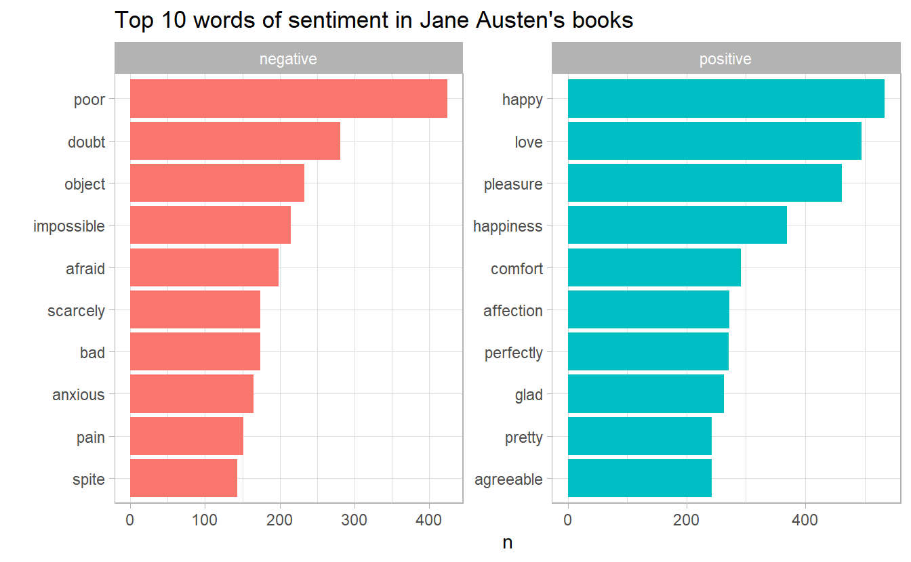
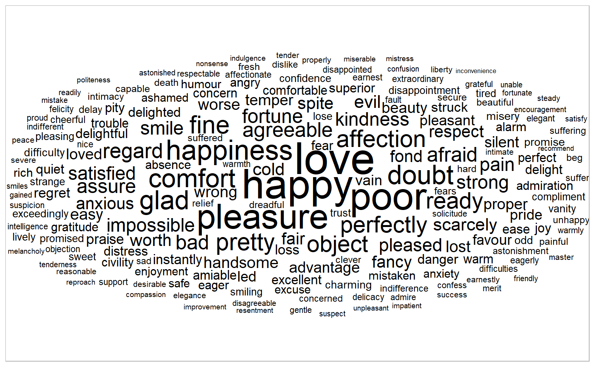
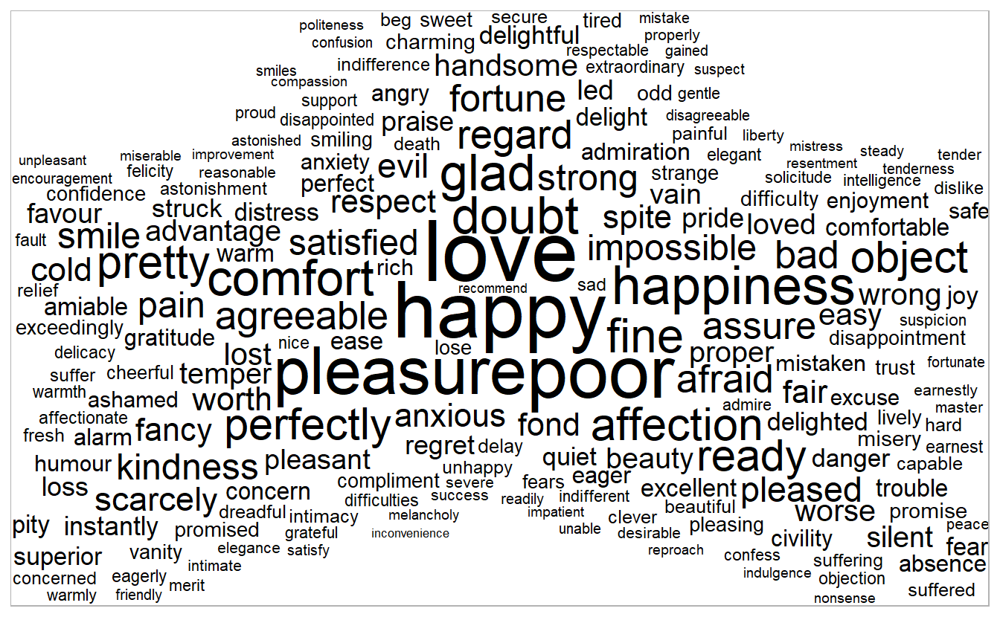
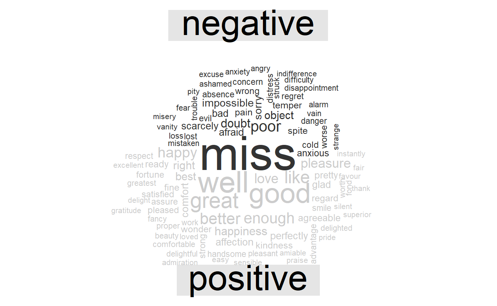

# Sentiment analysis with tidy data  


One way to analyze the sentiment of a text is to consider the text as a combination of its individual words and the sentiment content of the whole text as the sum of the sentiment content of the individual words. This isn’t the only way to approach sentiment analysis, but it is an often-used approach, and an approach that naturally takes advantage of the tidy tool ecosystem.


```r
library(janeaustenr)
```


## The `sentiments` dataset

There are a variety of methods and dictionaries that exist for evaluating the opinion or emotion in text. The tidytext package contains several sentiment lexicons. Three general-purpose lexicons are

* `AFINN` from [Finn Årup Nielsen](http://www2.imm.dtu.dk/pubdb/views/publication_details.php?id=6010)

* `bing` from [Bing Liu and collaborators](https://www.cs.uic.edu/~liub/FBS/sentiment-analysis.html)

* `nrc` from [Saif Mohammad and Peter Turney](http://saifmohammad.com/WebPages/NRC-Emotion-Lexicon.htm).  

* `loughran`: he Loughran and McDonald dictionary of financial sentiment terms. This dictionary was developed based on analyses of financial reports, and intentionally avoids words like “share” and “fool”, as well as subtler terms like “liability” and “risk” that may not have a negative meaning in a financial context.


All three of these lexicons are based on unigrams. These lexicons contain many English words and the words are assigned scores for positive / negative sentiment, and also possibly emotions like joy, anger, sadness, and so forth. The `nrc` lexicon categorizes words into classes of positive, negative, anger, anticipation, disgust, fear, joy, sadness, surprise, and trust. The `bing` lexicon categorizes words in a binary fashion into positive and negative categories. The `AFINN` lexicon assigns words with a score that runs between -5 and 5, with negative scores indicating negative sentiment and positive scores indicating positive sentiment. The `loughran` lexicon divided words into constraining, litigious, negative, positive, superfluous and uncertainty


```r
get_sentiments("nrc")
#> # A tibble: 13,901 x 2
#>   word      sentiment
#>   <chr>     <chr>    
#> 1 abacus    trust    
#> 2 abandon   fear     
#> 3 abandon   negative 
#> 4 abandon   sadness  
#> 5 abandoned anger    
#> 6 abandoned fear     
#> # ... with 1.39e+04 more rows

# install.packages("textdata")
get_sentiments("bing")
#> # A tibble: 6,786 x 2
#>   word       sentiment
#>   <chr>      <chr>    
#> 1 2-faces    negative 
#> 2 abnormal   negative 
#> 3 abolish    negative 
#> 4 abominable negative 
#> 5 abominably negative 
#> 6 abominate  negative 
#> # ... with 6,780 more rows

get_sentiments("afinn")
#> # A tibble: 2,477 x 2
#>   word       value
#>   <chr>      <dbl>
#> 1 abandon       -2
#> 2 abandoned     -2
#> 3 abandons      -2
#> 4 abducted      -2
#> 5 abduction     -2
#> 6 abductions    -2
#> # ... with 2,471 more rows

get_sentiments("loughran") %>% 
  filter(sentiment == "superfluous")
#> # A tibble: 21 x 2
#>   word         sentiment  
#>   <chr>        <chr>      
#> 1 aegis        superfluous
#> 2 amorphous    superfluous
#> 3 anticipatory superfluous
#> 4 appertaining superfluous
#> 5 assimilate   superfluous
#> 6 assimilating superfluous
#> # ... with 15 more rows
```


Dictionary-based methods like the ones we are discussing find the total sentiment of a piece of text by adding up the individual sentiment scores for each word in the text.   

One caveat is that  the size of the chunk of text that we use to add up unigram sentiment scores can have an effect on an analysis. A text the size of many paragraphs can often have positive and negative sentiment averaged out to about zero, while sentence-sized or paragraph-sized text often works better

## Sentiment analysis with inner join  


```r
library(janeaustenr)  

tidy_books <- austen_books() %>%
  group_by(book) %>%
  mutate(linenumber = row_number(),
         chapter = cumsum(str_detect(text, regex("^chapter [\\divxlc]", 
                                                 ignore_case = TRUE)))) %>%
  ungroup() %>%
  unnest_tokens(word, text)

tidy_books
#> # A tibble: 725,055 x 4
#>   book                linenumber chapter word       
#>   <fct>                    <int>   <int> <chr>      
#> 1 Sense & Sensibility          1       0 sense      
#> 2 Sense & Sensibility          1       0 and        
#> 3 Sense & Sensibility          1       0 sensibility
#> 4 Sense & Sensibility          3       0 by         
#> 5 Sense & Sensibility          3       0 jane       
#> 6 Sense & Sensibility          3       0 austen     
#> # ... with 7.25e+05 more rows
```

Because we name the count column `word` in `unnest_tokens()`, it's convenient to join with the sentiment dataset:  


```r
nrc_joy <- get_sentiments("nrc") %>%
  filter(sentiment == "joy")

tidy_books %>%
  filter(book == "Emma") %>%
  inner_join(nrc_joy) %>%
  count(word, sort = TRUE)
#> # A tibble: 303 x 2
#>   word       n
#>   <chr>  <int>
#> 1 good     359
#> 2 young    192
#> 3 friend   166
#> 4 hope     143
#> 5 happy    125
#> 6 love     117
#> # ... with 297 more rows
```

Next, we count up how many positive and negative words there are in defined sections of each book. We define an `index` here to keep track of where we are in the narrative; this index (using integer division) counts up sections of 80 lines of text.


```r
jane_austen_sentiment <- tidy_books %>%
  inner_join(get_sentiments("bing")) %>%
  mutate(index = linenumber %/% 80) %>% 
  count(book, index, sentiment) %>%
  pivot_wider(names_from = sentiment, values_from = n, values_fill = list(n = 0)) %>%
  mutate(sentiment = positive - negative)

jane_austen_sentiment
#> # A tibble: 920 x 5
#>   book                index negative positive sentiment
#>   <fct>               <dbl>    <int>    <int>     <int>
#> 1 Sense & Sensibility     0       16       32        16
#> 2 Sense & Sensibility     1       19       53        34
#> 3 Sense & Sensibility     2       12       31        19
#> 4 Sense & Sensibility     3       15       31        16
#> 5 Sense & Sensibility     4       16       34        18
#> 6 Sense & Sensibility     5       16       51        35
#> # ... with 914 more rows
```


```r
ggplot(jane_austen_sentiment) + 
  geom_col(aes(index, sentiment, fill = book), show.legend = F) + 
  facet_wrap( ~ book, ncol = 2, scales = "free_x") 
```


## Comparing 3 different dictionaries  


```r
pride_prejudice <- tidy_books %>% 
  filter(book == "Pride & Prejudice")

pride_prejudice
#> # A tibble: 122,204 x 4
#>   book              linenumber chapter word     
#>   <fct>                  <int>   <int> <chr>    
#> 1 Pride & Prejudice          1       0 pride    
#> 2 Pride & Prejudice          1       0 and      
#> 3 Pride & Prejudice          1       0 prejudice
#> 4 Pride & Prejudice          3       0 by       
#> 5 Pride & Prejudice          3       0 jane     
#> 6 Pride & Prejudice          3       0 austen   
#> # ... with 1.222e+05 more rows
```


```r
afinn <- pride_prejudice %>% 
  inner_join(get_sentiments("afinn")) %>% 
  mutate(index = linenumber %/% 80) %>% 
  count(book, index, wt = value, name = "value") %>%
  mutate(dict = "afinn") %>% 
  select(index, value, dict)

bing <- pride_prejudice %>% 
  inner_join(get_sentiments("bing")) %>% 
  mutate(index = linenumber %/% 80) %>% 
  count(index, sentiment) %>% 
  pivot_wider(names_from = sentiment, values_from = n, values_fill = list(n = 0)) %>% 
  mutate(value = positive - negative,
         dict = "bing") %>%  
  select(index, value, dict)

nrc <- pride_prejudice %>% 
  inner_join(get_sentiments("nrc")) %>%
  filter(sentiment %in% c("positive", "negative")) %>% 
  mutate(index = linenumber %/% 80) %>% 
  count(index, sentiment) %>% 
  pivot_wider(names_from = sentiment, values_from = n, values_fill = list(n = 0)) %>% 
  mutate(value = positive - negative,
         dict = "nrc") %>% 
  select(index, value, dict)
```


```r
bind_rows(afinn, bing, nrc) %>% 
  ggplot() + 
  geom_col(aes(index, value, fill = dict), show.legend = FALSE) + 
  facet_wrap(~ dict, nrow = 3)
```


It is natural for score based on these 3 different dictionary to differ in some sense, because for the latter two we are just consider as the sentiment score the number of positive words minus that of negative words. But they shoud all have similar relative trajectories through the novel.

Why is, for example, the result for the NRC lexicon biased so high in sentiment compared to the Bing et al. result? Let’s look briefly at how many positive and negative words are in these lexicons.


```r
get_sentiments("nrc") %>% 
  filter(sentiment %in% c("positive", "negative")) %>% 
  count(sentiment)
#> # A tibble: 2 x 2
#>   sentiment     n
#>   <chr>     <int>
#> 1 negative   3324
#> 2 positive   2312

get_sentiments("bing") %>% 
  count(sentiment)
#> # A tibble: 2 x 2
#>   sentiment     n
#>   <chr>     <int>
#> 1 negative   4781
#> 2 positive   2005
```

Both lexicons have more negative than positive words, but the ratio of negative to positive words is higher in the `Bing` lexicon than the `NRC` lexicon. This will contribute to the effect we see in the plot above, as will any systematic difference in word matches, e.g. if the negative words in the NRC lexicon do not match the words that Jane Austen uses very well.. Whatever the source of these differences, we see similar relative trajectories across the narrative arc, with similar changes in slope, but marked differences in absolute sentiment from lexicon to lexicon. This is all important context to keep in mind when choosing a sentiment lexicon for analysis.


## Most common positive and negative words 


```r
bing_word_counts <- tidy_books %>%
  inner_join(get_sentiments("bing")) %>%
  count(word, sentiment, sort = TRUE) %>%
  ungroup()

bing_word_counts
#> # A tibble: 2,585 x 3
#>   word   sentiment     n
#>   <chr>  <chr>     <int>
#> 1 miss   negative   1855
#> 2 well   positive   1523
#> 3 good   positive   1380
#> 4 great  positive    981
#> 5 like   positive    725
#> 6 better positive    639
#> # ... with 2,579 more rows
```


The word “miss” is coded as negative but it is used as a title for young, unmarried women in Jane Austen’s works. If it were appropriate for our purposes, we could easily add “miss” to a custom stop-words list using `bind_rows()`. We could implement that with a strategy such as this：  


```r
custom_stop_words <- tibble(word = c("miss"), lexicon = c("custom")) %>% 
  bind_rows(stop_words)

bing_word_counts <- tidy_books %>%
  inner_join(get_sentiments("bing")) %>% 
  anti_join(custom_stop_words) %>%
  group_by(sentiment) %>%
  count(word, sentiment, sort = T) %>% 
  ungroup()
```

Then we can make a bar plot


```r
bing_word_counts %>%
  group_by(sentiment) %>% 
  top_n(10) %>%
  ungroup()  %>% 
  facet_bar(y = word, x = n, by = sentiment, nrow = 1) + 
  labs(title = "Top 10 words of sentiment in Jane Austen's books") 
```




## Wordclouds  

The `ggwordcloud` package adds wordcloud extension into the ggplot2 ecosystem. The geometry `geom_text_wordcloud()` has a similar sytax comparing to `geom_text_repel`: `label` for the word and `size` for the count. 


```r
library(ggwordcloud)


wordcloud_df <-tidy_books %>% 
  anti_join(custom_stop_words) %>% 
  inner_join(get_sentiments("bing")) %>% 
  count(sentiment, word, sort = T) %>% 
  top_n(200)

wordcloud_df %>%
  ggplot() + 
  geom_text_wordcloud_area(aes(label = word, size = n)) +
  scale_size_area(max_size = 15)
```



One particular issue with wordcloud plot is that they use font size porportional to the corresponding frequency, so that long words with smaller frequency can sometimes misleadingly encompass much ink area than short words with larger frequency. One solution is to use `geom_texg_wordcloud`, which aims to set the ink area, rather than font size, proportional to the frequency, so that our perception are not biased by number of letters.  


```r
wordcloud_df %>%
  ggplot() + 
  geom_text_wordcloud_area(aes(label = word, size = n), shape = "star") + 
  scale_size_area(max_size = 15)
```




In other functions, such as `wordcloud::comparison.cloud()`, you may need to turn the data frame into a matrix with reshape2’s `acast()`. Let’s do the sentiment analysis to tag positive and negative words using an inner join, then find the most common positive and negative words. Until the step where we need to send the data to `comparison.cloud()`  


```r
library(wordcloud)

tidy_books %>%
  inner_join(get_sentiments("bing")) %>%
  count(word, sentiment, sort = TRUE) %>%
  reshape2::acast(word ~ sentiment, value.var = "n", fill = 0) %>%
  comparison.cloud(colors = c("gray20", "gray80"),
                   max.words = 100)
```




## Units other than words  

Some sentiment analysis algorithms look beyond only unigrams (i.e. single words) to try to understand the sentiment of a sentence as a whole.  

We may want to tokenize text into sentences, and it makes sense to use a new name for the output column in such a case.  


```r
PandP_sentences <- tibble(text = prideprejudice) %>% 
  unnest_tokens(sentence, text, token = "sentences")

PandP_sentences
#> # A tibble: 7,066 x 1
#>   sentence                                                                      
#>   <chr>                                                                         
#> 1 "pride and prejudice  by jane austen    chapter 1   it is a truth universally~
#> 2 "however little known the feelings or views of such a man may be on his first~
#> 3 "\"my dear mr."                                                               
#> 4 "bennet,\" said his lady to him one day, \"have you heard that netherfield pa~
#> 5 "mr."                                                                         
#> 6 "bennet replied that he had not."                                             
#> # ... with 7,060 more rows
```

The sentence tokenizing does seem to have a bit of trouble with UTF-8 encoded text, especially with sections of dialogue; it does much better with punctuation in ASCII. One possibility, if this is important, is to try using `iconv()`, with something like `iconv(text, to = 'latin1')` in a mutate statement before unnesting.  


```r
tibble(text = prideprejudice) %>% 
  mutate(text = iconv(text, to = "ASCII")) %>% 
  unnest_tokens(sentence, text, token = "sentences")
#> # A tibble: 7,066 x 1
#>   sentence                                                                      
#>   <chr>                                                                         
#> 1 "pride and prejudice  by jane austen    chapter 1   it is a truth universally~
#> 2 "however little known the feelings or views of such a man may be on his first~
#> 3 "\"my dear mr."                                                               
#> 4 "bennet,\" said his lady to him one day, \"have you heard that netherfield pa~
#> 5 "mr."                                                                         
#> 6 "bennet replied that he had not."                                             
#> # ... with 7,060 more rows
```

Another option in `unnest_tokens()` is to split into tokens using a regex pattern. We could use this, for example, to split the text of Jane Austen’s novels into a data frame by chapter.


```r

austen_chapters <- austen_books() %>%
  group_by(book) %>%
  unnest_tokens(chapter, text, token = "regex", 
                pattern = "Chapter|CHAPTER [\\dIVXLC]") %>%
  ungroup()

# 275 rows
austen_chapters
#> # A tibble: 275 x 2
#>   book             chapter                                                      
#>   <fct>            <chr>                                                        
#> 1 Sense & Sensibi~ "sense and sensibility\n\nby jane austen\n\n(1811)\n\n\n\n\n"
#> 2 Sense & Sensibi~ "\n\n\nthe family of dashwood had long been settled in susse~
#> 3 Sense & Sensibi~ "\n\n\nmrs. john dashwood now installed herself mistress of ~
#> 4 Sense & Sensibi~ "\n\n\nmrs. dashwood remained at norland several months; not~
#> 5 Sense & Sensibi~ "\n\n\n\"what a pity it is, elinor,\" said marianne, \"that ~
#> 6 Sense & Sensibi~ "\n\n\nno sooner was her answer dispatched, than mrs. dashwo~
#> # ... with 269 more rows

# 275 rows
tidy_books %>%
  distinct(book, chapter)
#> # A tibble: 275 x 2
#>   book                chapter
#>   <fct>                 <int>
#> 1 Sense & Sensibility       0
#> 2 Sense & Sensibility       1
#> 3 Sense & Sensibility       2
#> 4 Sense & Sensibility       3
#> 5 Sense & Sensibility       4
#> 6 Sense & Sensibility       5
#> # ... with 269 more rows
```

In the `austen_chapters` data frame, each row corresponds to one chapter.


Near the beginning of this chapter, we used a similar regex to find where all the chapters were in Austen’s novels for a tidy data frame organized by one-word-per-row (Section \@ref(sentiment-analysis-with-inner-join)). Using a regex as the token is somewhat similar to 


```r
tidy_books %>% 
  group_by(book, chapter) %>% 
  summarize(str_c(word, collapse = " "))
#> # A tibble: 275 x 3
#> # Groups:   book [6]
#>   book           chapter `str_c(word, collapse = " ")`                          
#>   <fct>            <int> <chr>                                                  
#> 1 Sense & Sensi~       0 sense and sensibility by jane austen 1811              
#> 2 Sense & Sensi~       1 chapter 1 the family of dashwood had long been settled~
#> 3 Sense & Sensi~       2 chapter 2 mrs john dashwood now installed herself mist~
#> 4 Sense & Sensi~       3 chapter 3 mrs dashwood remained at norland several mon~
#> 5 Sense & Sensi~       4 chapter 4 what a pity it is elinor said marianne that ~
#> 6 Sense & Sensi~       5 chapter 5 no sooner was her answer dispatched than mrs~
#> # ... with 269 more rows
```


We can use tidy text analysis to ask questions such as what are the most negative chapters in each of Jane Austen’s novels? First, let’s get the list of negative words from the Bing lexicon. Second, let’s make a data frame of how many words are in each chapter so we can normalize for the length of chapters. Then, let’s find the number of negative words in each chapter and divide by the total words in each chapter. For each book, which chapter has the highest proportion of negative words?


```r
bing_negative <- get_sentiments("bing") %>% 
  filter(sentiment == "negative")

chapter_words <- tidy_books %>% 
  count(book, chapter)

tidy_books %>%
  semi_join(bing_negative) %>%
  count(book, chapter, name = "negative_words") %>% 
  left_join(chapter_words) %>%
  mutate(ratio = negative_words / n) %>%
  filter(chapter != 0) %>%
  group_by(book) %>% 
  top_n(1) 
#> # A tibble: 6 x 5
#> # Groups:   book [6]
#>   book                chapter negative_words     n  ratio
#>   <fct>                 <int>          <int> <int>  <dbl>
#> 1 Sense & Sensibility      43            161  3405 0.0473
#> 2 Pride & Prejudice        34            111  2104 0.0528
#> 3 Mansfield Park           46            173  3685 0.0469
#> 4 Emma                     15            151  3340 0.0452
#> 5 Northanger Abbey         21            149  2982 0.0500
#> 6 Persuasion                4             62  1807 0.0343
```

