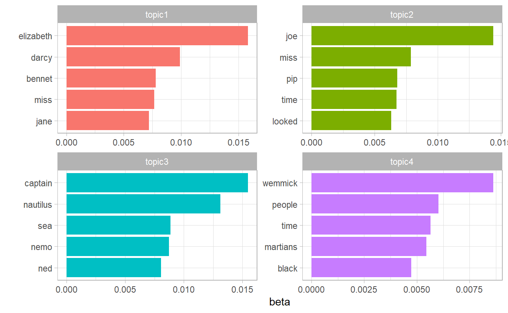
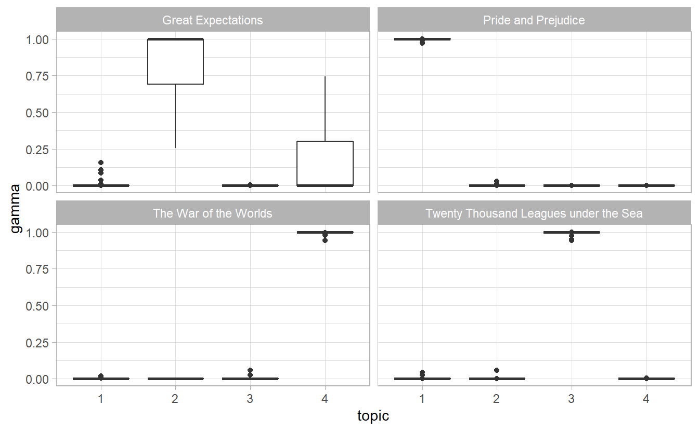
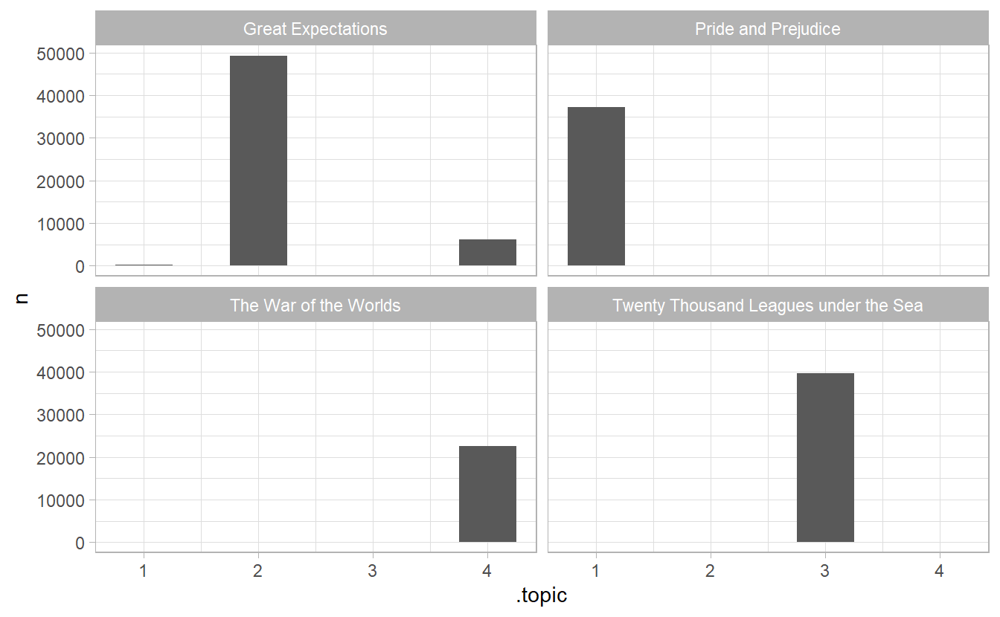
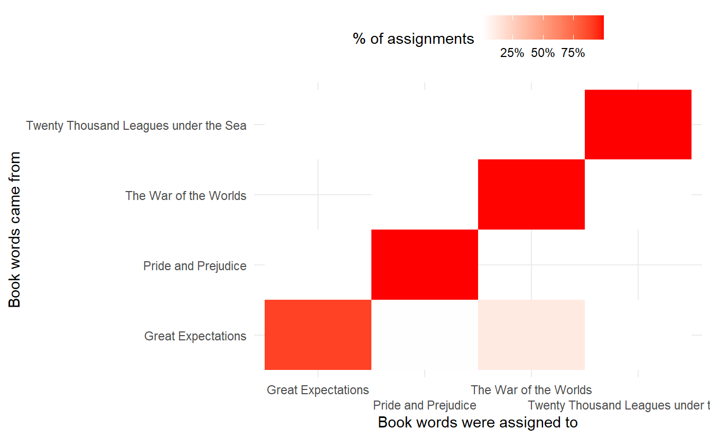

# Topic modeling    

A topic model is a type of statistical model for discovering the abstract "topics" that occur in a collection of documents. Topic modeling is a frequently used text-mining tool for discovery of hidden semantic structures in a text body.  A document typically concerns multiple topics in different proportions; thus, in a document that is 10% about cats and 90% about dogs, there would probably be about 9 times more dog words than cat words. The "topics" produced by topic modeling techniques are clusters of similar words. 


## Latent Dirichlet Allocation 

> Latent Dirichlet allocation (LDA) is a particularly popular method for fitting a topic model. It treats each document as a mixture of topics, and each topic as a mixture of words. This allows documents to “overlap” each other in terms of content, rather than being separated into discrete groups, in a way that mirrors typical use of natural language.  

The LDA model is guided by two principles: 

- **Each document is a mixture of topics**. In a 3 topic model we could assert that a document is 70% about topic A, 30 about topic B, and 0% about topic C.    

- **Every topic is a mixture of words**. A topic is considered a probabilistic distribution over multiple words.

<div class="figure" style="text-align: center">

<p class="caption">(\#fig:unnamed-chunk-2)Source: http://nlpx.net/wp/wp-content/uploads/2016/01/LDA_image2.jpg</p>
</div>

In particular, LDA is a imagined generative process, illustrated in the plate notation below:  


<div class="figure" style="text-align: center">

<p class="caption">(\#fig:unnamed-chunk-3)(ref:LDA)</p>
</div>


(ref:LDA) Source: @lee  


- $M$ denotes the number of documents   
- $N$ is the number of words in a given document (document $i$ has $N_i$ words)   
- $\vec{\theta_m}$ is the expected topic proportion of document $m$, which is generated by a Dirichlet distribution parameterized by $\vec{\alpha}$ (e.g., in a two topic model $\theta_m = [0.3, 0.7]$ means document $m$ is expected to have 30% topic 1 and 70% topic 2)    
- $\vec{\phi_k}$ is the word distribution of topic $k$, which is generated by a Dirichlet distribution parameterized by $\vec{\beta}$  
- $z_{m, n}$ is the topic for the $n$th word in document $m$, one word are assigned to one topic.  
- $w_{m, n}$ is the word in the $n$th position word of document $m$   

The only observed variable in this graphical probabilistic model is $w_{m, n}$, so it is "latent".

To actually infer the topics in a corpus, we imagine the generative process as follows. LDA assumes the following generative process for a corpus $D$ consisting of $M$ M documents each of length $N_i$:  

1. Generate $\vec{\theta_i} \sim \text{Dir}(\vec{\alpha})$, where $i \in \{1, 2, ..., M\}$. $\text{Dir}(\vec{\alpha})$ is a Dirichlet distribution with symmetric parameter $\vec{\alpha}$ where $\vec{\alpha}$ is often sparse.

2. Generate $\vec{\phi_k} \sim \text{Dir}(\vec{\beta})$, where $k \in \{1, 2, ..., K\}$ and $\vec{\beta}$ is typically sparse  

3. For the $n$th position in document $m$, where $n \in \{1, 2, ..., N_m\}$ and $m \in \{1, 2, ..., M\}$   
    a. Choose a topic $z_{m, n}$ for that position which is generated from $z_{m, n} \sim \text{Multinomial}(\vec{\theta_i})$   
    b. Fill in that position with word $w_{m, n}$ which is generated from the word distribution of the topic picked in the previous step $w_{i,j} \sim \text{Multinomial}(\phi_{z_{m, n}})$ 
  
### Example: Associated Press  

We come to the `AssociatedPress` document term matrix (the required data strcture for the modeling function) and fit a two topic LDA model with `topicmodels::LDA()`  


```r
library(topicmodels)
data("AssociatedPress")

ap_lda <- LDA(AssociatedPress, k = 2)
ap_lda
#> A LDA_VEM topic model with 2 topics.
```

For tidying model objects, `tidy(model_object, matrix = "beta")` (the default) access the topic-word probability vector (we denotes with $\vec{\phi_k}$)  


```r
tidy(ap_lda)
#> # A tibble: 20,946 x 3
#>   topic term            beta
#>   <int> <chr>          <dbl>
#> 1     1 aaron     0.00000513
#> 2     2 aaron     0.0000403 
#> 3     1 abandon   0.0000499 
#> 4     2 abandon   0.0000193 
#> 5     1 abandoned 0.0000116 
#> 6     2 abandoned 0.000170  
#> # ... with 20,940 more rows
```

Which words have a relateve higher probabiltity to appear in each topic?    


```r
tidy(ap_lda) %>% 
  group_by(topic) %>%
  top_n(10) %>% 
  ungroup() %>% 
  mutate(topic = str_c("topic", topic)) %>%
  facet_bar(y = term, x = beta, by = topic) +
  labs(title = "Words with highest probability in each topic")
```


As an alternative, we could consider the terms that had the **greatest difference** in $\vec{\phi_k}$ between topic 1 and topic 2. This can be estimated based on the log ratio of the two: $\log_2(\frac{\phi_{1n}}{\phi_{2n}})$, $\phi_{1n} / \phi_{2n}$ being the probability ratio of the sam e word $n$ in two topics (a log ratio is useful because it makes the difference symmetrical)  


```r
phi_ratio <- tidy(ap_lda) %>%
  mutate(topic = str_c("topic", topic)) %>% 
  pivot_wider(names_from = topic, values_from = beta) %>% 
  filter(topic1 > .001 | topic2 > .001) %>%
  mutate(log_ratio = log2(topic2 / topic1))
```


This can answer a question like: which word is most representative of a topic?  


```r
phi_ratio %>% 
  top_n(20, abs(log_ratio)) %>% 
  ggplot(aes(y = fct_reorder(term, log_ratio),
             x = log_ratio)) + 
  geom_col() + 
  labs(y = "",
       x = "log ratio of phi between topic 2 and topic 1 (base 2)")
```


To extrac the word proportion vector $\vec{\theta_m}$ for document $m$, use `matrix = "gamma"` in `tidy()`  


```r
tidy(ap_lda, matrix = "gamma")
#> # A tibble: 4,492 x 3
#>   document topic gamma
#>      <int> <int> <dbl>
#> 1        1     1 0.552
#> 2        2     1 0.623
#> 3        3     1 0.491
#> 4        4     1 0.464
#> 5        5     1 0.517
#> 6        6     1 0.482
#> # ... with 4,486 more rows
```


With this data frame, we want to knwo which document is most charateristic of each topic?  


```r
library(reshape2)
library(wordcloud)

tidy(ap_lda, matrix = "gamma") %>% 
  group_by(topic) %>%
  top_n(15) %>% 
  mutate(document = as.character(document)) %>% 
  acast(document ~ topic, value.var = "gamma", fill = 0) %>% 
  comparison.cloud(colors = c("gray20", "gray80"), scale = c(2, 8))
```


This plot would definitely be more insightful if we have document titles rather than an ID.  

## Example: the great library heist  

To evaluate our topic model, we first divided 4 books into chapters. If a topic model with $K = 4$ performs well, then there should be a corresponding segmentation among those chpaters coming from those 4 different books.  


```r
titles <- c("Twenty Thousand Leagues under the Sea", "The War of the Worlds",
            "Pride and Prejudice", "Great Expectations")  

library(gutenbergr)

books <- gutenberg_works(title %in% titles) %>%
  gutenberg_download(meta_fields = "title")
```


```r
# add a chapter column
by_chapter <- books %>%
  group_by(title) %>%
  mutate(chapter = cumsum(str_detect(text, regex("^chapter ", ignore_case = TRUE)))) %>%
  ungroup() %>%
  filter(chapter > 0) %>%
  unite(document, title, chapter)


# find document-word counts
word_counts <- by_chapter %>%
  unnest_tokens(word, text) %>% 
  anti_join(stop_words) %>%
  rename(chapter = document) %>% 
  count(chapter, word, sort = TRUE) %>%
  ungroup()

word_counts
#> # A tibble: 104,722 x 3
#>   chapter               word        n
#>   <chr>                 <chr>   <int>
#> 1 Great Expectations_57 joe        88
#> 2 Great Expectations_7  joe        70
#> 3 Great Expectations_17 biddy      63
#> 4 Great Expectations_27 joe        58
#> 5 Great Expectations_38 estella    58
#> 6 Great Expectations_2  joe        56
#> # ... with 104,716 more rows
```

### LDA on chapters  


```r
chapters_dtm <- word_counts %>% 
  cast_dtm(document = chapter, term = word, value = n)

chapters_lda <- chapters_dtm %>%
  LDA(k  = 4)
```


Much as we did on the Associated Press data, we can examine per-topic-per-word probabilities.  


```r
chapter_topics <- tidy(chapters_lda, matrix = "beta")
chapter_topics
#> # A tibble: 72,860 x 3
#>   topic term       beta
#>   <int> <chr>     <dbl>
#> 1     1 joe   1.45e- 52
#> 2     2 joe   1.44e-  2
#> 3     3 joe   4.69e-118
#> 4     4 joe   3.61e- 19
#> 5     1 biddy 5.21e-181
#> 6     2 biddy 4.75e-  3
#> # ... with 72,854 more rows
```

We can find top 5 terms within each topic.  


```r
chapter_topics %>% 
  group_by(topic) %>% 
  top_n(5) %>% 
  ungroup() %>% 
  mutate(topic = str_c("topic", topic)) %>% 
  facet_bar(y = term, x = beta, by = topic)
```



I am not an expert on the other 3 books aside from Pride & Prejudice, but according to [Julia](https://www.tidytextmining.com/topicmodeling#lda-on-chapters), each topic did correspond to one book by and large!  

### Per-document classification

We may want to how which topics are associated with each document, in particular, the majority of chapters in the same book should belong to the same topic (if we assign a chapter$_m$ to a topic$_k$ when the $k$th postion in $\hat{\theta}_m$ is significantly higher).  


```r
chapters_gamma <- tidy(chapters_lda, matrix = "gamma") %>% 
  separate(document, c("title", "chapter"), sep = "_", convert = TRUE) %>% 
  mutate(topic = factor(topic) %>% fct_inseq())

chapters_gamma
#> # A tibble: 772 x 4
#>   title              chapter topic     gamma
#>   <chr>                <int> <fct>     <dbl>
#> 1 Great Expectations      57 1     0.0000150
#> 2 Great Expectations       7 1     0.0000163
#> 3 Great Expectations      17 1     0.0000234
#> 4 Great Expectations      27 1     0.0000213
#> 5 Great Expectations      38 1     0.0000142
#> 6 Great Expectations       2 1     0.0000191
#> # ... with 766 more rows
```


```r
ggplot(chapters_gamma) + 
  geom_boxplot(aes(topic, gamma)) + 
  facet_wrap(~ title)
```



Ideally we would expect that in every book panel, there is one boxplot highly centered at 1 with the other 3 boxes at 0, since chapters in the same book are categorized in the same topic. 

It does look like some chapters from Great Expectations (which should be topic 4) were somewhat associated with other topics. Are there any cases where the topic most associated with a chapter belonged to another book?   

First we’d find the topic that was most associated with each chapter using `top_n()`, which is effectively the “classification” of that chapter.


```r
chapter_classifications <- chapters_gamma %>%
  group_by(title, chapter) %>%
  top_n(1, gamma) %>%
  ungroup()

chapter_classifications
#> # A tibble: 193 x 4
#>   title               chapter topic gamma
#>   <chr>                 <int> <fct> <dbl>
#> 1 Pride and Prejudice      43 1     1.00 
#> 2 Pride and Prejudice      18 1     1.00 
#> 3 Pride and Prejudice      45 1     1.00 
#> 4 Pride and Prejudice      16 1     1.00 
#> 5 Pride and Prejudice      29 1     0.988
#> 6 Pride and Prejudice      10 1     1.00 
#> # ... with 187 more rows
```

We can then compare each to the “consensus” topic for each book (the most common topic among its chapters), and see which were most often misidentified.  


```r
# identify which topic is most related to which book
book_topics <- chapter_classifications %>%
  count(title, topic) %>%
  group_by(title) %>%
  top_n(1, n) %>%
  ungroup() %>%
  transmute(consensus = title, topic)

# which chapter in misidentified
chapter_classifications %>% 
  inner_join(book_topics) %>% 
  filter(consensus != title)
#> # A tibble: 5 x 5
#>   title              chapter topic gamma consensus            
#>   <chr>                <int> <fct> <dbl> <chr>                
#> 1 Great Expectations      20 4     0.521 The War of the Worlds
#> 2 Great Expectations      37 4     0.451 The War of the Worlds
#> 3 Great Expectations      54 4     0.742 The War of the Worlds
#> 4 Great Expectations      45 4     0.556 The War of the Worlds
#> 5 Great Expectations      21 4     0.527 The War of the Worlds
```

We see that one chapter in "Great Expectation" is misidentified as a member of topic 3, which is essentially "The War of the Worlds" 


### By word assignments: `augment()`   

One step of the LDA algorithm is assigning each word in each document to a topic $z_{m, n}$. The more words in a document are assigned to that topic, generally, the more weight $\theta_m$ will go on that document-topic classification.

We may want to take the original document-word pairs and find which words in each document were assigned to which topic. This is the job of the `augment()` function, which is to add information to each observation in the original data.  


```r
assignments <- augment(chapters_lda, data = chapters_dtm) %>% 
  rename(chapter = document)
assignments
#> # A tibble: 104,722 x 4
#>   chapter               term  count .topic
#>   <chr>                 <chr> <dbl>  <dbl>
#> 1 Great Expectations_57 joe      88      2
#> 2 Great Expectations_7  joe      70      2
#> 3 Great Expectations_17 joe       5      2
#> 4 Great Expectations_27 joe      58      2
#> 5 Great Expectations_2  joe      56      2
#> 6 Great Expectations_23 joe       1      2
#> # ... with 104,716 more rows
```

To get a sense of how our model works, we can draw a bar plot of assigned topics in each book  


```r
assignments %>% 
  separate(chapter, into = c("title", "chapter"), sep = "_") %>%
  count(title, .topic, wt = count) %>%
  ggplot(aes(.topic, n)) + 
  geom_col(width = 0.5) + 
  facet_wrap(~ title)
```




We can combine this assignments table with the `consensus` book titles to find which words were incorrectly classified by a coofusion matrix.  


```r
assignments <- assignments %>%
  separate(chapter, c("title", "chapter"), sep = "_", convert = TRUE) %>%
  inner_join(book_topics, by = c(".topic" = "topic"))

assignments
#> # A tibble: 104,722 x 6
#>   title              chapter term  count .topic consensus         
#>   <chr>                <int> <chr> <dbl>  <dbl> <chr>             
#> 1 Great Expectations      57 joe      88      2 Great Expectations
#> 2 Great Expectations       7 joe      70      2 Great Expectations
#> 3 Great Expectations      17 joe       5      2 Great Expectations
#> 4 Great Expectations      27 joe      58      2 Great Expectations
#> 5 Great Expectations       2 joe      56      2 Great Expectations
#> 6 Great Expectations      23 joe       1      2 Great Expectations
#> # ... with 104,716 more rows
```


```r
# confusion matrix  
assignments %>% 
  count(title, consensus, wt = count) %>% 
  group_by(title) %>% 
  mutate(percent = n / sum(n)) %>% 
  ungroup() %>% 
  ggplot(aes(consensus, title, fill = percent)) + 
  geom_tile() + 
  scale_fill_gradient2(high = "red", label = scales::percent_format()) +
  scale_x_discrete(guide = guide_axis(n.dodge = 2)) + 
  theme_minimal() +
  theme(legend.position = "top") + 
  labs(x = "Book words were assigned to",
       y = "Book words came from",
       fill = "% of assignments")
```



What were the most commonly mistaken words?  


```r
assignments %>% 
  filter(title != consensus) %>% 
  count(title, consensus, term, .wt = count) %>%
  arrange(desc(n))
#> # A tibble: 3,523 x 5
#>   title              consensus             term        .wt     n
#>   <chr>              <chr>                 <chr>     <dbl> <int>
#> 1 Great Expectations The War of the Worlds britain       1    11
#> 2 Great Expectations The War of the Worlds yards         1     8
#> 3 Great Expectations The War of the Worlds deep          1     7
#> 4 Great Expectations The War of the Worlds direction     1     7
#> 5 Great Expectations The War of the Worlds feet          1     7
#> 6 Great Expectations The War of the Worlds london        1     7
#> # ... with 3,517 more rows
```

We can see that a number of words were often assigned to the Pride and Prejudice or War of the Worlds cluster even when they appeared in Great Expectations. For some of these words, such as “love” and “lady”, that’s because they’re more common in Pride and Prejudice (we could confirm that by examining the counts).

It is possible that a word is assigned to a book, even though it never appears in that book. 

